# Agents Learning Loops

**Memoria asociativa en grafo para bucles de aprendizaje de agentes autónomos**

[](https://github.com/cherrera0001/Agents_Learning_Loops/actions/workflows/ci.yml)
[](https://github.com/cherrera0001/Agents_Learning_Loops/releases)


[](LICENSE)

`associative-agent-loop` implementa una memoria episódica y semántica que permite a un agente
**capturar trayectorias de ejecución, extraer lecciones, enlazarlas en un grafo asociativo y
recuperarlas por activación propagada** para condicionar decisiones futuras. El objetivo operativo
es: *el agente no debe repetir un error cuya causa ya observó*, y la experiencia adquirida en un
contexto no debe contaminar decisiones en contextos no relacionados.
**Ese objetivo está evaluado solo en parte**: «no repetir» se cumple en tres de los cuatro
escenarios simulados; con señuelo y el agente por defecto no se cumple (H4), y con un diagnóstico
público común no hay diferencia según el criterio pre-registrado (#58)
([qué presenta este experimento](#qué-presenta-este-experimento)).

El propio repositorio registra su desarrollo con este mecanismo: cada issue se guarda como un episodio de
aprendizaje y se consulta la memoria antes de iniciar el siguiente ([§ 11](#11-desarrollo-guiado-por-su-propia-memoria)).
Hay una excepción documentada: el experimento de Kaggle no se condujo con este proceso
([§ 7.3](#73-experimento-con-gemma-4-en-kaggle-exploratorio-y-todavía-sin-memoria)).

> **Terminología.** «Agente», «skill» y «harness» tienen significados distintos según la capa (agente de
> biblioteca, solver acotado, agente de entorno…). Todos los textos usan los nombres del
> [glosario](docs/entorno/glosario.md); el contrato para quien edita el repositorio está en [`docs/entorno/`](docs/entorno/README.md).
> «Modelo» también tiene tres usos (de datos, de embedding y de construcción): ver [§ 3.2](#32-modelo-de-construcción).

## Qué presenta este experimento

**Pregunta.** ¿La experiencia de tareas previas, guardada en una memoria, cambia la primera decisión de un
agente en una tarea nueva y mejora su resultado? ¿Y un grafo asociativo aporta más que un historial de texto?

**Diseño.** Dos experimentos deterministas. El Experimento 0 usa herramientas simuladas (semilla 7). El
Experimento 1 repara defectos inyectados en una aplicación real ([Task Ledger](experiments/software_project/))
con un solver acotado: tres operadores de reparación escritos a mano, sin modelos de lenguaje. Compara tres
condiciones (sin memoria, historial textual y memoria asociativa) en 6 tareas y después en 9, tres de ellas
con un señuelo. Las hipótesis posteriores (H4, #58, H6 y H7) se pre-registraron antes de generar los datos.
Son conteos exactos de un diseño exhaustivo: no hay muestra ni inferencia estadística.

| Qué se observó | Lectura | Fuente |
|---|---|---|
| Simulado: con memoria, 0 fallos repetidos en tres de los cuatro escenarios y 1 en el de dominio cruzado; éxito al primer intento 2/20 → 19/20 con errores intermitentes | A favor, solo en simulación | [`evidence/baseline/`](evidence/baseline/) |
| Software, tareas originales: éxito final igual en las tres condiciones; intentos por tarea 2.0 sin memoria y 1.0 con cualquiera de las dos memorias | Tener memoria ayudó; las dos memorias empataron | [`results/`](results/README.md), [`results/reference-v2/`](results/reference-v2/README.md) |
| La asociativa expone una lección y es la relevante (18/18); el historial expone todas (18/54 relevantes) | Diferencia de precisión, no de resultado | [`results/`](results/README.md) |
| H4, tareas con señuelo y agente por defecto: éxito al primer intento 6/18 sin memoria y 0/18 con historial y con asociativa; 2.5 intentos frente a 2.0 | **En contra**: las dos memorias empeoraron | [`h4`](docs/results/h4-associative-vs-history.md) |
| Campaña de 9 tareas: el proxy `RepeatedFailureRate` vale 1.0 en las tres condiciones (54/54 con cada memoria, 72/72 sin memoria); cuenta intentos fallidos cuya causa ya se resolvió en el entrenamiento de esa condición, también sin memoria | Las dos memorias no eliminaron los fallos de causa ya resuelta; la métrica es un proxy | [`results/reference-v2/`](results/reference-v2/README.md) (`RepeatedFailureRate`) |
| #58, con un diagnóstico público común: +6/18 al primer intento en las originales y −2/18 en las engañosas | A favor en las originales; sin diferencia en las engañosas según el criterio pre-registrado | [`diagnostic-baseline`](docs/results/diagnostic-baseline.md) |
| H6, memoria de fallos: no repite la estrategia fallida al repetir la **misma** tarea; ningún registro de otra tarea llegó a aplicarse (`applied_records.other_task` = 0 en `python -m scripts.analyze_failure_memory --evidence evidence/failure-memory-v1`) | Aprendizaje por repetición; la contaminación no se puso a prueba | [`failure-memory`](docs/results/failure-memory.md) |
| H7, memoria de fallos entre tareas: con τ = 0.1 quita el primer intento correcto en 3 de 18 pares; ningún umbral separa lo que ayuda de lo que daña | **En contra**: «contamina» | [`failure-transfer`](docs/results/failure-transfer.md) |

**Qué aporta.** Un resultado negativo, pre-registrado y reproducible: la asociación sobre las mismas señales
léxicas que usa el historial no lo supera, y con un señuelo las dos memorias empeoraron el primer intento con
el agente por defecto (H4, 0/18 frente a 6/18); con un diagnóstico público común la diferencia fue de −2/18,
sin diferencia según el criterio pre-registrado (#58). Aporta también el método: tareas con señuelo que
permiten que la memoria pierda, recibos inmutables de cada ejecución, una verificación independiente y
análisis escritos antes de ver los datos.

**Qué no presenta.** Aprendizaje autónomo de ingeniería de software, una habilidad nueva (el solver reordena
operadores ya escritos), resultados de memoria con agentes LLM, mediciones de tokens o de costo, ni la
promoción de lecciones a skills, que el esquema declara y el [protocolo](specs/software_learning_protocol.md)
deja como trabajo futuro. El repositorio tiene mediciones con un modelo de lenguaje, exploratorias, en un
experimento aparte y sin memoria (el concurso Gemma 4 Developer Agent); no establecen ninguna mejora
([§ 7.3](#73-experimento-con-gemma-4-en-kaggle-exploratorio-y-todavía-sin-memoria)).

**Pregunta abierta.** Si una recuperación sembrada con señales no léxicas (la traza de la excepción, el
componente inspeccionado o el embedding del código) evita el señuelo. Es una prueba que podría distinguir al grafo
del historial. La describió el
[informe de H4](docs/results/h4-associative-vs-history.md#trabajo-futuro-sin-issue-abierto), cuando aún no
tenía issue, y hoy es H8, el issue
[#98](https://github.com/cherrera0001/Agents_Learning_Loops/issues/98).

---

## Contenido

[Qué presenta este experimento](#qué-presenta-este-experimento)

1. [Características](#1-características)
2. [Inicio rápido](#2-inicio-rápido)
3. [Arquitectura](#3-arquitectura) · [3.1 Entorno de desarrollo](#31-entorno-de-desarrollo) · [3.2 Modelo de construcción](#32-modelo-de-construcción)
4. [Modelo de datos](#4-modelo-de-datos)
5. [Ciclo del agente de biblioteca](#5-ciclo-del-agente-de-biblioteca)
6. [Algoritmos](#6-algoritmos)
7. [Resultados experimentales](#7-resultados-experimentales)
8. [Aseguramiento de calidad](#8-aseguramiento-de-calidad)
9. [Uso como librería](#9-uso-como-librería)
10. [Persistencia y formato](#10-persistencia-y-formato)
11. [Desarrollo guiado por su propia memoria](#11-desarrollo-guiado-por-su-propia-memoria)
12. [Limitaciones conocidas](#12-limitaciones-conocidas)
13. [Hoja de ruta](#13-hoja-de-ruta)
14. [Estructura del repositorio](#14-estructura-del-repositorio)
15. [Contribuir y licencia](#15-contribuir-y-licencia)

---

## 1. Características

| Capacidad | Implementación |
|---|---|
| **Contrato formal** | Modelos Pydantic v2 (`Node`, `Edge`, `GraphDocument`) validados al crear y al asignar; JSON Schema **generado** desde el código ([`specs/memory_schema.json`](specs/memory_schema.json)) |
| **Recuperación híbrida** | Similitud `α·coseno(embeddings) + (1−α)·léxica` sobre todo nodo con texto; embeddings léxicos por defecto o semánticos multilingües locales (ONNX) |
| **Activación propagada** | Umbral de disparo sobre activación acumulada, refracción, normalización por *fan-out*, saturación y trazas explicativas |
| **Valencia contextual** | Evidencia episódica ponderada por la similitud del episodio con la consulta; aísla dominios |
| **Aprendizaje** | Regla hebbiana acotada para rutas co-activadas + refuerzo dirigido (EMA) para relaciones agregadas |
| **Olvido controlado** | Decaimiento exponencial por arista (`λₑ`), perezoso o materializado, y poda por umbral y por tamaño |
| **Ciclo verificable** | Máquina de estados `PLAN → RETRIEVE → ACT → OBSERVE → CONSOLIDATE` con transiciones validadas |
| **Determinismo** | Reloj lógico, hashing estable (`blake2b`) y semillas fijas: el benchmark produce el mismo JSON en cada ejecución |
| **Operación** | Paquete instalable, CLI `aal-benchmark`, configuración TOML/entorno, escritura atómica, logging estructurado |
| **Calidad** | 614 tests, cobertura 98.7 % (medida el 2026-10-02; CI exige ≥ 90 %), propiedades `hypothesis` con verificación por mutación, `mypy --strict`, CI multiplataforma |

## 2. Inicio rápido

Requisitos: Python ≥ 3.11.

```bash
git clone https://github.com/cherrera0001/Agents_Learning_Loops.git
cd Agents_Learning_Loops
python -m venv .venv
source .venv/bin/activate           # Windows: .venv\Scripts\activate

pip install -e ".[dev]"             # núcleo + herramientas de desarrollo
pip install -e ".[dev,embeddings]"  # + embeddings semánticos locales (fastembed, ONNX)

aal-benchmark                       # benchmark legible
aal-benchmark --json                # reporte determinista (misma semilla ⇒ mismo JSON)
aal-benchmark -vv                   # logging DEBUG de cada transición (stderr)
pytest                              # tests unitarios y de integración
```

| Extra | Dependencias | Uso |
|---|---|---|
| *(núcleo)* | `networkx ≥ 3`, `pydantic ≥ 2` | Grafo, modelos, similitud léxica. Sin descarga de modelos |
| `embeddings` | `fastembed` (ONNX Runtime, sin PyTorch) | Búsqueda semántica; modelo por defecto `paraphrase-multilingual-MiniLM-L12-v2` (384 d, 0.22 GB) |
| `dev` | `pytest`, `pytest-cov`, `hypothesis`, `jsonschema`, `ruff`, `mypy` | Desarrollo y CI |

## 3. Arquitectura

El sistema se organiza en tres capas. El **agente de biblioteca** orquesta el ciclo y no conoce los detalles del
grafo; la **memoria** encapsula representación, recuperación y aprendizaje; la **infraestructura**
provee configuración, persistencia y utilidades sin dependencias internas.

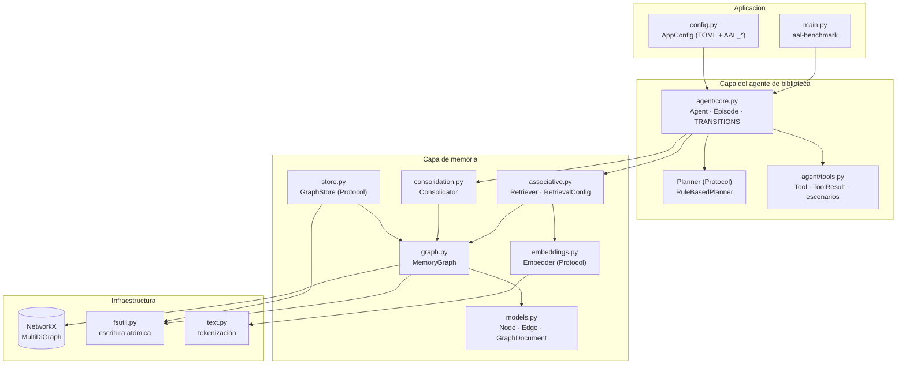

| Módulo | Responsabilidad | Punto de extensión |
|---|---|---|
| `agent/core.py` | Ciclo del agente de biblioteca, máquina de estados, construcción desde configuración | `Planner`, `Evaluator` |
| `agent/tools.py` | Contrato de herramientas y escenarios de benchmark (`weather`, `flaky`, `domain`) | `Tool` |
| `memory/models.py` | Contrato formal del grafo (Pydantic) | — |
| `memory/graph.py` | Almacenamiento en memoria, decaimiento, serialización v2 y migración v1 | — |
| `memory/associative.py` | Indexación, siembra híbrida, activación propagada, valencia contextual | `RetrievalConfig` |
| `memory/embeddings.py` | Vectorización de etiquetas | `Embedder` |
| `memory/consolidation.py` | Escritura de trayectorias, aprendizaje, lecciones, decaimiento, poda | parámetros de `ConsolidationConfig` |
| `memory/store.py` | Persistencia | `GraphStore` |

### 3.1 Entorno de desarrollo

La arquitectura anterior es el **agente de biblioteca**. El Experimento 1 añade el **solver acotado** y su
**harness de experimento** (§ 7.2). Quien edita el repositorio, sea una persona o un agente de Cursor o
Claude, es un **agente de entorno** y trabaja bajo un contrato documental, sin código propio:

| Pieza | Archivo |
|---|---|
| Entrada para cualquier agente de entorno | [`AGENTS.md`](AGENTS.md) (`CLAUDE.md` y `.cursor/rules/entorno.mdc` remiten a él) |
| Glosario de los siete términos | [`docs/entorno/glosario.md`](docs/entorno/glosario.md) |
| Roles: orquestador, implementador, revisor (de código y de documentos), gestor del proyecto, cierre, evaluador del experimento, bitácora | [`docs/entorno/agentes.md`](docs/entorno/agentes.md) |
| Harness de entorno (permisos, parada, evidencia) y resumen del harness de experimento | [`docs/entorno/harness.md`](docs/entorno/harness.md) |
| Skills de entorno: procedimientos ya fijados, en Markdown | [`skills/`](skills/README.md) · regla de admisión en [`docs/entorno/skills.md`](docs/entorno/skills.md) |
| Staff de texto público, con veto: investigador de papers, revisor redactor y validador estadístico | [`investigador-papers`](skills/investigador-papers/SKILL.md) · [`revisor-redactor`](skills/revisor-redactor/SKILL.md) · [`validador-estadistico`](skills/validador-estadistico/SKILL.md) · roles en [`docs/entorno/agentes.md`](docs/entorno/agentes.md#staff-de-texto-público) |

Las skills de entorno no son la **skill de memoria** del esquema `software-learning-memory/v1`, que sigue
sin implementarse.

El contrato de entorno también se usó fuera de este repositorio, en el sitio público `vinculaterritorio.cl`:
agentes de entorno que recuperan la memoria del sitio, comprueban producción y cierran o bloquean issues. Es un
[caso observacional](docs/entorno/caso-real-contacto-vt.md), sin ablación de memoria ni control pareado. No
ejercita el solver acotado ni el grafo del Experimento 1 y no es evidencia de ninguno de los dos. Su
[registro visible](docs/entorno/caso-real-contacto-vt.md#registro-visible) cuenta desde los archivos todos los
resultados, no solo los verdes, y los dibuja: una flecha solo donde un archivo enlaza la causa con el desenlace.

### 3.2 Modelo de construcción

En este repositorio «modelo» tiene tres significados distintos, que no se mezclan:

| Uso | Qué es | Dónde se describe |
|---|---|---|
| **Modelo de datos** | El grafo Pydantic: `Node`, `Edge`, `GraphDocument` | § 4 |
| **Modelo de embedding** | `LexicalEmbedder` o `FastEmbedEmbedder`; `GraphDocument.embedding_model` nombra este, no un modelo de Claude | § 6 |
| **Modelo de construcción** | El modelo de Claude que construye un issue | [`docs/estimation.md`](docs/estimation.md) |

La política del modelo de construcción está **solo** en [`docs/estimation.md`](docs/estimation.md). Allí se
calcula la talla XS–XL con cuatro factores (alcance, incertidumbre, riesgo y verificación), la tabla de su
§ 2 asigna modelo, ID y esfuerzo a cada talla, y cuatro reglas completan la política:

1. piso por riesgo;
2. si la verificación falla, se sube un solo escalón;
3. antes de sumar modelos, bajar el esfuerzo;
4. el orquestador (Opus 5.5) especifica, revisa y es el único que hace merge.

El registro por issue es la estimación del cuerpo del issue y los campos del Project #5 (*Modelo* es el
previsto; *Modelo usado*, el real, autoinformado); las excepciones están en la § 2.2 de esa política. Task Ledger
(`experiments/software_project/`) es la aplicación del Experimento 1 y no es ese registro.

**Cuánta fuerza tiene la elección.** No existe un interruptor automático. La elección opera en tres niveles:

- **Política**: `docs/estimation.md` fija la talla y el modelo, pero no se carga sola.
- **Reglas inyectadas**: `AGENTS.md`, `CLAUDE.md` y `.cursor/rules/entorno.mdc` las carga el entorno y
  ordenan leer la política antes de delegar. **No cambian el modelo de la sesión ya abierta.**
- **Aplicación del ID**: el modelo cambia cuando el orquestador crea el subagente o el worktree y le pasa el
  ID de la tabla (`claude-haiku-4-5`, `claude-sonnet-5-5` o `claude-opus-5-5`) junto con el esfuerzo de esa
  fila. En Claude Code, el lugar que fija el modelo de un rol es el frontmatter `model:` de
  `.claude/agents/<rol>.md`; el repositorio versiona `implementador-haiku`, `implementador-sonnet` e
  `implementador-opus`, y quince que no construyen (`revisor-codigo`, `revisor-docs`, `gestor-proyecto`,
  los cinco del staff de texto público y los siete del staff de experimento:
  [`docs/entorno/agentes.md`](docs/entorno/agentes.md));
  todas declaran el alias del modelo pero no el esfuerzo (el modelo que ejecuta se comprueba en la
  transcripción). En Cursor, la persona elige el modelo del chat
  en el selector, y un subagente usa el ID de la tabla solo si quien lo lanza lo copia desde
  `docs/estimation.md`.

Contrato completo: [`docs/entorno/enrutamiento.md`](docs/entorno/enrutamiento.md).

## 4. Modelo de datos

### 4.1 Esquema

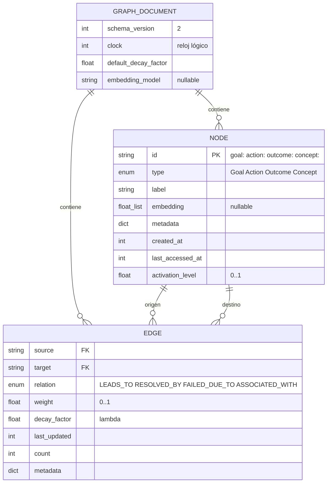

Entre dos nodos existe como máximo **una arista por relación**: el grafo es un `MultiDiGraph` cuya
clave de arista es la relación. Los timestamps son un **reloj lógico** (un tick por episodio), lo
que hace el decaimiento determinista y verificable en tests.

### 4.2 Nodos y relaciones

| Nodo | Semántica | Cardinalidad |
|---|---|---|
| `Goal` | Meta de un episodio (texto de la tarea) | Uno por episodio |
| `Action` | Herramienta o acción ejecutable | **Compartido** entre episodios: acumula la experiencia |
| `Outcome` | Resultado de una ejecución (`success`, `latency_ms`, `error`, `episode`, `step`) | Uno por paso |
| `Concept` | `topic` (término de la meta), `error` (causa de fallo) o `lesson` (lección) | Deduplicado por contenido |

| Relación | Semántica | ρ (recorrido inverso) | Aprendizaje |
|---|---|---|---|
| `LEADS_TO` | Goal → Action (intento), Action → Outcome (resultado) | 0.5 | Hebbiano |
| `RESOLVED_BY` | Goal → Action (éxito), Concept(error) → Action (recuperación) | 0.5 | Hebbiano + EMA |
| `FAILED_DUE_TO` | Action → Concept(error), Outcome → Concept(error) | 0.5 | EMA |
| `ASSOCIATED_WITH` | Goal → Concept(topic), Concept(lesson) → nodos relacionados | 1.0 | EMA |

### 4.3 Ejemplo: subgrafo tras un fallo y su recuperación

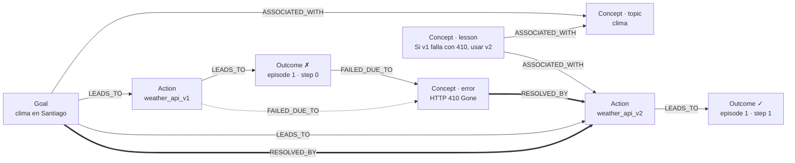

### 4.4 Invariantes

1. **Tiempo lógico**: `clock` se incrementa exactamente una vez por episodio.
2. **Transiciones verificadas**: el episodio solo avanza por la tabla `TRANSITIONS`.
3. **Recuperar antes de escribir**: la meta actual se inserta después del RETRIEVE, para que no se active a sí misma.
4. **Orden estable**: con memoria vacía el ranking conserva el orden del planificador.
5. **Pesos acotados**: `weight ∈ [0, 1]`, garantizado por las reglas de aprendizaje y por `validate_assignment`.
6. **Integridad referencial**: toda arista une nodos existentes y tipados.
7. **Contrato generado**: el JSON Schema publicado coincide con los modelos (verificado en CI).

Especificación completa: [`specs/loop_protocol.md`](specs/loop_protocol.md).

## 5. Ciclo del agente de biblioteca

### 5.1 Máquina de estados

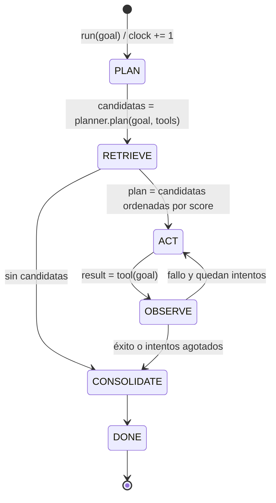

Cualquier transición fuera de `TRANSITIONS` lanza `IllegalTransition`. `Episode.candidates`
(salida de PLAN) y `Episode.plan` (salida de RETRIEVE) quedan registrados, de modo que el aporte
de la memoria a cada decisión es observable.

### 5.2 Secuencia de un episodio

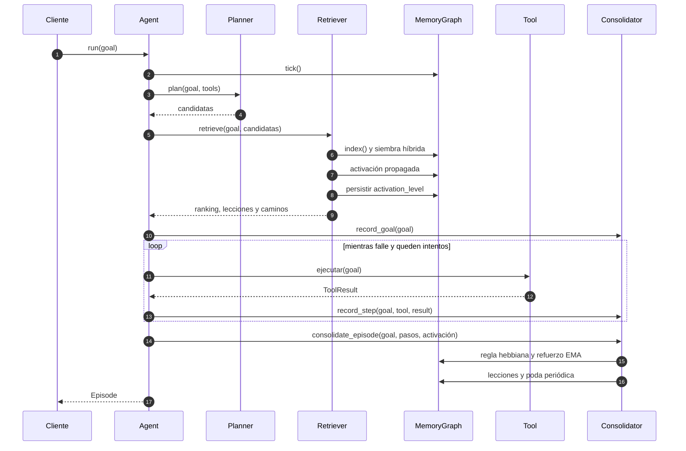

## 6. Algoritmos

Parámetros entre paréntesis: valores por defecto (sección [6.6](#66-parámetros)).

### 6.1 Siembra híbrida

Todo nodo `Goal`, `Action` o `Concept` es candidato a semilla. Los `Outcome` se excluyen porque su
etiqueta duplica la información de los `Concept(error)`.

```text
sim(q, n) = α · max(0, cos(emb(q), emb(n))) + (1 − α) · léxica(q, n.label)          (α = 0.7)
seeds(q)  = top_k { n ↦ sim(q, n) | sim ≥ τ_seed }  ∪  { topic(t) ↦ 1 | t ∈ tokens(q) }
                                                                  (τ_seed = 0.25, top_k = 20)
```

Los vectores se calculan una sola vez y se almacenan en `Node.embedding` junto con el nombre del
modelo (`GraphDocument.embedding_model`); un cambio de modelo invalida el índice completo.

### 6.2 Activación propagada

```text
A ← seeds;  F ← ∅;  frontera ← { u | A(u) ≥ θ }
repetir max_hops veces:
    F ← F ∪ frontera                                   # refracción: cada nodo dispara una vez
    para u ∈ frontera, para cada vecino v ∉ F:
        Δ(v) += A(u) · δ · τ(u, v) / norm(grado(u))
    A(v) ← min(1, A(v) + Δ(v))
    frontera ← { v | Δ(v) > 0 ∧ A(v) ≥ θ }            # umbral sobre la activación acumulada
resultado ← { v | A(v) ≥ θ }

τ(u, v) = w̃(u→v) hacia adelante;  ρ(relación) · w̃(v→u) hacia atrás
norm(d) = 1 | √d | d                                   (fan_out = sqrt)
w̃(e)    = weight(e) · exp(−λₑ · (clock − last_updated(e)))
                                              (δ = 0.7, θ = 0.01, max_hops = 3)
```

| Propiedad | Efecto |
|---|---|
| **Umbral acumulado** | Varias señales débiles pueden sumar hasta disparar; ninguna se descarta aisladamente |
| **Refracción** | Los ciclos no inflan la activación; el grafo de aportes es acíclico por construcción |
| **Fan-out** | Los nodos *hub* (p. ej. topics frecuentes) reparten su activación en lugar de saturar a todos sus vecinos |
| **Trazabilidad** | El camino de mayor aporte desde una semilla hasta cada acción se devuelve en `ActionScore.path` |

### 6.3 Puntuación y valencia contextual

```text
score(a) = relevancia(a) · valencia(a)             relevancia(a) = A(a)

v_global(a) = tanh( Σ w̃(· −RESOLVED_BY→ a) − Σ w̃(a −FAILED_DUE_TO→ ·) )

Para cada Outcome o de a, con meta g = goal:{o.episode} y s = +1 (éxito) | −1 (fallo):
    k(g)    = A(g) · exp(−(A_max − A(g)) / T)                              (T = 0.1)
    ctx(a)  = Σ k · s · w̃(a→o) / Σ k · w̃(a→o)                              ∈ [−1, 1]
    conf(a) = masa / (masa + κ),   masa = Σ k · w̃(a→o)                     (κ = 0.2)
valencia(a) = conf · ctx(a) + (1 − conf) · v_global(a)
```

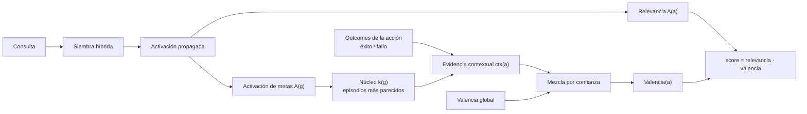

| Situación | Score | Consecuencia |
|---|---|---|
| Acción que resolvió metas similares | > 0 | Se prioriza |
| Acción nunca asociada al contexto | 0 | Se explora después de las exitosas |
| Acción que falló en contextos similares | < 0 | Queda al final del plan |

La evidencia contextual proviene de los `Goal` de episodios pasados, que solo se activan por su
similitud con la consulta. Un fallo en el dominio *clima* pesa poco en una consulta de *noticias*
aunque ambas compartan términos, porque el núcleo privilegia los episodios más cercanos.

### 6.4 Consolidación

Dos reglas complementarias, ambas acotadas en `[0, 1]`:

**Hebbiana con signo** para rutas (`LEADS_TO`, `RESOLVED_BY`) entre nodos co-activados:

```text
éxito (r = +1):  Δw = η_h · a_i · a_j · (1 − w)        potenciación, satura en 1
fallo (r = −1):  Δw = −η_h · a_i · a_j · w             depresión, satura en 0        (η_h = 0.3)
```

`a_j = 1` para la acción ejecutada; `a_i = 1` para la meta actual y `a_i = A(u)` para el contexto
recuperado. Solo cambia lo que efectivamente se recordó. `ASSOCIATED_WITH` y `FAILED_DUE_TO` quedan
excluidas: un fallo no debe debilitar la lección que lo advertía.

**Refuerzo dirigido (EMA)** para relaciones agregadas, `w ← w + η · (objetivo − w)`:

| Evento | Arista | Objetivo | η |
|---|---|---|---|
| La acción resuelve la meta | `g −RESOLVED_BY→ a` | 1 | 0.4 |
| La acción tiene éxito | `a −FAILED_DUE_TO→ e` | 0 | 0.2 |
| Primer éxito tras un fallo con error `e` | `e −RESOLVED_BY→ a` | 1 | 0.4 |
| La acción falla con error `e` | `a −FAILED_DUE_TO→ e` | 1 | 0.4 |

Lecciones generadas automáticamente:

- `lesson:avoid:<acción>:<error>`: «'<acción>' falló con '<error>'».
- `lesson:fallback:<falló>:<resolvió>`: «Si '<falló>' falla con '<error>', usar '<resolvió>'». Solo el **primer** éxito posterior a un fallo se considera su resolución.

### 6.5 Decaimiento y poda

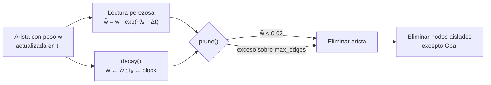

La lectura perezosa y `decay()` son equivalentes (verificado por test). La poda se ejecuta cada
`prune_every` episodios; los `Goal` se conservan como registro episódico.

### 6.6 Parámetros

| Sección | Clave | Símbolo | Defecto | Función |
|---|---|---|---|---|
| `retrieval` | `alpha` | α | 0.7 | Peso del canal semántico |
| `retrieval` | `min_seed_similarity` | τ_seed | 0.25 | Similitud mínima para sembrar |
| `retrieval` | `seed_top_k` | — | 20 | Máximo de semillas por similitud |
| `retrieval` | `damping` | δ | 0.7 | Atenuación por salto |
| `retrieval` | `firing_threshold` | θ | 0.01 | Activación mínima para disparar |
| `retrieval` | `max_hops` | — | 3 | Profundidad de propagación |
| `retrieval` | `fan_out` | — | `sqrt` | Normalización por grado (`none`, `sqrt`, `linear`) |
| `retrieval` | `contextual_valence` | — | `true` | Valencia contextual o global |
| `retrieval` | `context_temperature` | T | 0.1 | Selectividad del núcleo episódico |
| `retrieval` | `context_prior` | κ | 0.2 | Evidencia necesaria para preferir la valencia contextual |
| `consolidation` | `learning_rate` | η | 0.4 | Tasa EMA de refuerzo |
| `consolidation` | `penalty_rate` | — | 0.2 | Tasa EMA de debilitamiento |
| `consolidation` | `hebbian_rate` | η_h | 0.3 | Tasa de la regla hebbiana |
| `consolidation` | `prune_threshold` | — | 0.02 | Peso efectivo mínimo para conservar una arista |
| `consolidation` | `max_edges` | — | sin límite | Tamaño máximo del grafo |
| `agent` | `max_attempts` | — | 3 | Intentos por episodio |
| `agent` | `prune_every` | — | 10 | Frecuencia de poda (0 la desactiva) |
| `agent` | `decay_rate` | λ | 0.05 | `decay_factor` de las aristas nuevas |

## 7. Resultados experimentales

El proyecto separa dos experimentos. El **Experimento 0** evalúa el mecanismo de memoria con herramientas
simuladas. El **Experimento 1** evalúa si la experiencia previa cambia decisiones y mejora resultados en
tareas reales de software relacionadas.

### 7.1 Experimento 0: reutilización asociativa en escenarios sintéticos

Todos los escenarios usan herramientas simuladas y deterministas; `aal-benchmark --json` reproduce
exactamente los valores siguientes. La salida es idéntica a la línea base registrada en
[`evidence/baseline/`](evidence/baseline/) (commit `ca853fd`).

| Escenario | Hipótesis evaluada | Condición de control | Resultado |
|---|---|---|---|
| **Misma meta repetida** | Tras consolidar un fallo, el siguiente intento toma la ruta alternativa | Agente sin memoria¹ | **0** fallos repetidos; el control repite el fallo en cada episodio |
| **Metas parafraseadas** | La experiencia se generaliza por asociación | Agente sin memoria¹ | **0** fallos repetidos |
| **Errores intermitentes** (tasa de fallo 0.7, 20 episodios) | Con memoria, la herramienta poco fiable deja de elegirse primero | Agente sin memoria | Éxito al primer intento **2/20 → 19/20**; llamadas **38 → 21** |
| **Fallo en otro dominio** | La valencia contextual aísla dominios | Valencia global | Latencia **1540 → 1260 ms (−18 %)**; se conserva la herramienta rápida donde funciona |
| **Paráfrasis sin solapamiento léxico** (extra `embeddings`) | Los embeddings semánticos recuperan experiencia por significado | Canal léxico | «temperatura prevista para Lima» elige la ruta correcta al primer intento; el canal léxico no activa nada |

¹ Control verificado en `tests/integration/test_learning.py` (`test_baseline_without_memory_repeats_the_mistake`); el benchmark reporta directamente la comparación con control en los escenarios 3 y 4.

Salida de referencia:

```text
=== Escenario 1: misma meta repetida (API deprecada) ===
  [OK ] #1 'clima en Santiago'  intentos=2  weather_api_v1✗ → weather_api_v2✓
  [OK ] #2 'clima en Santiago'  intentos=1  weather_api_v2✓
         memoria: weather_api_v2=+0.293, weather_api_v1=-0.093
         lección recordada: 'weather_api_v1' falló con 'HTTP 410 Gone: endpoint deprecated'
  fallos repetidos tras el primer episodio: 0

=== Escenario 3: errores intermitentes, 20 episodios ===
  sin memoria  éxito al 1er intento=2/20  llamadas totales=38  latencia total=5100 ms
  con memoria  éxito al 1er intento=19/20  llamadas totales=21  latencia total=5030 ms

=== Escenario 4: fallo en un dominio (clima) vs otro (noticias) ===
  valencia global      llamadas totales=7  latencia total=1540 ms
  valencia contextual  llamadas totales=7  latencia total=1260 ms
```

> **Alcance de la evidencia.** Estos resultados muestran reutilización asociativa de acciones bajo
> condiciones simuladas y controladas, con una sola semilla (7). En el escenario de otro dominio queda 1
> fallo repetido con las dos valencias. No demuestran aprendizaje en tareas reales de software; esa
> pregunta la aborda el Experimento 1.

### 7.2 Experimento 1: transferencia entre tareas de software

**Pregunta**: ¿un agente de software (aquí, el [solver acotado](docs/entorno/glosario.md)) puede usar evidencia de tareas previas para cambiar su estrategia
en una tarea distinta con una causa relacionada? Almacenar no es recuperar, y recuperar no es aprender.
La cadena que se exige demostrar es:

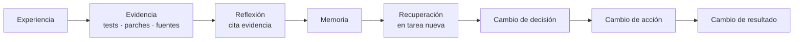

**Laboratorio.** [Task Ledger](experiments/software_project/) es una aplicación WSGI real (autenticación,
middleware, configuración, SQLite, servicios, worker) con tests por subproceso. Se copia sana y se le
inyecta exactamente un defecto por tarea. El solver solo recibe la tarea pública, el código fuente
actual y las lecciones elegibles; las etiquetas causales viven en `benchmark/private/`, fuera de su
alcance. Protocolo completo: [`specs/software_learning_protocol.md`](specs/software_learning_protocol.md).

| Familia | Entrenamiento | Transferencia | Distancia declarada |
|---|---|---|---|
| Autenticación | EXP-01 (#24) | EXP-04 (#27) | L3 causal |
| Configuración | EXP-02 (#25) | EXP-05 (#28) | L5 otro componente |
| Disponibilidad | EXP-03 (#26) | EXP-06 (#29) | L4 multi-salto |

**Condiciones** (mismo solver acotado, operadores, presupuesto, fuentes y tests):

| Condición | Memoria disponible |
|---|---|
| A · `NO_MEMORY` | Ninguna; orden de estrategias sembrado |
| B · `TEXT_HISTORY` | Todas las lecciones verificadas, como texto |
| C · `ASSOCIATIVE_MEMORY` | Top-1 por activación propagada sobre el grafo tipado, con caminos |

**Evidencia.** Cada ejecución publica un recibo inmutable (publicación atómica sin sobrescritura,
SHA-256 canónico) con fuentes, parches, salidas de tests, decisiones, recuperación y reflexión. Las
actualizaciones de memoria son recibos separados. Los agregados se **generan** a partir de los recibos
([`results/`](results/README.md)) y nunca se editan a mano.

**Resultados de la campaña histórica** (6 tareas: 3 de entrenamiento y 3 de transferencia; partición de
transferencia, 18 ejecuciones por condición). Es la campaña de [`results/`](results/README.md) y
[`evidence/runs/`](evidence/runs/), con recibos v1 (`checkout-bytes/v0`):

| Métrica | A · Sin memoria | B · Historial | C · Asociativa |
|---|---|---|---|
| Éxito final | 100 % (18/18) | 100 % (18/18) | 100 % (18/18) |
| Éxito al primer intento | 33 % (6/18) | 100 % (18/18) | 100 % (18/18) |
| Intentos por tarea | 2.0 | 1.0 | 1.0 |
| Precisión de recuperación | — | 33 % (18/54) | **100 %** (18/18) |
| Recuperaciones falsas | — | 67 % (36/54) | **0 %** (0/18) |

Una [verificación independiente](docs/verification/experiment1.md) reconstruyó las 27 métricas,
verificó los 144 recibos y replicó la campaña (54/54 comportamientos idénticos). Hallazgos:

- La memoria corrigió **todas** las decisiones iniciales equivocadas. Las que no cambió eran casos en que
  el orden sin memoria ya era correcto.
- La ganancia se mantiene al usar las 6 permutaciones posibles del orden sin memoria, no solo las 2 que
  cubren las semillas originales.
- **No se observa ventaja de resultado** de la memoria asociativa sobre el historial textual: ambas
  llegan a 1.0 intentos. La asociativa es más **precisa**. Durante el entrenamiento, una lección de otra
  causa puede desviar la primera estrategia (transferencia negativa).

**Campaña de referencia v2** (9 tareas: las 6 históricas más 3 tareas engañosas, EXP-07..09; las 6
permutaciones del orden sin memoria y 2 réplicas; recibos v2 con hashes `lf/v1`). Evidencia en
[`evidence/reference-v2/`](evidence/reference-v2/) y agregados en [`results/reference-v2/`](results/reference-v2/README.md).
Los desgloses [por familia](results/reference-v2/family_breakdown.md) y
[por tarea](results/reference-v2/task_breakdown.md) separan las tareas de transferencia originales de las
engañosas, que se interpretan al revés y nunca se agrupan. Son conteos descriptivos con 12 ejecuciones por
tarea y condición:

| Tareas de transferencia | Intentos · A · Sin memoria | Intentos · B · Historial | Intentos · C · Asociativa |
|---|---|---|---|
| Originales (EXP-04..06) | 2.0 | 1.0 | 1.0 |
| Engañosas (EXP-07..09) | 2.0 | 2.5 | 2.5 |

En las tareas engañosas el texto del issue apunta a otra familia de causa; ninguna de las dos memorias
mejora a la ausencia de memoria y ambas necesitan más intentos. En esta campaña el proxy
`RepeatedFailureRate` es 1.0 en las tres condiciones (54/54 con cada memoria y 72/72 sin memoria). El protocolo
llama «conocida» a una causa que una ejecución de entrenamiento de esa condición ya resolvió, y eso también
ocurre sin memoria: la cifra dice que las memorias no eliminaron esos fallos, no que el solver recordara la
causa. Una lectura consistente con los datos es que
el beneficio de las tareas originales depende de las pistas léxicas del texto del issue, pero el diseño no
aísla esa causa, así que no se trata como demostrada.

**H4: memoria asociativa frente a historial textual (negativo).** El [pre-registro](docs/preregistration/h4-associative-vs-history.md)
preguntó si aparece una diferencia de resultado entre C y B cuando la tarea ofrece un señuelo plausible.
El [informe](docs/results/h4-associative-vs-history.md) (una réplica por semilla, como fija el pre-registro)
concluye que **H4 no se sostiene en este diseño**: H4a sin diferencia entre C y B (0 ejecuciones de
diferencia) y H4b no apoyada:

| Métrica pre-registrada | A · Sin memoria | B · Historial | C · Asociativa |
|---|---|---|---|
| Éxito al primer intento en tareas engañosas | 6/18 | **0/18** | **0/18** |
| Transferencia negativa en entrenamiento (tasa) | — | 4/12 (1/3) | 2/6 (1/3) |

La diferencia en el conteo bruto de transferencia negativa (4 frente a 2) no es diferencia de tasa: los
denominadores son distintos y las tasas son iguales. Ninguna regla pre-registrada apoya una ventaja de C.

**Campañas posteriores a H4 (#58, H6 y H7).** Cada una nace del resultado anterior, con su pre-registro, su
agente opt-in y sus recibos propios; el agente por defecto y las campañas ya publicadas no cambian.

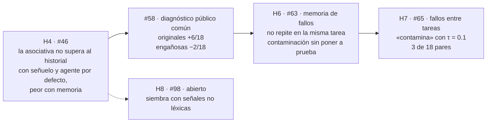

| Campaña | Pregunta | Recibos | Lectura | Informe |
|---|---|---|---|---|
| `diagnostic-baseline-v1` (#58) | Con el mismo diagnóstico público en las tres condiciones, ¿la experiencia previa sigue aportando? | 396 | Exploratoria: +6/18 al primer intento en las originales, en B y en C; −2/18 en las engañosas, sin diferencia según el criterio pre-registrado | [`diagnostic-baseline`](docs/results/diagnostic-baseline.md) |
| `failure-memory-v1` (H6, #63) | ¿Una memoria de fallos evita repetir una estrategia que ya falló, sin contaminar otro contexto? | 860 | Las tres reglas salen favorables, pero miden menos de lo que su nombre sugiere: no repite porque la **misma** tarea se repite, y ningún registro de otra tarea llegó a aplicarse | [`failure-memory`](docs/results/failure-memory.md) |
| `failure-transfer-v1` (H7, #65) | Si el alcance deja pasar fallos de otra tarea, ¿ayudan o dañan? | 2 830 | Veredicto pre-registrado sobre la base asociativa: «contamina» (τ = 0.1, 3 de 18 pares). Con lecciones presentes la memoria de fallos entre tareas nunca ayudó, y ningún umbral separa lo que ayuda de lo que daña | [`failure-transfer`](docs/results/failure-transfer.md) |

Evidencia en [`evidence/`](evidence/README.md) y agregados en [`results/`](results/README.md), un directorio
por campaña.

El objetivo operativo del encabezado queda así. «No repetir» se cumple en simulación (tres de los cuatro
escenarios) y, en software, en las tareas originales (18/18 al primer intento con memoria frente a 6/18
sin ella, campaña histórica) y, con memoria de fallos, al repetir la misma tarea (H6), por construcción y
sin transferencia; con señuelo y el agente por defecto, las dos memorias empeoran el primer intento (H4,
0/18 frente a 6/18) y, con el diagnóstico público común, no hay diferencia según el criterio
pre-registrado (#58). «No contaminar» no se puso a prueba con el alcance
de H6 y no se cumple cuando el alcance deja pasar fallos de otra tarea (H7, base C, τ = 0.1).

> **Qué no se demuestra**: aprendizaje autónomo de ingeniería de software, significancia estadística,
> superioridad de la memoria asociativa sobre el historial, ni transferencia con agentes LLM. Tampoco se
> demuestra que una pista léxica sea la causa de la ganancia observada. El solver acotado tiene tres
> operadores de reparación escritos a mano; las réplicas con la misma semilla verifican determinismo, no
> observaciones independientes; y ningún test del harness exige una ganancia positiva agregada.
> El objetivo operativo general (no repetir un error cuya causa ya se observó y no contaminar decisiones
> en contextos no relacionados) sigue **parcial**: H4 se
> resolvió negativamente en este diseño, y la pregunta general sigue abierta. El informe no evaluó
> recuperación semántica ni causal.

**Dos esquemas de hash.** Los recibos históricos de `evidence/runs/` son v1 (`checkout-bytes/v0`): el texto
de la aplicación ya se leía con saltos de línea universales, pero `acceptance_sha256` hasheaba los bytes crudos
de los tests de aceptación, así que ese hash v1 no coincide entre un checkout LF y uno CRLF. Los recibos v2
(`evidence/reference-v2/`, `evidence/reference-lf-v1/`) normalizan a LF (`lf/v1`); no son comparables por
hash con los v1. La referencia portable [`evidence/reference-lf-v1/`](evidence/reference-lf-v1/) se generó en
Windows y CI la compara en Ubuntu (`python -m experiments compare`). En la ejecución
[36629907320](https://github.com/cherrera0001/Agents_Learning_Loops/actions/runs/36629907320/job/109616197349)
sobre el commit `93693fe`, el job *Experiment 1 A/B/C reproducibility* terminó en `success`, con los pasos de
portabilidad entre plataformas y de comparación en `success`. Es el resultado de ese commit; no es una
garantía general de CI.

```bash
python -m experiments reproduce EXP-04          # el defecto falla antes de reparar
python -m experiments run --seeds 7 11 23 --replicates 2 --evidence-dir evidence/replication
python -m experiments evaluate --evidence-dir evidence/runs --output results
python -m scripts.verify_experiment1 --root .   # verificación independiente
```

### 7.3 Experimento con Gemma 4 en Kaggle: exploratorio, y todavía sin memoria

Es un experimento aparte de los dos anteriores. Usa un modelo de lenguaje, Gemma 4, dentro del concurso
[Gemma 4 Developer Agent](experiments/gemma_developer_agent/README.md) de Kaggle, y **no pone a prueba la
memoria asociativa**. Hasta el 2026-10-07 se midieron siete condiciones distintas del agente de ejemplo que entrega el
concurso (el «kit oficial»): parámetros distintos, líneas añadidas a su instrucción y un diseño público de
dos etapas tomado de otro participante. Ninguno lleva una skill consolidada por la memoria; las líneas añadidas
se escribieron a mano tras leer trazas. Todo es exploratorio:
el diseño pre-registrado (reservar un repositorio para la prueba y comparar tarea a tarea) no se corrió, y el
manuscrito lo declara. Una *corrida* es una ejecución de una configuración sobre una lista fija de tareas
públicas; el *agente* de esta sección es el agente del envío, no el agente de biblioteca.

| Qué se midió (corte de datos: 2026-10-07 02:30 UTC) | Resultado |
|---|---|
| Tareas públicas que sirven para medir en el notebook de la competencia | 71 de 129 con el entorno tal como viene; 103 al instalar tres paquetes que solo usan las pruebas |
| Variación entre dos corridas iguales (tres pares) | Cambian de resultado 1 o 2 tareas; el total cambia en 0 o 1; la clase de fallo cambia en 13 de 30 tareas |
| Siete condiciones, una corrida por condición | Ninguna mejora establecida, lo que no es evidencia de que no haya efecto |
| La séptima: razonamiento encendido, 60 llamadas y 4,5 minutos por tarea | Resolvió 9 de 19 tareas (las 19 se eligieron a partir de los resultados anteriores). Las tres corridas anteriores sobre esas mismas 19 (razonamiento apagado, 4 minutos y 40 llamadas; una de ellas con la línea añadida para la herramienta de edición) resolvieron 6, 7 y 7. El umbral fijado antes de correr era 10: no se alcanzó, y no permite afirmar una mejora |
| Dónde se pierde el agente | De 12 tareas que ninguna de tres corridas resolvió y que un revisor juzgó resolubles (juicio posterior, con la solución a la vista), en 10 el agente no llega a una edición relevante para el defecto en al menos dos de tres corridas |
| El mismo zip local enviado dos veces al concurso | Puntuaciones 0,06 y 0,05 en la tabla pública (fracción de tareas resueltas). Kaggle guardó archivos de distinto tamaño y su identidad no se comprobó |

Fuente de las cinco primeras filas: el manuscrito, [`docs/paper/manuscript_en.md`](docs/paper/manuscript_en.md)
(§ 4.1 a § 4.4), que da solo conteos agregados porque el reglamento prohíbe redistribuir las tareas. La
última: [`submissions/registry.json`](experiments/gemma_developer_agent/submissions/registry.json). Detalle y
límites en el
[documento de entrada del experimento](experiments/gemma_developer_agent/README.md#1-en-pocas-líneas).

**Qué dice esto del principio de ALL.** Sobre si la memoria ayuda, nada: no se probó. Sobre el proceso, algo
en contra: el experimento no se condujo con el bucle de ALL.

- **En el envío.** El concurso ejecuta cada tarea aislada y sin memoria; lo aprendido solo puede entrar como
  un archivo fijo dentro del envío (las *skills del envío*, archivos `SKILL.md`; no son las skills de memoria
  que el esquema declara). Ese archivo no existe: los envíos no llevan ninguna. La comparación que lo
  probaría (skills del envío hechas con lecciones consolidadas, frente al kit oficial y frente a un texto de
  relleno, sin lecciones, del mismo largo) está
  [pre-registrada](docs/preregistration/kaggle-campaign-abcd.md) y no ha empezado.
- **En la operación.** El experimento no se condujo con el bucle de ALL. Las predicciones anteriores a cada
  corrida se anotaron en un registro propio de quien ejecutaba las corridas, que estuvo fuera del control de
  versiones (manuscrito, § 3). Los episodios de [`learning/episodes/`](learning/episodes/) de ese periodo
  registran el primer envío con sus ensayos de notebook, el manuscrito y trabajo de herramientas, no las
  corridas medidas. El 2026-10-07, tres
  consultas a `devlog recall` (la consulta de la memoria antes de empezar un issue) devolvían 1 de 5
  lecciones que ese ciclo ya había producido. Tras registrar el
  [episodio 064](learning/episodes/064-issue-103-estado-medido-y-ciclo-kaggle.json) devuelven las 5; esa
  segunda cifra no prueba nada, porque las lecciones se escribieron conociendo las consultas (el episodio
  cita las tres).

## 8. Aseguramiento de calidad

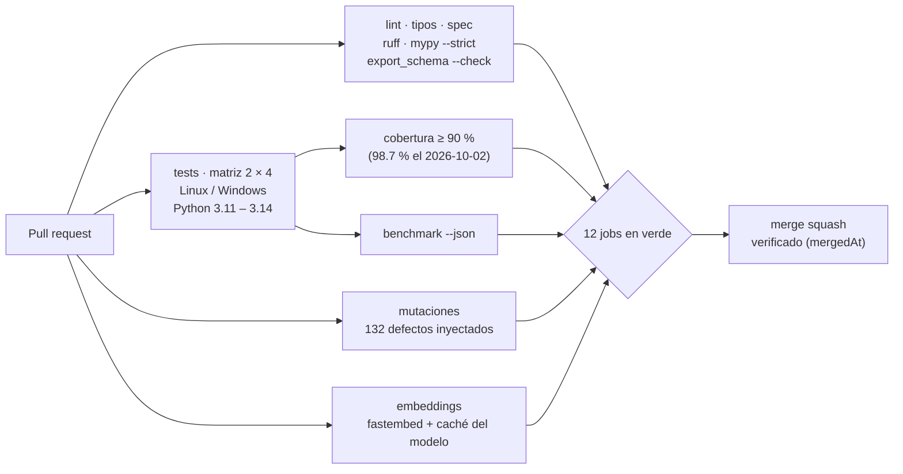

| Nivel | Contenido | Ubicación |
|---|---|---|
| Unitarios | Grafo, modelos, activación con valores calculados a mano, consolidación, embeddings, configuración | `tests/unit/` |
| Propiedades | Invariantes sobre entradas aleatorias con `hypothesis` | `tests/unit/test_properties.py` |
| Integración | Agente de biblioteca completo, benchmark, CLI, bitácora de desarrollo, valencia entre dominios | `tests/integration/` |
| Mutación | Cada propiedad debe detectar un defecto inyectado deliberadamente | `scripts/mutation_check.py` |

`scripts/mutation_check.py` inyecta hoy 132 defectos, uno por uno, y exige que algún test falle con cada uno:

| Grupo | Defectos | Qué protege |
|---|---|---|
| Experimento 0 | 5 | Las propiedades del grafo y de la recuperación (tabla siguiente) |
| Experimento 1 | 8 | Esquema de memoria, integridad de recibos y rechazo de UPDATE, MERGE y DEPRECATE |
| Diagnóstico público (#58) | 20 | El orden entre diagnóstico y memoria, y las verificaciones del evaluador y del análisis |
| H6 (#63) | 24 | El alcance de la memoria de fallos, sus registros y las reglas de decisión |
| H7 (#65) | 31 | El umbral τ, el placebo y la lectura pareada contra la base |
| H8 (#98) | 44 | La señal de la traza, los estados de la siembra, las verificaciones del evaluador y las reglas de decisión |

Las cinco del Experimento 0:

| Mutación inyectada | Propiedad que la detecta |
|---|---|
| Se elimina la saturación en 1.0 | La activación permanece en `[θ, 1]` |
| El ranking deja de ser estable | Con memoria vacía se conserva el orden del planificador |
| Se invierte el signo del decaimiento | El peso efectivo nunca crece con el tiempo |
| Se elimina la normalización de la valencia contextual | La valencia permanece en `[−1, 1]` |
| Se pierde `embedding_model` al cargar | El round-trip de serialización es exacto |

Criterio aplicado: **una propiedad que ninguna mutación rompe no está verificando nada**.

## 9. Uso como librería

```python
from associative_agent_loop import Agent, JsonGraphStore, Tool, ToolResult, load_config


def search(query: str) -> ToolResult:
    return ToolResult(True, output=f"resultados para {query}", latency_ms=120)


store = JsonGraphStore("memory_graph.json")
agent = Agent.from_config(
    [Tool("search_api", "búsqueda web", search)],
    load_config("aal.toml"),  # opcional; también acepta variables AAL_*
    memory=store.load_or_new(),
)

episode = agent.run("buscar la documentación de la API de pagos")
episode.plan  # candidatas re-rankeadas por la memoria
episode.retrieval.lessons  # lecciones recuperadas (p. ej. para el prompt de un LLM)
episode.retrieval.ranked_actions[0].path  # explicación: camino semilla → acción
store.save(agent.memory)  # escritura atómica
```

Configuración (`aal.toml`; las variables `AAL_<SECCIÓN>__<CAMPO>` tienen prioridad):

```toml
[agent]
max_attempts = 3

[retrieval]
damping = 0.7
fan_out = "sqrt"
contextual_valence = true

[consolidation]
hebbian_rate = 0.3
max_edges = 5000
```

Puntos de extensión (tipado estructural, sin herencia obligatoria):

| Interfaz | Contrato | Uso típico |
|---|---|---|
| `Planner` | `plan(goal, tools) -> list[str]` | Planificador basado en LLM que recibe las lecciones como contexto |
| `Embedder` | `name`, `dim`, `embed(texts) -> list[list[float]]` | `sentence-transformers`, embeddings de un proveedor externo |
| `GraphStore` | `load() -> MemoryGraph`, `save(graph)` | SQLite, Neo4j, almacenamiento de objetos |
| `Evaluator` | `(goal, ToolResult) -> bool` | Criterios de éxito específicos del dominio |

```python
from associative_agent_loop.memory.embeddings import FastEmbedEmbedder

agent = Agent(tools, embedder=FastEmbedEmbedder())  # requiere el extra [embeddings]
```

## 10. Persistencia y formato

- **Formato**: JSON conforme a [`specs/memory_schema.json`](specs/memory_schema.json) (`schema_version: 2`), generado con `python -m scripts.export_schema`.
- **Migración**: los documentos v1 (v0.1.0) se convierten automáticamente al cargarse (atributos sueltos → `metadata`, λ global → `decay_factor` por arista).
- **Atomicidad**: la escritura usa archivo temporal, `fsync` y `os.replace`; una interrupción nunca deja un archivo truncado (verificado simulando el fallo de `os.replace`).
- **Embeddings**: se serializan con el nombre del modelo y no se recalculan al cargar.

## 11. Desarrollo guiado por su propia memoria

El repositorio aplica su propio bucle de aprendizaje al proceso de desarrollo. Cada issue es un
episodio ([`learning/episodes/`](learning/episodes/)) con los pasos ejecutados, los fallos **tal
como ocurrieron** (atribuidos a la acción que los causó) y las lecciones extraídas. La memoria
derivada (`learning/dev_memory.json`, no versionada: se genera con `devlog rebuild`) se consulta antes de cada
issue; `recall` la reconstruye desde los episodios.

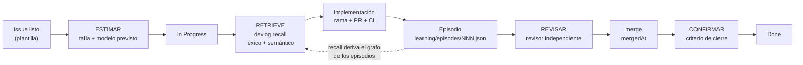

ESTIMAR y CONFIRMAR los hace el orquestador sobre el issue y el Project #5; el episodio conserva su rastro
en los bloques opcionales `estimate` y `outcome`. Pasos canónicos en
[`CONTRIBUTING.md`](CONTRIBUTING.md#flujo-por-issue-la-vida-del-proyecto); el piloto que mide si este
registro se sostiene (no valida todavía las tallas) está en
[`docs/piloto-estimacion.md`](docs/piloto-estimacion.md).

```bash
python -m scripts.devlog recall "título del issue" --embedder fastembed
python -m scripts.devlog rebuild   # opcional: escribe learning/dev_memory.json (ignorado por git)
```

Estado tras el ciclo v0.2: **14 episodios, 126 pasos, 26 fallos registrados y 61 lecciones**. Al 2026-10-02
hay 43 episodios, 438 pasos, 110 fallos y 191 lecciones; las dos tablas siguientes son del cierre de v0.2.

**Defectos descubiertos al consultar la memoria real**, no visibles en los escenarios sintéticos:

| Síntoma observado en `recall` | Causa | Resolución |
|---|---|---|
| Relevancia 1.00 para todas las acciones | Saturación de la activación en grafos densos | Umbral acumulado, refracción y fan-out (#4) |
| Consultas sin resultados pese a existir la lección | La siembra solo consideraba etiquetas de `Goal` | Siembra híbrida sobre todos los nodos con texto (#3) |
| Lecciones *fallback* sin sentido | Todo éxito posterior a un fallo se registraba como su resolución | Solo el primer éxito resuelve (#13) |
| Una herramienta válida se evitaba en otro dominio | Valencia global | Valencia contextual (#8) |

**Valencia aprendida de las acciones de desarrollo** (señal para el proceso). Son lecturas de `devlog recall`
al cierre de v0.2 y dependen de la consulta: el episodio 014 anota +0.39 para `write_tests` en su consulta
previa, y la tabla, +0.37. No se han recalculado:

| Acción | Valencia | Lectura |
|---|---|---|
| `review_code`, `run_tests`, `edit_module` | +1.00 | Salvaguardas más efectivas |
| `write_tests` | +0.37 | Eslabón débil: tests tautológicos y propiedades débiles detectados durante el ciclo |
| `merge_pr` | +0.39 | Incidente de red que dejó un PR sin merge |
| `git_push` | −0.05 | Artefactos de build publicados por error |

Lecciones de proceso incorporadas como mecanismos, no solo como recordatorios: verificación de
`mergedAt` antes de cerrar una tarjeta, verificación por mutación en CI y chequeo de sincronización
del esquema. Formato y vocabulario de acciones: [`learning/README.md`](learning/README.md).

Los procedimientos ya fijados de este ciclo (entre ellos recuperar antes de un issue, registrar un
episodio, proteger la evidencia y revisar un texto público) también están escritos como **skills de
entorno** en [`skills/`](skills/README.md). Son una
proyección legible: los episodios de `learning/episodes/` siguen siendo la fuente de verdad y
`learning/dev_memory.json` sigue siendo derivado (y no versionado). El rol que ejecuta `recall` y `rebuild` es la
**bitácora** ([`docs/entorno/agentes.md`](docs/entorno/agentes.md)).

Antes de abrir el worktree del implementador, el **orquestador** lee [`docs/estimation.md`](docs/estimation.md),
asigna la talla y delega con el ID y el esfuerzo de esa fila ([§ 3.2](#32-modelo-de-construcción)). El
implementador abre el PR y no hace merge: el merge lo hace el orquestador, después de verificar `mergedAt`.

## 12. Limitaciones conocidas

| Limitación | Impacto | Mitigación / línea de trabajo |
|---|---|---|
| Búsqueda vectorial por fuerza bruta en Python | Coste O(N) por consulta; adecuado hasta miles de nodos | Índice ANN (FAISS, hnswlib) detrás de `Embedder`/`Retriever` |
| Episodios de un solo nivel | El agente de biblioteca ordena herramientas; no descompone metas en subobjetivos | `Planner` basado en LLM |
| Experimento 1 acotado: un proyecto, 3 operadores escritos a mano; 6 tareas en la campaña histórica y 9 en la referencia v2 | No sustenta generalización ni significancia estadística | Sin línea de trabajo abierta en este issue |
| H4 no se sostiene en este diseño: con tareas engañosas, C y B aciertan 0/18 al primer intento frente a 6/18 sin memoria | La pregunta general (si alguna memoria asociativa aporta más que el historial) sigue abierta; solo se evaluó recuperación léxica | [`docs/results/h4-associative-vs-history.md`](docs/results/h4-associative-vs-history.md) (*Alcance*); H8 abierta en [#98](https://github.com/cherrera0001/Agents_Learning_Loops/issues/98) |
| Los recibos históricos de `evidence/runs/` usan hashes v1 (`checkout-bytes/v0`) | No son comparables por hash con los v2; la dependencia CRLF/LF quedó resuelta en los recibos v2 (`lf/v1`, #42) | Se conservan como evidencia histórica; véase [§ 7.2](#72-experimento-1-transferencia-entre-tareas-de-software) |
| El solver acotado es código local auditado y el harness de experimento no es un sandbox | Un adaptador LLM no confiable no debe recibir el repositorio completo | Aislamiento de proceso/contenedor antes de integrar un LLM |
| Un Markdown no cambia el modelo de la sesión ya abierta | La política de `docs/estimation.md` no se aplica sola; el ID solo viaja al crear el subagente | La regla de `AGENTS.md` obliga a leer la política antes de delegar; el frontmatter `model:` de `.claude/agents/implementador-<modelo>.md` declara el alias del modelo del subagente (no el esfuerzo ni el modelo de la sesión abierta; lo que ejecuta se comprueba en la transcripción; [enrutamiento](docs/entorno/enrutamiento.md)) ([§ 3.2](#32-modelo-de-construcción)) |
| No existía un contrato explícito para quien edita el repositorio | Reglas de trabajo repartidas entre `CONTRIBUTING.md`, `learning/README.md` y el protocolo | Cubierto por la base documental de [`docs/entorno/`](docs/entorno/README.md); es documentación, no cambia el algoritmo |
| Valencia global saturable (`tanh`) | Varias acciones pueden empatar en +1.00 en historiales largos | La valencia contextual domina cuando hay evidencia |
| Asociación `Outcome` → `Goal` por convención de identificadores (`goal:{episode}`) | Acopla la valencia contextual al esquema de ids | Relación explícita en el grafo tipado (#34) |
| Sin control de concurrencia | Un único escritor por archivo de memoria | Backend transaccional vía `GraphStore` |

## 13. Hoja de ruta

La versión 0.2.0 estableció el mecanismo y el Experimento 1 lo llevó a tareas reales de software con
evidencia auditable (#24–#36). La fase posterior endureció esa evidencia (#42–#45) y evaluó H4 (#46): en
este diseño, la memoria asociativa no supera al historial textual. Después se midió una línea base con
diagnóstico público (#58) y una memoria de fallos, dentro de una tarea (H6, #63) y entre tareas (H7, #65). La
pregunta general sigue abierta y tiene un issue: H8 (#98) propone sembrar la recuperación con señales no
léxicas y repetir la prueba con las mismas tareas con señuelo.

Aparte de esa línea, el repositorio documenta un experimento con un modelo de lenguaje en el concurso Gemma 4
Developer Agent de Kaggle: [`experiments/gemma_developer_agent/`](experiments/gemma_developer_agent/README.md).
Al 2026-10-07 tiene mediciones exploratorias y ninguna mejora establecida
([§ 7.3](#73-experimento-con-gemma-4-en-kaggle-exploratorio-y-todavía-sin-memoria)). Lo previsto en esa
línea, sin compromiso de fecha: repetir la configuración más reciente para saber si su diferencia (9 de 19
frente a 6, 7 y 7 de las corridas anteriores, por debajo del umbral de 10) se repite y, después, probar la primera condición con
lecciones consolidadas en una skill del envío, frente a un texto de relleno del mismo largo.
El concurso cierra el 2026-12-02 y su pista de artículo, el 2026-11-12.

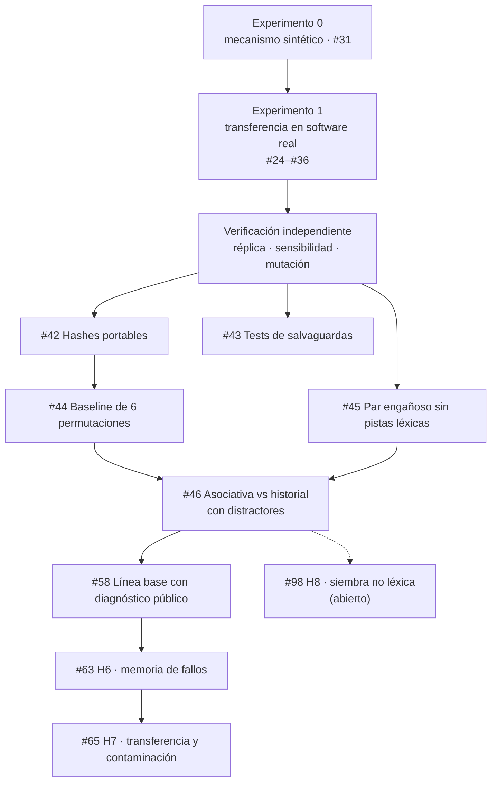

La estimación por tallas y el modelo asignado a cada issue están en [`docs/estimation.md`](docs/estimation.md); cómo
se aplica esa elección, en [§ 3.2](#32-modelo-de-construcción).
El contrato de entorno ([`docs/entorno/`](docs/entorno/README.md)) es documentación de proceso y no forma parte de esta hoja de ruta.

## 14. Estructura del repositorio

```text
.
├── src/associative_agent_loop/
│   ├── agent/
│   │   ├── core.py            # Agent, Episode, State, TRANSITIONS, Planner
│   │   └── tools.py           # Tool, ToolResult, escenarios weather · flaky · domain
│   ├── memory/
│   │   ├── models.py          # Node, Edge, GraphDocument (Pydantic v2)
│   │   ├── graph.py           # MemoryGraph: MultiDiGraph, decaimiento, JSON v2, migración v1
│   │   ├── associative.py     # Retriever: índice, siembra híbrida, propagación, valencia
│   │   ├── embeddings.py      # LexicalEmbedder, FastEmbedEmbedder
│   │   ├── consolidation.py   # Consolidator: hebbiana, EMA, lecciones, decay, poda
│   │   ├── store.py           # GraphStore, JsonGraphStore
│   │   ├── text.py            # tokenización y similitud léxica
│   │   └── fsutil.py          # escritura atómica
│   ├── config.py              # AppConfig (TOML + variables AAL_*)
│   └── main.py                # CLI aal-benchmark
├── src/experiments/           # Experimento 1: solver acotado, harness de experimento, recibos, evaluación
├── experiments/software_project/  # Task Ledger: aplicación WSGI/SQLite sana (no es el registro de modelos)
├── experiments/gemma_developer_agent/  # experimento con Gemma 4 en Kaggle (§ 7.3): pre-registro, agregados y registro de envíos
├── benchmark/
│   ├── public/                # tareas y tests de aceptación visibles para el solver
│   └── private/               # etiquetas causales, pares e inyecciones (solo el evaluador)
├── evidence/                  # recibos inmutables: baseline, runs (v1), reference-v2 y reference-lf-v1 (v2), validation, pilot
├── results/                   # agregados generados desde los recibos (raíz: histórica; reference-v2/)
├── specs/
│   ├── memory_schema.json     # JSON Schema generado desde los modelos (Experimento 0)
│   ├── loop_protocol.md       # estados, fórmulas e invariantes
│   ├── software_learning_protocol.md  # protocolo del Experimento 1
│   └── software_memory_schema_v1.json, reflection_schema_v1.json
├── docs/                      # verificación, estimación, pre-registro y resultados de H4, referencia histórica del Experimento 0
│   └── entorno/               # contrato de entorno: glosario, agentes, harness, skills, enrutamiento.md
│       └── caso-real-contacto-vt.md  # caso observacional del sitio público (no es evidencia del Experimento 1)
├── skills/                    # skills de entorno (SKILL.md), proyección de procedimientos ya fijados
├── AGENTS.md                  # entrada para agentes de entorno (CLAUDE.md y .cursor/rules/ remiten aquí)
├── learning/                  # episodios de desarrollo y memoria derivada
├── scripts/                   # devlog, export_schema, mutation_check, verify_experiment1
├── tests/
│   ├── unit/                  # componentes y propiedades
│   ├── integration/           # agente de biblioteca, benchmark, CLI, bitácora
│   └── test_experiment_harness.py  # Experimento 1
└── .github/workflows/ci.yml   # 12 jobs (incluye la reproducibilidad A/B/C)
```

## 15. Contribuir y licencia

- Flujo de trabajo, comprobaciones locales y convenciones: [`CONTRIBUTING.md`](CONTRIBUTING.md).
- Historial de versiones: [`CHANGELOG.md`](CHANGELOG.md).
- Especificación formal: [`specs/loop_protocol.md`](specs/loop_protocol.md).

Distribuido bajo licencia MIT. Consulte [LICENSE](LICENSE).
