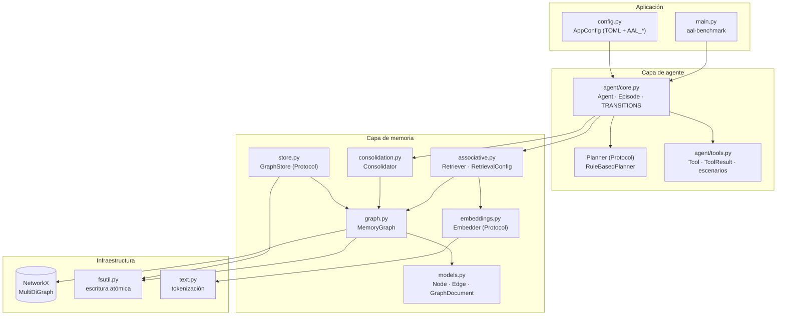
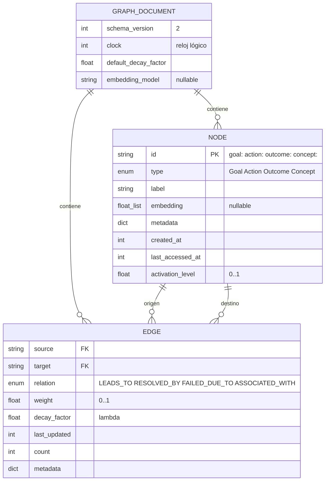
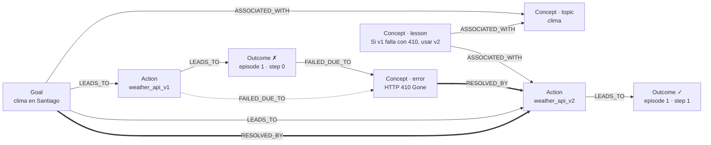
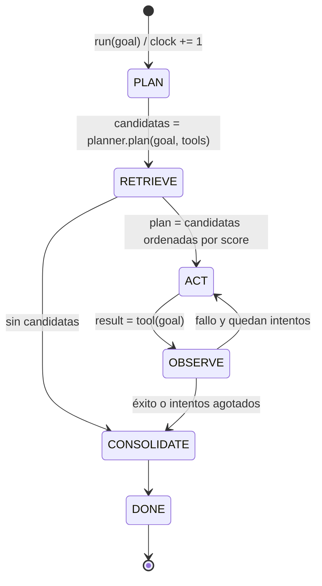
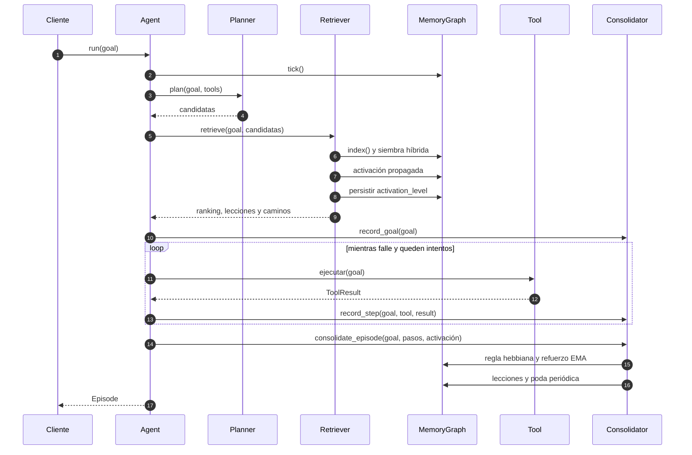
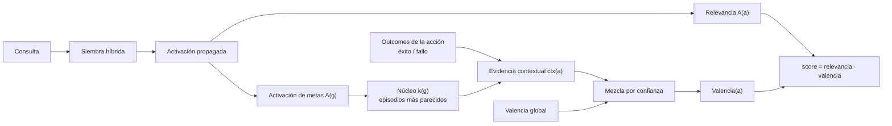
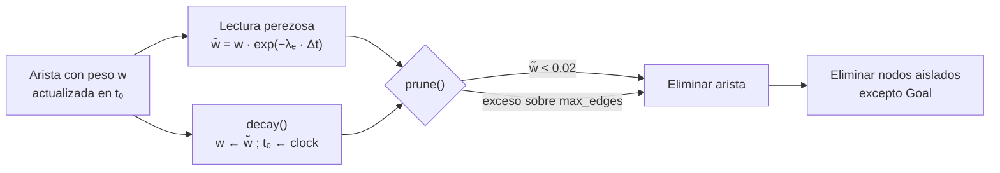
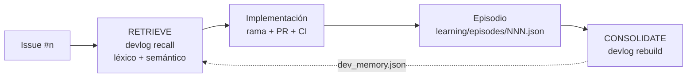
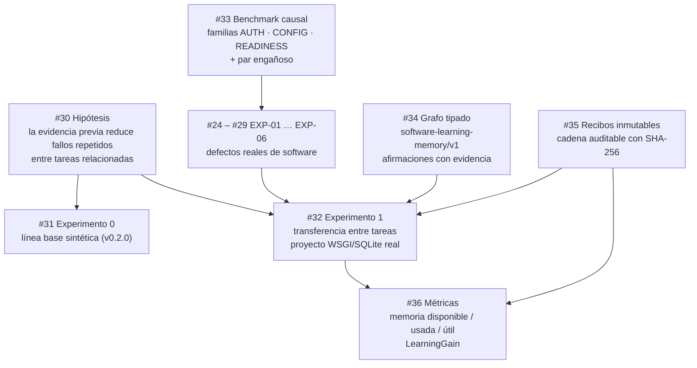

# Agents Learning Loops

**Memoria asociativa en grafo para bucles de aprendizaje de agentes autónomos**

[](https://github.com/cherrera0001/Agents_Learning_Loops/actions/workflows/ci.yml)
[](https://github.com/cherrera0001/Agents_Learning_Loops/releases)


[](LICENSE)

`associative-agent-loop` implementa una memoria episódica y semántica que permite a un agente
**capturar trayectorias de ejecución, extraer lecciones, enlazarlas en un grafo asociativo y
recuperarlas por activación propagada** para condicionar decisiones futuras. El objetivo operativo
es concreto y medible: *el agente no debe repetir un error cuya causa ya observó*, y la experiencia
adquirida en un contexto no debe contaminar decisiones en contextos no relacionados.

El propio repositorio se desarrolla con este mecanismo: cada issue se registra como un episodio de
aprendizaje y se consulta la memoria antes de iniciar el siguiente ([§ 11](#11-desarrollo-guiado-por-su-propia-memoria)).

---

## Contenido

1. [Características](#1-características)
2. [Inicio rápido](#2-inicio-rápido)
3. [Arquitectura](#3-arquitectura)
4. [Modelo de datos](#4-modelo-de-datos)
5. [Ciclo del agente](#5-ciclo-del-agente)
6. [Algoritmos](#6-algoritmos)
7. [Resultados experimentales](#7-resultados-experimentales)
8. [Aseguramiento de calidad](#8-aseguramiento-de-calidad)
9. [Uso como librería](#9-uso-como-librería)
10. [Persistencia y formato](#10-persistencia-y-formato)
11. [Desarrollo guiado por su propia memoria](#11-desarrollo-guiado-por-su-propia-memoria)
12. [Limitaciones conocidas](#12-limitaciones-conocidas)
13. [Hoja de ruta](#13-hoja-de-ruta)
14. [Estructura del repositorio](#14-estructura-del-repositorio)
15. [Contribuir y licencia](#15-contribuir-y-licencia)

---

## 1. Características

| Capacidad | Implementación |
|---|---|
| **Contrato formal** | Modelos Pydantic v2 (`Node`, `Edge`, `GraphDocument`) validados al crear y al asignar; JSON Schema **generado** desde el código ([`specs/memory_schema.json`](specs/memory_schema.json)) |
| **Recuperación híbrida** | Similitud `α·coseno(embeddings) + (1−α)·léxica` sobre todo nodo con texto; embeddings léxicos por defecto o semánticos multilingües locales (ONNX) |
| **Activación propagada** | Umbral de disparo sobre activación acumulada, refracción, normalización por *fan-out*, saturación y trazas explicativas |
| **Valencia contextual** | Evidencia episódica ponderada por la similitud del episodio con la consulta; aísla dominios |
| **Aprendizaje** | Regla hebbiana acotada para rutas co-activadas + refuerzo dirigido (EMA) para relaciones agregadas |
| **Olvido controlado** | Decaimiento exponencial por arista (`λₑ`), perezoso o materializado, y poda por umbral y por tamaño |
| **Ciclo verificable** | Máquina de estados `PLAN → RETRIEVE → ACT → OBSERVE → CONSOLIDATE` con transiciones validadas |
| **Determinismo** | Reloj lógico, hashing estable (`blake2b`) y semillas fijas: el benchmark produce el mismo JSON en cada ejecución |
| **Operación** | Paquete instalable, CLI `aal-benchmark`, configuración TOML/entorno, escritura atómica, logging estructurado |
| **Calidad** | 87 tests, cobertura 98.5 %, propiedades `hypothesis` con verificación por mutación, `mypy --strict`, CI multiplataforma |

## 2. Inicio rápido

Requisitos: Python ≥ 3.11.

```bash
git clone https://github.com/cherrera0001/Agents_Learning_Loops.git
cd Agents_Learning_Loops
python -m venv .venv
source .venv/bin/activate           # Windows: .venv\Scripts\activate

pip install -e ".[dev]"             # núcleo + herramientas de desarrollo
pip install -e ".[dev,embeddings]"  # + embeddings semánticos locales (fastembed, ONNX)

aal-benchmark                       # benchmark legible
aal-benchmark --json                # reporte determinista (misma semilla ⇒ mismo JSON)
aal-benchmark -vv                   # logging DEBUG de cada transición (stderr)
pytest                              # tests unitarios y de integración
```

| Extra | Dependencias | Uso |
|---|---|---|
| *(núcleo)* | `networkx ≥ 3`, `pydantic ≥ 2` | Grafo, modelos, similitud léxica. Sin descarga de modelos |
| `embeddings` | `fastembed` (ONNX Runtime, sin PyTorch) | Búsqueda semántica; modelo por defecto `paraphrase-multilingual-MiniLM-L12-v2` (384 d, 0.22 GB) |
| `dev` | `pytest`, `pytest-cov`, `hypothesis`, `jsonschema`, `ruff`, `mypy` | Desarrollo y CI |

## 3. Arquitectura

El sistema se organiza en tres capas. El **agente** orquesta el ciclo y no conoce los detalles del
grafo; la **memoria** encapsula representación, recuperación y aprendizaje; la **infraestructura**
provee configuración, persistencia y utilidades sin dependencias internas.



| Módulo | Responsabilidad | Punto de extensión |
|---|---|---|
| `agent/core.py` | Ciclo del agente, máquina de estados, construcción desde configuración | `Planner`, `Evaluator` |
| `agent/tools.py` | Contrato de herramientas y escenarios de benchmark (`weather`, `flaky`, `domain`) | `Tool` |
| `memory/models.py` | Contrato formal del grafo (Pydantic) | — |
| `memory/graph.py` | Almacenamiento en memoria, decaimiento, serialización v2 y migración v1 | — |
| `memory/associative.py` | Indexación, siembra híbrida, activación propagada, valencia contextual | `RetrievalConfig` |
| `memory/embeddings.py` | Vectorización de etiquetas | `Embedder` |
| `memory/consolidation.py` | Escritura de trayectorias, aprendizaje, lecciones, decaimiento, poda | parámetros de `ConsolidationConfig` |
| `memory/store.py` | Persistencia | `GraphStore` |

## 4. Modelo de datos

### 4.1 Esquema



Entre dos nodos existe como máximo **una arista por relación**: el grafo es un `MultiDiGraph` cuya
clave de arista es la relación. Los timestamps son un **reloj lógico** (un tick por episodio), lo
que hace el decaimiento determinista y verificable en tests.

### 4.2 Nodos y relaciones

| Nodo | Semántica | Cardinalidad |
|---|---|---|
| `Goal` | Meta de un episodio (texto de la tarea) | Uno por episodio |
| `Action` | Herramienta o acción ejecutable | **Compartido** entre episodios: acumula la experiencia |
| `Outcome` | Resultado de una ejecución (`success`, `latency_ms`, `error`, `episode`, `step`) | Uno por paso |
| `Concept` | `topic` (término de la meta), `error` (causa de fallo) o `lesson` (lección) | Deduplicado por contenido |

| Relación | Semántica | ρ (recorrido inverso) | Aprendizaje |
|---|---|---|---|
| `LEADS_TO` | Goal → Action (intento), Action → Outcome (resultado) | 0.5 | Hebbiano |
| `RESOLVED_BY` | Goal → Action (éxito), Concept(error) → Action (recuperación) | 0.5 | Hebbiano + EMA |
| `FAILED_DUE_TO` | Action → Concept(error), Outcome → Concept(error) | 0.5 | EMA |
| `ASSOCIATED_WITH` | Goal → Concept(topic), Concept(lesson) → nodos relacionados | 1.0 | EMA |

### 4.3 Ejemplo: subgrafo tras un fallo y su recuperación



### 4.4 Invariantes

1. **Tiempo lógico**: `clock` se incrementa exactamente una vez por episodio.
2. **Transiciones verificadas**: el episodio solo avanza por la tabla `TRANSITIONS`.
3. **Recuperar antes de escribir**: la meta actual se inserta después del RETRIEVE, para que no se active a sí misma.
4. **Orden estable**: con memoria vacía el ranking conserva el orden del planificador.
5. **Pesos acotados**: `weight ∈ [0, 1]`, garantizado por las reglas de aprendizaje y por `validate_assignment`.
6. **Integridad referencial**: toda arista une nodos existentes y tipados.
7. **Contrato generado**: el JSON Schema publicado coincide con los modelos (verificado en CI).

Especificación completa: [`specs/loop_protocol.md`](specs/loop_protocol.md).

## 5. Ciclo del agente

### 5.1 Máquina de estados



Cualquier transición fuera de `TRANSITIONS` lanza `IllegalTransition`. `Episode.candidates`
(salida de PLAN) y `Episode.plan` (salida de RETRIEVE) quedan registrados, de modo que el aporte
de la memoria a cada decisión es observable.

### 5.2 Secuencia de un episodio



## 6. Algoritmos

Parámetros entre paréntesis: valores por defecto (sección [6.6](#66-parámetros)).

### 6.1 Siembra híbrida

Todo nodo `Goal`, `Action` o `Concept` es candidato a semilla. Los `Outcome` se excluyen porque su
etiqueta duplica la información de los `Concept(error)`.

```text
sim(q, n) = α · max(0, cos(emb(q), emb(n))) + (1 − α) · léxica(q, n.label)          (α = 0.7)
seeds(q)  = top_k { n ↦ sim(q, n) | sim ≥ τ_seed }  ∪  { topic(t) ↦ 1 | t ∈ tokens(q) }
                                                                  (τ_seed = 0.25, top_k = 20)
```

Los vectores se calculan una sola vez y se almacenan en `Node.embedding` junto con el nombre del
modelo (`GraphDocument.embedding_model`); un cambio de modelo invalida el índice completo.

### 6.2 Activación propagada

```text
A ← seeds;  F ← ∅;  frontera ← { u | A(u) ≥ θ }
repetir max_hops veces:
    F ← F ∪ frontera                                   # refracción: cada nodo dispara una vez
    para u ∈ frontera, para cada vecino v ∉ F:
        Δ(v) += A(u) · δ · τ(u, v) / norm(grado(u))
    A(v) ← min(1, A(v) + Δ(v))
    frontera ← { v | Δ(v) > 0 ∧ A(v) ≥ θ }            # umbral sobre la activación acumulada
resultado ← { v | A(v) ≥ θ }

τ(u, v) = w̃(u→v) hacia adelante;  ρ(relación) · w̃(v→u) hacia atrás
norm(d) = 1 | √d | d                                   (fan_out = sqrt)
w̃(e)    = weight(e) · exp(−λₑ · (clock − last_updated(e)))
                                              (δ = 0.7, θ = 0.01, max_hops = 3)
```

| Propiedad | Efecto |
|---|---|
| **Umbral acumulado** | Varias señales débiles pueden sumar hasta disparar; ninguna se descarta aisladamente |
| **Refracción** | Los ciclos no inflan la activación; el grafo de aportes es acíclico por construcción |
| **Fan-out** | Los nodos *hub* (p. ej. topics frecuentes) reparten su activación en lugar de saturar a todos sus vecinos |
| **Trazabilidad** | El camino de mayor aporte desde una semilla hasta cada acción se devuelve en `ActionScore.path` |

### 6.3 Puntuación y valencia contextual

```text
score(a) = relevancia(a) · valencia(a)             relevancia(a) = A(a)

v_global(a) = tanh( Σ w̃(· −RESOLVED_BY→ a) − Σ w̃(a −FAILED_DUE_TO→ ·) )

Para cada Outcome o de a, con meta g = goal:{o.episode} y s = +1 (éxito) | −1 (fallo):
    k(g)    = A(g) · exp(−(A_max − A(g)) / T)                              (T = 0.1)
    ctx(a)  = Σ k · s · w̃(a→o) / Σ k · w̃(a→o)                              ∈ [−1, 1]
    conf(a) = masa / (masa + κ),   masa = Σ k · w̃(a→o)                     (κ = 0.2)
valencia(a) = conf · ctx(a) + (1 − conf) · v_global(a)
```



| Situación | Score | Consecuencia |
|---|---|---|
| Acción que resolvió metas similares | > 0 | Se prioriza |
| Acción nunca asociada al contexto | 0 | Se explora después de las exitosas |
| Acción que falló en contextos similares | < 0 | Queda al final del plan |

La evidencia contextual proviene de los `Goal` de episodios pasados, que solo se activan por su
similitud con la consulta. Un fallo en el dominio *clima* pesa poco en una consulta de *noticias*
aunque ambas compartan términos, porque el núcleo privilegia los episodios más cercanos.

### 6.4 Consolidación

Dos reglas complementarias, ambas acotadas en `[0, 1]`:

**Hebbiana con signo** para rutas (`LEADS_TO`, `RESOLVED_BY`) entre nodos co-activados:

```text
éxito (r = +1):  Δw = η_h · a_i · a_j · (1 − w)        potenciación, satura en 1
fallo (r = −1):  Δw = −η_h · a_i · a_j · w             depresión, satura en 0        (η_h = 0.3)
```

`a_j = 1` para la acción ejecutada; `a_i = 1` para la meta actual y `a_i = A(u)` para el contexto
recuperado. Solo cambia lo que efectivamente se recordó. `ASSOCIATED_WITH` y `FAILED_DUE_TO` quedan
excluidas: un fallo no debe debilitar la lección que lo advertía.

**Refuerzo dirigido (EMA)** para relaciones agregadas, `w ← w + η · (objetivo − w)`:

| Evento | Arista | Objetivo | η |
|---|---|---|---|
| La acción resuelve la meta | `g −RESOLVED_BY→ a` | 1 | 0.4 |
| La acción tiene éxito | `a −FAILED_DUE_TO→ e` | 0 | 0.2 |
| Primer éxito tras un fallo con error `e` | `e −RESOLVED_BY→ a` | 1 | 0.4 |
| La acción falla con error `e` | `a −FAILED_DUE_TO→ e` | 1 | 0.4 |

Lecciones generadas automáticamente:

- `lesson:avoid:<acción>:<error>`: «'<acción>' falló con '<error>'».
- `lesson:fallback:<falló>:<resolvió>`: «Si '<falló>' falla con '<error>', usar '<resolvió>'». Solo el **primer** éxito posterior a un fallo se considera su resolución.

### 6.5 Decaimiento y poda



La lectura perezosa y `decay()` son equivalentes (verificado por test). La poda se ejecuta cada
`prune_every` episodios; los `Goal` se conservan como registro episódico.

### 6.6 Parámetros

| Sección | Clave | Símbolo | Defecto | Función |
|---|---|---|---|---|
| `retrieval` | `alpha` | α | 0.7 | Peso del canal semántico |
| `retrieval` | `min_seed_similarity` | τ_seed | 0.25 | Similitud mínima para sembrar |
| `retrieval` | `seed_top_k` | — | 20 | Máximo de semillas por similitud |
| `retrieval` | `damping` | δ | 0.7 | Atenuación por salto |
| `retrieval` | `firing_threshold` | θ | 0.01 | Activación mínima para disparar |
| `retrieval` | `max_hops` | — | 3 | Profundidad de propagación |
| `retrieval` | `fan_out` | — | `sqrt` | Normalización por grado (`none`, `sqrt`, `linear`) |
| `retrieval` | `contextual_valence` | — | `true` | Valencia contextual o global |
| `retrieval` | `context_temperature` | T | 0.1 | Selectividad del núcleo episódico |
| `retrieval` | `context_prior` | κ | 0.2 | Evidencia necesaria para preferir la valencia contextual |
| `consolidation` | `learning_rate` | η | 0.4 | Tasa EMA de refuerzo |
| `consolidation` | `penalty_rate` | — | 0.2 | Tasa EMA de debilitamiento |
| `consolidation` | `hebbian_rate` | η_h | 0.3 | Tasa de la regla hebbiana |
| `consolidation` | `prune_threshold` | — | 0.02 | Peso efectivo mínimo para conservar una arista |
| `consolidation` | `max_edges` | — | sin límite | Tamaño máximo del grafo |
| `agent` | `max_attempts` | — | 3 | Intentos por episodio |
| `agent` | `prune_every` | — | 10 | Frecuencia de poda (0 la desactiva) |
| `agent` | `decay_rate` | λ | 0.05 | `decay_factor` de las aristas nuevas |

## 7. Resultados experimentales

Todos los escenarios usan herramientas simuladas y deterministas; `aal-benchmark --json` reproduce
exactamente los valores siguientes.

| Escenario | Hipótesis evaluada | Condición de control | Resultado |
|---|---|---|---|
| **Misma meta repetida** | Tras consolidar un fallo, el siguiente intento toma la ruta alternativa | Agente sin memoria¹ | **0** fallos repetidos; el control repite el fallo en cada episodio |
| **Metas parafraseadas** | La experiencia se generaliza por asociación | Agente sin memoria¹ | **0** fallos repetidos |
| **Errores intermitentes** (tasa de fallo 0.7, 20 episodios) | La valencia converge a la fiabilidad observada | Agente sin memoria | Éxito al primer intento **2/20 → 19/20**; llamadas **38 → 21** |
| **Fallo en otro dominio** | La valencia contextual aísla dominios | Valencia global | Latencia **1540 → 1260 ms (−18 %)**; se conserva la herramienta rápida donde funciona |
| **Paráfrasis sin solapamiento léxico** (extra `embeddings`) | Los embeddings semánticos recuperan experiencia por significado | Canal léxico | «temperatura prevista para Lima» elige la ruta correcta al primer intento; el canal léxico no activa nada |

¹ Control verificado en `tests/integration/test_learning.py` (`test_baseline_without_memory_repeats_the_mistake`); el benchmark reporta directamente la comparación con control en los escenarios 3 y 4.

Salida de referencia:

```text
=== Escenario 1: misma meta repetida (API deprecada) ===
  [OK ] #1 'clima en Santiago'  intentos=2  weather_api_v1✗ → weather_api_v2✓
  [OK ] #2 'clima en Santiago'  intentos=1  weather_api_v2✓
         memoria: weather_api_v2=+0.293, weather_api_v1=-0.093
         lección recordada: 'weather_api_v1' falló con 'HTTP 410 Gone: endpoint deprecated'
  fallos repetidos tras el primer episodio: 0

=== Escenario 3: errores intermitentes, 20 episodios ===
  sin memoria  éxito al 1er intento=2/20  llamadas totales=38  latencia total=5100 ms
  con memoria  éxito al 1er intento=19/20  llamadas totales=21  latencia total=5030 ms

=== Escenario 4: fallo en un dominio (clima) vs otro (noticias) ===
  valencia global      llamadas totales=7  latencia total=1540 ms
  valencia contextual  llamadas totales=7  latencia total=1260 ms
```

> **Alcance de la evidencia.** Estos resultados demuestran el comportamiento del mecanismo bajo
> condiciones simuladas y controladas. La transferencia entre tareas reales de software es objeto
> de la fase de investigación descrita en la [§ 13](#13-hoja-de-ruta).

## 8. Aseguramiento de calidad


| Nivel | Contenido | Ubicación |
|---|---|---|
| Unitarios | Grafo, modelos, activación con valores calculados a mano, consolidación, embeddings, configuración | `tests/unit/` |
| Propiedades | Invariantes sobre entradas aleatorias con `hypothesis` | `tests/unit/test_properties.py` |
| Integración | Agente completo, benchmark, CLI, bitácora de desarrollo, valencia entre dominios | `tests/integration/` |
| Mutación | Cada propiedad debe detectar un defecto inyectado deliberadamente | `scripts/mutation_check.py` |

| Mutación inyectada | Propiedad que la detecta |
|---|---|
| Se elimina la saturación en 1.0 | La activación permanece en `[θ, 1]` |
| El ranking deja de ser estable | Con memoria vacía se conserva el orden del planificador |
| Se invierte el signo del decaimiento | El peso efectivo nunca crece con el tiempo |
| Se elimina la normalización de la valencia contextual | La valencia permanece en `[−1, 1]` |
| Se pierde `embedding_model` al cargar | El round-trip de serialización es exacto |

Criterio aplicado: **una propiedad que ninguna mutación rompe no está verificando nada**.

## 9. Uso como librería

```python
from associative_agent_loop import Agent, JsonGraphStore, Tool, ToolResult, load_config


def search(query: str) -> ToolResult:
    return ToolResult(True, output=f"resultados para {query}", latency_ms=120)


store = JsonGraphStore("memory_graph.json")
agent = Agent.from_config(
    [Tool("search_api", "búsqueda web", search)],
    load_config("aal.toml"),  # opcional; también acepta variables AAL_*
    memory=store.load_or_new(),
)

episode = agent.run("buscar la documentación de la API de pagos")
episode.plan  # candidatas re-rankeadas por la memoria
episode.retrieval.lessons  # lecciones recuperadas (p. ej. para el prompt de un LLM)
episode.retrieval.ranked_actions[0].path  # explicación: camino semilla → acción
store.save(agent.memory)  # escritura atómica
```

Configuración (`aal.toml`; las variables `AAL_<SECCIÓN>__<CAMPO>` tienen prioridad):

```toml
[agent]
max_attempts = 3

[retrieval]
damping = 0.7
fan_out = "sqrt"
contextual_valence = true

[consolidation]
hebbian_rate = 0.3
max_edges = 5000
```

Puntos de extensión (tipado estructural, sin herencia obligatoria):

| Interfaz | Contrato | Uso típico |
|---|---|---|
| `Planner` | `plan(goal, tools) -> list[str]` | Planificador basado en LLM que recibe las lecciones como contexto |
| `Embedder` | `name`, `dim`, `embed(texts) -> list[list[float]]` | `sentence-transformers`, embeddings de un proveedor externo |
| `GraphStore` | `load() -> MemoryGraph`, `save(graph)` | SQLite, Neo4j, almacenamiento de objetos |
| `Evaluator` | `(goal, ToolResult) -> bool` | Criterios de éxito específicos del dominio |

```python
from associative_agent_loop.memory.embeddings import FastEmbedEmbedder

agent = Agent(tools, embedder=FastEmbedEmbedder())  # requiere el extra [embeddings]
```

## 10. Persistencia y formato

- **Formato**: JSON conforme a [`specs/memory_schema.json`](specs/memory_schema.json) (`schema_version: 2`), generado con `python -m scripts.export_schema`.
- **Migración**: los documentos v1 (v0.1.0) se convierten automáticamente al cargarse (atributos sueltos → `metadata`, λ global → `decay_factor` por arista).
- **Atomicidad**: la escritura usa archivo temporal, `fsync` y `os.replace`; una interrupción nunca deja un archivo truncado (verificado simulando el fallo de `os.replace`).
- **Embeddings**: se serializan con el nombre del modelo y no se recalculan al cargar.

## 11. Desarrollo guiado por su propia memoria

El repositorio aplica su propio bucle de aprendizaje al proceso de desarrollo. Cada issue es un
episodio ([`learning/episodes/`](learning/episodes/)) con los pasos ejecutados, los fallos **tal
como ocurrieron** (atribuidos a la acción que los causó) y las lecciones extraídas. La memoria
derivada ([`learning/dev_memory.json`](learning/dev_memory.json)) se consulta antes de cada issue.



```bash
python -m scripts.devlog recall "título del issue" --embedder fastembed
python -m scripts.devlog rebuild
```

Estado tras el ciclo v0.2: **14 episodios, 126 pasos, 26 fallos registrados y 61 lecciones**.

**Defectos descubiertos al consultar la memoria real**, no visibles en los escenarios sintéticos:

| Síntoma observado en `recall` | Causa | Resolución |
|---|---|---|
| Relevancia 1.00 para todas las acciones | Saturación de la activación en grafos densos | Umbral acumulado, refracción y fan-out (#4) |
| Consultas sin resultados pese a existir la lección | La siembra solo consideraba etiquetas de `Goal` | Siembra híbrida sobre todos los nodos con texto (#3) |
| Lecciones *fallback* sin sentido | Todo éxito posterior a un fallo se registraba como su resolución | Solo el primer éxito resuelve (#13) |
| Una herramienta válida se evitaba en otro dominio | Valencia global | Valencia contextual (#8) |

**Valencia aprendida de las acciones de desarrollo** (señal para el proceso):

| Acción | Valencia | Lectura |
|---|---|---|
| `review_code`, `run_tests`, `edit_module` | +1.00 | Salvaguardas más efectivas |
| `write_tests` | +0.37 | Eslabón débil: tests tautológicos y propiedades débiles detectados durante el ciclo |
| `merge_pr` | +0.39 | Incidente de red que dejó un PR sin merge |
| `git_push` | −0.05 | Artefactos de build publicados por error |

Lecciones de proceso incorporadas como mecanismos, no solo como recordatorios: verificación de
`mergedAt` antes de cerrar una tarjeta, verificación por mutación en CI y chequeo de sincronización
del esquema. Formato y vocabulario de acciones: [`learning/README.md`](learning/README.md).

## 12. Limitaciones conocidas

| Limitación | Impacto | Mitigación / línea de trabajo |
|---|---|---|
| Búsqueda vectorial por fuerza bruta en Python | Coste O(N) por consulta; adecuado hasta miles de nodos | Índice ANN (FAISS, hnswlib) detrás de `Embedder`/`Retriever` |
| Episodios de un solo nivel | El agente ordena herramientas; no descompone metas en subobjetivos | `Planner` basado en LLM |
| Evaluación con herramientas simuladas | No demuestra transferencia en tareas reales | Fase de investigación (§ 13) |
| Valencia global saturable (`tanh`) | Varias acciones pueden empatar en +1.00 en historiales largos | La valencia contextual domina cuando hay evidencia |
| Asociación `Outcome` → `Goal` por convención de identificadores (`goal:{episode}`) | Acopla la valencia contextual al esquema de ids | Relación explícita en el grafo tipado (#34) |
| Sin control de concurrencia | Un único escritor por archivo de memoria | Backend transaccional vía `GraphStore` |

## 13. Hoja de ruta

La versión 0.2.0 establece el mecanismo. La siguiente fase, abierta como investigación, evalúa si
la memoria **cambia decisiones de forma útil en tareas de software reales**, con evidencia auditable.



Consulte los issues enlazados para el diseño experimental detallado.

## 14. Estructura del repositorio

```text
.
├── src/associative_agent_loop/
│   ├── agent/
│   │   ├── core.py            # Agent, Episode, State, TRANSITIONS, Planner
│   │   └── tools.py           # Tool, ToolResult, escenarios weather · flaky · domain
│   ├── memory/
│   │   ├── models.py          # Node, Edge, GraphDocument (Pydantic v2)
│   │   ├── graph.py           # MemoryGraph: MultiDiGraph, decaimiento, JSON v2, migración v1
│   │   ├── associative.py     # Retriever: índice, siembra híbrida, propagación, valencia
│   │   ├── embeddings.py      # LexicalEmbedder, FastEmbedEmbedder
│   │   ├── consolidation.py   # Consolidator: hebbiana, EMA, lecciones, decay, poda
│   │   ├── store.py           # GraphStore, JsonGraphStore
│   │   ├── text.py            # tokenización y similitud léxica
│   │   └── fsutil.py          # escritura atómica
│   ├── config.py              # AppConfig (TOML + variables AAL_*)
│   └── main.py                # CLI aal-benchmark
├── specs/
│   ├── memory_schema.json     # JSON Schema generado desde los modelos
│   └── loop_protocol.md       # estados, fórmulas e invariantes
├── learning/                  # episodios de desarrollo y memoria derivada
├── scripts/                   # devlog, export_schema, mutation_check
├── tests/
│   ├── unit/                  # componentes y propiedades
│   └── integration/           # agente, benchmark, CLI, bitácora
└── .github/workflows/ci.yml   # 11 jobs
```

## 15. Contribuir y licencia

- Flujo de trabajo, comprobaciones locales y convenciones: [`CONTRIBUTING.md`](CONTRIBUTING.md).
- Historial de versiones: [`CHANGELOG.md`](CHANGELOG.md).
- Especificación formal: [`specs/loop_protocol.md`](specs/loop_protocol.md).

Distribuido bajo licencia MIT. Consulte [LICENSE](LICENSE).
