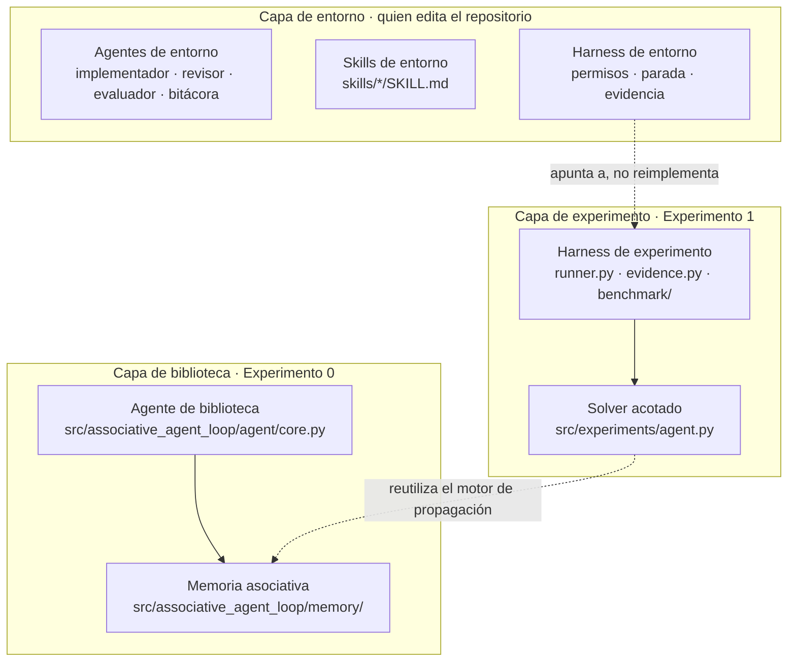

# Entorno: agentes, skills y harness

Este directorio define el **contrato de trabajo** para quien edita el repositorio. Es documentación:
no cambia el comportamiento del agente de biblioteca, del solver acotado ni del harness de experimento.
Los términos siguen el [glosario](glosario.md).

## Tres capas

## Qué archivo es canónico en cada capa

| Capa | Tema | Archivo canónico |
|---|---|---|
| Entorno | Punto de entrada para cualquier agente de entorno | [`AGENTS.md`](../../AGENTS.md) |
| Entorno | Terminología | [`glosario.md`](glosario.md) |
| Entorno | Roles | [`agentes.md`](agentes.md) |
| Entorno | Permisos, parada y evidencia | [`harness.md`](harness.md) |
| Entorno | Regla de admisión de skills | [`skills.md`](skills.md) y [`skills/`](../../skills/README.md) |
| Entorno | Flujo por issue y comprobaciones de CI | [`CONTRIBUTING.md`](../../CONTRIBUTING.md) |
| Entorno | Bitácora de desarrollo (fuente de verdad) | [`learning/README.md`](../../learning/README.md) y `learning/episodes/` |
| Experimento | Protocolo, frontera de fuga y recibos | [`specs/software_learning_protocol.md`](../../specs/software_learning_protocol.md) |
| Experimento | Evidencia y cómo corregir hallazgos | [`evidence/README.md`](../../evidence/README.md) |
| Experimento | Aplicación bajo reparación | [`experiments/software_project/README.md`](../../experiments/software_project/README.md) |
| Biblioteca | Estados, fórmulas e invariantes | [`specs/loop_protocol.md`](../../specs/loop_protocol.md) |
| Biblioteca | Esquema de la memoria | [`specs/memory_schema.json`](../../specs/memory_schema.json) (generado) |

Si un documento de entorno contradice uno de experimento o de biblioteca, prevalece el de experimento o
el de biblioteca, y el documento de entorno debe corregirse.
