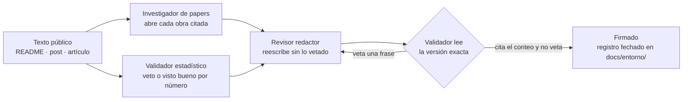
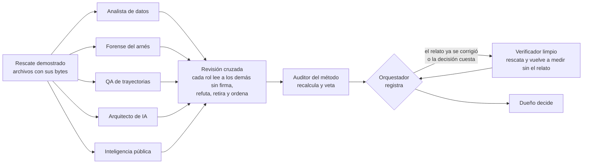

# Agentes de entorno: roles

Un **agente de entorno** es un rol de quien edita este repositorio: una persona o un agente de Cursor o
Claude ([glosario](glosario.md), término 3). Estos roles no son código: no hay clases Python que los
implementen. Una misma persona o agente puede ejercer varios roles, pero en cada momento actúa bajo uno
y respeta sus límites.

No se confunden con el **agente de biblioteca** (Experimento 0) ni con el **solver acotado**
(Experimento 1).

## Orquestador

Coordina el trabajo sobre los issues. Es la regla 4 de [`docs/estimation.md`](../estimation.md) convertida en rol.

1. **Estima** la talla de cada issue con la política de `docs/estimation.md` y la registra («Estimación v1»
   en el issue y campos del Project #5), skill [`estimar-issue`](../../skills/estimar-issue/SKILL.md).
2. **Delega** pasando el ID del modelo y el esfuerzo de esa fila al crear el subagente o el worktree
   ([`enrutamiento.md`](enrutamiento.md)).
3. **Revisa** cada entrega con medios propios, independientes del agente que la produjo.
4. Es el **único que hace merge**, después de verificar `mergedAt`.
5. **Confirma** el cierre según el tipo de trabajo ([criterios](harness.md#criterios-de-cierre-por-tipo-de-trabajo)),
   registra *Verificación*, *Modelo usado* y *Escaló* y es el único que mueve una tarjeta a *Done* a mano
   (la automatización del tablero también la mueve al mergear: *Done* sin *Verificada* no está confirmado); skill
   [`confirmar-cierre`](../../skills/confirmar-cierre/SKILL.md). Flujo canónico:
   [`CONTRIBUTING.md`](../../CONTRIBUTING.md#flujo-por-issue-la-vida-del-proyecto).

## Implementador

Resuelve un issue.

1. Pasa la tarjeta a *In Progress* y recupera memoria antes de actuar: skill
   [`recall-antes-de-issue`](../../skills/recall-antes-de-issue/SKILL.md).
2. Edita en una rama `issue-<n>-<tema>`, dentro de los permisos del [harness de entorno](harness.md).
3. Registra el episodio con los fallos tal como ocurrieron, y con los bloques `estimate` y `outcome`: skill
   [`registrar-episodio`](../../skills/registrar-episodio/SKILL.md).
4. No commitees `learning/dev_memory.json`: no se versiona ([`learning/README.md`](../../learning/README.md#por-qué-dev_memoryjson-no-se-versiona)).
5. Abre el PR con `Closes #<n>` (`Refs #<n>` si el cierre es de sistema externo y falta la observación) y
   **no hace merge** ni mueve la tarjeta a *Done*: eso corresponde al orquestador.

No lee `benchmark/private/` y no agrega recibos: eso corresponde al evaluador del experimento.

## Revisor

Comprueba una entrega antes del merge, con medios propios e independientes de quien la produjo. No edita la
entrega: informa. Se desdobla en dos roles, porque revisar un cambio de código y revisar un documento
exigen comprobaciones distintas; un PR que toca ambos pasa por los dos.

### Revisor de código

Definición ejecutable: [`.claude/agents/revisor-codigo.md`](../../.claude/agents/revisor-codigo.md).

- Los tests y las comprobaciones de [`CONTRIBUTING.md`](../../CONTRIBUTING.md) pasan, y CI está en verde.
- Cada test nuevo puede fallar: tiene un control o una mutación que lo demuestra.
- En el episodio, cada fallo está atribuido a la acción que lo **causó**, no a la que lo detectó
  ([`learning/README.md`](../../learning/README.md), regla 1).
- El PR no mezcla evidencia vieja con conclusiones nuevas: no modifica recibos existentes y las
  conclusiones nuevas se apoyan en una campaña nueva e identificada (skill
  [`proteger-evidencia`](../../skills/proteger-evidencia/SKILL.md)).
- Inyecta defectos propios en el código nuevo y comprueba que los tests los detectan; ejecuta él mismo lo
  que el issue pide ejecutar, sin copiar la salida del implementador.

### Revisor de documentos

Definición ejecutable: [`.claude/agents/revisor-docs.md`](../../.claude/agents/revisor-docs.md).

- Cada cifra, fecha, ruta, issue o comando que el cambio añade tiene una fuente que existe y que dice eso.
- El cambio no deja falsa una frase en otro documento, y no copia lo que ya tiene un texto canónico
  (`CONTRIBUTING.md` para el flujo, `docs/estimation.md` para la política, `specs/` para los protocolos).
- Nada autoinformado se presenta como medido, los puntos no se leen como horas ni tokens, y ningún
  registro histórico se reescribe.
- Enlaces y anclas resuelven, los diagramas coinciden con el texto y los términos son los del
  [glosario](glosario.md).

## Gestor del proyecto

Prepara y vigila la planificación en GitHub para el orquestador, que sigue siendo quien decide. Definición
ejecutable: [`.claude/agents/gestor-proyecto.md`](../../.claude/agents/gestor-proyecto.md).

- Redacta épicas e issues con su plantilla y propone la «Estimación v1»
  ([jerarquía](../../CONTRIBUTING.md#jerarquía-épica-issue-tareas)).
- Informa del estado: chequeo del tablero, issues abiertos por épica y qué le falta a cada uno según su
  tipo de cierre.
- Calcula las lecturas del [piloto](../piloto-estimacion.md), cada medida con numerador, denominador y
  fuente.
- Solo lee, salvo que el encargo ordene de forma explícita qué escribir. No mueve tarjetas a *Done* a
  mano, no sobrescribe *Modelo* y no cierra épicas.

## Staff de texto público

Tres roles revisan un texto que explica el proyecto hacia fuera (el README, un post, un artículo) antes de
publicarlo. Son personal de entorno: no son el agente de biblioteca ni el solver acotado. Cada uno tiene
veto, solo informa y no publica en ninguna red. El procedimiento está en
[`CONTRIBUTING.md`](../../CONTRIBUTING.md#revisión-de-un-texto-público).

El investigador y el validador no dependen uno del otro. El staff no publica: un texto firmado queda en el
registro fechado, y cualquier cambio posterior exige otra lectura del validador.

### Investigador de papers

Skill: [`investigador-papers`](../../skills/investigador-papers/SKILL.md). Definición ejecutable:
[`.claude/agents/investigador-papers.md`](../../.claude/agents/investigador-papers.md).

- Localiza la obra que corresponde a un mecanismo que el código ya nombra. Cada ficha lleva autor, año,
  título y un identificador abierto (DOI, ISBN o URL del editor). Si no lo abre, no cita.
- Una cita ilumina el mecanismo y no hereda la conclusión del paper.

### Revisor redactor

Skill: [`revisor-redactor`](../../skills/revisor-redactor/SKILL.md). Definición ejecutable:
[`.claude/agents/revisor-redactor.md`](../../.claude/agents/revisor-redactor.md).

- Escribe en español, con frases completas, para alguien técnico que no vive en el repositorio. Quita el
  anuncio y conserva el límite: qué se midió, en qué diseño y qué salió peor.

### Validador estadístico

Skill: [`validador-estadistico`](../../skills/validador-estadistico/SKILL.md). Definición ejecutable:
[`.claude/agents/validador-estadistico.md`](../../.claude/agents/validador-estadistico.md).

- Su salida es un veto o un visto bueno por cada número, con su fuente. El protocolo no tiene inferencia
  estadística. Si un texto afirma una ventaja de la memoria asociativa sobre el historial textual, el veto
  es obligatorio: [H4](../results/h4-associative-vs-history.md) no la sostiene.

### Auditor de datos

Skill: [`auditor-datos`](../../skills/auditor-datos/SKILL.md). Definición ejecutable:
[`.claude/agents/auditor-datos.md`](../../.claude/agents/auditor-datos.md).

- Trabaja antes del validador. Hace el inventario de lo que el experimento midió y marca cada afirmación
  del texto como vigente, desactualizada, contradicha o nunca ejecutada.
- Exige el universo de cada conteo, separa controles sin modelo, corridas del modelo y juicios de un
  revisor, y contrasta lo preregistrado con lo ejecutado.

### Revisor de figuras y tablas

Skill: [`revisor-figuras-tablas`](../../skills/revisor-figuras-tablas/SKILL.md). Definición ejecutable:
[`.claude/agents/revisor-figuras-tablas.md`](../../.claude/agents/revisor-figuras-tablas.md).

- Comprueba que cada figura, tabla y diagrama corresponde al texto, a su fuente y a lo que hoy se hace:
  numeración, valores celda a celda, una medida por columna, denominadores, legibilidad.
- Lista las figuras huérfanas, las que faltan y las afirmaciones desactualizadas del material visual.

## Staff de experimento

Siete roles trabajan cada **vuelta de un experimento con modelo**
([procedimiento](../../CONTRIBUTING.md#vuelta-de-un-experimento-con-modelo)). Son personal de entorno: no
son el agente de biblioteca ni el solver acotado, y tampoco el agente que el experimento evalúa. Ninguno
modifica el repositorio, la evidencia ni un sistema externo: leen los mismos archivos, ejecutan solo en
local (un validador, un ensayo en Docker), escriben solo en una carpeta ignorada por git, dicen qué
refutaría su conclusión y no suben, envían ni contratan nada. El rescate lo hace el orquestador antes
del concilio; la única excepción es el verificador limpio, que hace el suyo. Los convoca el orquestador con la skill
[`concilio-de-experimento`](../../skills/concilio-de-experimento/SKILL.md); el criterio que aplican está
en [`corrida-valida`](../../skills/corrida-valida/SKILL.md).

Analista de datos, forense del arnés y auditor del método van en todas las vueltas. Los otros se
convocan cuando la pregunta lo pide. El staff no reemplaza al [revisor](#revisor) de un PR ni al
[staff de texto público](#staff-de-texto-público): el primero revisa un cambio del repositorio y el
segundo un texto que sale hacia fuera.

### Arquitecto de IA

Definición ejecutable: [`.claude/agents/arquitecto-ia.md`](../../.claude/agents/arquitecto-ia.md).

- Dice si un diseño de agente, un método de un paper o un cambio de condición cabe en el modelo y en el
  presupuesto reales: ventana de contexto, tokens por segundo, memoria de GPU, topes del arnés y plazo.
- Lee la configuración que de verdad corrió, hace la cuenta en la unidad del experimento y exige un solo
  cambio por condición. Un precio entra a su informe solo con la URL abierta; una factura, solo con la
  velocidad medida.

### Forense del arnés

Definición ejecutable: [`.claude/agents/forense-arnes.md`](../../.claude/agents/forense-arnes.md).

- Reconstruye por qué falló o se cortó una corrida leyendo el código del arnés, con archivo y línea, y
  los archivos que la corrida dejó, con sus bytes.
- Entrega un árbol de causas con la prueba que decide cada rama, la tabla de cortes con su causa y la
  lista de eventos de fallo que no dejan rastro. Se convoca sin esperar a que alguien lo pida.

### Analista de datos

Definición ejecutable: [`.claude/agents/analista-datos.md`](../../.claude/agents/analista-datos.md). En el
caso Kaggle se le llama Datito.

- Vuelve a contar desde los archivos crudos, declara el universo de cada conteo y calcula qué diferencia
  puede detectar el diseño antes de leer una.
- No es el [auditor de datos](#auditor-de-datos): aquel contrasta un texto público con las mediciones;
  este analiza las corridas antes de que exista un texto.

### QA de trayectorias

Definición ejecutable: [`.claude/agents/qa-trayectorias.md`](../../.claude/agents/qa-trayectorias.md).

- Lee las trayectorias y los parches del agente evaluado: en qué gastó el presupuesto, qué editó, qué vio
  en las pruebas y por qué un parche no pasa.
- Para clasificar puede abrir el parche de referencia que el banco de pruebas externo publica con sus
  tareas, guardado en la carpeta de datos del experimento. Nada de lo que vea ahí puede proponerse como
  entrada del agente evaluado. No lee `benchmark/private/`: eso sigue siendo solo del
  [evaluador del experimento](#evaluador-del-experimento).

### Inteligencia pública

Definición ejecutable:
[`.claude/agents/inteligencia-publica.md`](../../.claude/agents/inteligencia-publica.md).

- Lee las reglas, el foro, la tabla y las soluciones públicas del sistema donde se mide el experimento.
  Cita sección y texto de cada regla y distingue lo contestado por los organizadores de lo que nadie
  contestó.
- No inicia sesión, no publica y no recoge datos personales.

### Auditor del método

Definición ejecutable: [`.claude/agents/auditor-metodo.md`](../../.claude/agents/auditor-metodo.md).

- Recalcula las cifras de los otros roles, aplica el criterio de corrida válida y de decisión válida, y
  dice si el trabajo usa el bucle de la [bitácora](#bitácora) o solo su vocabulario.
- Tiene veto sobre las decisiones tomadas dentro del ruido: se anotan «exploratorias» y no cambian la
  configuración vigente.

### Verificador limpio

Definición ejecutable: [`.claude/agents/verificador-limpio.md`](../../.claude/agents/verificador-limpio.md).

- Vuelve a medir las afirmaciones de una vuelta sin heredar el relato: las recibe como frases sin cifras,
  baja los archivos de nuevo y marca cada una como «se sostiene», «se cae» o «no medido».
- Trabaja solo y por puertas: hace su propio rescate y, si no lo demuestra o falta el log de la corrida
  en cuestión, se detiene. Se usa cuando un informe ya
  cambió de conclusión, o antes de una decisión que cuesta dinero, cuota o un envío.

## Cierre

Decide el estado final de un issue después de su comprobación.

- Un issue se **cierra** si su comprobación está en exit 0 contra el sistema real, o se **bloquea en el dueño**
  con la etiqueta `human-decision` si lo que falta es una decisión, una credencial o un acceso que solo tiene el
  dueño.
- **Prohibido dejarlo en Todo** después de una comprobación en exit 0: o se cierra, o se bloquea con la etiqueta y
  un comentario que diga qué falta y quién lo tiene.
- Integrar código listo para aplicar no cierra el issue si la comprobación del sistema real sigue en rojo: el PR
  usa `Refs #<n>`, no `Closes #<n>`.

El verificador SEO de la landing de VinculaTerritorio no es un agente de este laboratorio. Su comprobación
publicada es `yarn check:produccion` en `vinculaterritorio/vt-landing`; aquí se enlaza, no se reimplementa
([caso real](caso-real-contacto-vt.md)).

## Evaluador del experimento

Es el **único** rol que lee `benchmark/private/` y agrega recibos (`python -m experiments evaluate`). Aplica
las etiquetas privadas de relevancia solo después de la ejecución, como indica
[`specs/software_learning_protocol.md`](../../specs/software_learning_protocol.md) (*Metrics and
falsification*). Ni el implementador ni el solver acotado lo hacen.

## Bitácora

Mantiene la memoria de desarrollo en `learning/`:

- **antes** de actuar, `python -m scripts.devlog recall "<título del issue>"`;
- **si hace falta el grafo en disco**, `python -m scripts.devlog rebuild` (copia local; no es un paso de entrega).

No decide el diseño: recupera y consolida experiencia para que el implementador y el revisor la usen.
Los episodios de `learning/episodes/` son la fuente de verdad y `learning/dev_memory.json` es derivado y no
versionado ([`learning/README.md`](../../learning/README.md#por-qué-dev_memoryjson-no-se-versiona)).
