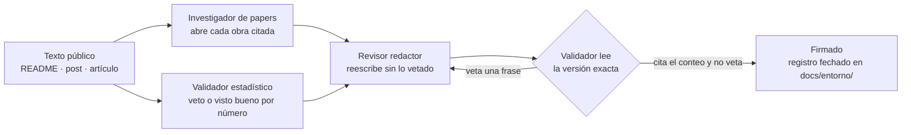

# Agentes de entorno: roles

Un **agente de entorno** es un rol de quien edita este repositorio: una persona o un agente de Cursor o
Claude ([glosario](glosario.md), término 3). Estos roles no son código: no hay clases Python que los
implementen. Una misma persona o agente puede ejercer varios roles, pero en cada momento actúa bajo uno
y respeta sus límites.

No se confunden con el **agente de biblioteca** (Experimento 0) ni con el **solver acotado**
(Experimento 1).

## Orquestador

Coordina el trabajo sobre los issues. Es la regla 4 de [`docs/estimation.md`](../estimation.md) convertida en rol.

1. **Estima** la talla de cada issue con la política de `docs/estimation.md` y la registra («Estimación v1»
   en el issue y campos del Project #5), skill [`estimar-issue`](../../skills/estimar-issue/SKILL.md).
2. **Delega** pasando el ID del modelo y el esfuerzo de esa fila al crear el subagente o el worktree
   ([`enrutamiento.md`](enrutamiento.md)).
3. **Revisa** cada entrega con medios propios, independientes del agente que la produjo.
4. Es el **único que hace merge**, después de verificar `mergedAt`.
5. **Confirma** el cierre según el tipo de trabajo ([criterios](harness.md#criterios-de-cierre-por-tipo-de-trabajo)),
   registra *Verificación*, *Modelo usado* y *Escaló* y es el único que mueve una tarjeta a *Done* a mano
   (la automatización del tablero también la mueve al mergear: *Done* sin *Verificada* no está confirmado); skill
   [`confirmar-cierre`](../../skills/confirmar-cierre/SKILL.md). Flujo canónico:
   [`CONTRIBUTING.md`](../../CONTRIBUTING.md#flujo-por-issue-la-vida-del-proyecto).

## Implementador

Resuelve un issue.

1. Pasa la tarjeta a *In Progress* y recupera memoria antes de actuar: skill
   [`recall-antes-de-issue`](../../skills/recall-antes-de-issue/SKILL.md).
2. Edita en una rama `issue-<n>-<tema>`, dentro de los permisos del [harness de entorno](harness.md).
3. Registra el episodio con los fallos tal como ocurrieron, y con los bloques `estimate` y `outcome`: skill
   [`registrar-episodio`](../../skills/registrar-episodio/SKILL.md).
4. Reconstruye la bitácora con `python -m scripts.devlog rebuild`.
5. Abre el PR con `Closes #<n>` (`Refs #<n>` si el cierre es de sistema externo y falta la observación) y
   **no hace merge** ni mueve la tarjeta a *Done*: eso corresponde al orquestador.

No lee `benchmark/private/` y no agrega recibos: eso corresponde al evaluador del experimento.

## Revisor

Comprueba una entrega antes del merge, con medios propios e independientes de quien la produjo. No edita la
entrega: informa. Se desdobla en dos roles, porque revisar un cambio de código y revisar un documento
exigen comprobaciones distintas; un PR que toca ambos pasa por los dos.

### Revisor de código

Definición ejecutable: [`.claude/agents/revisor-codigo.md`](../../.claude/agents/revisor-codigo.md).

- Los tests y las comprobaciones de [`CONTRIBUTING.md`](../../CONTRIBUTING.md) pasan, y CI está en verde.
- Cada test nuevo puede fallar: tiene un control o una mutación que lo demuestra.
- En el episodio, cada fallo está atribuido a la acción que lo **causó**, no a la que lo detectó
  ([`learning/README.md`](../../learning/README.md), regla 1).
- El PR no mezcla evidencia vieja con conclusiones nuevas: no modifica recibos existentes y las
  conclusiones nuevas se apoyan en una campaña nueva e identificada (skill
  [`proteger-evidencia`](../../skills/proteger-evidencia/SKILL.md)).
- Inyecta defectos propios en el código nuevo y comprueba que los tests los detectan; ejecuta él mismo lo
  que el issue pide ejecutar, sin copiar la salida del implementador.

### Revisor de documentos

Definición ejecutable: [`.claude/agents/revisor-docs.md`](../../.claude/agents/revisor-docs.md).

- Cada cifra, fecha, ruta, issue o comando que el cambio añade tiene una fuente que existe y que dice eso.
- El cambio no deja falsa una frase en otro documento, y no copia lo que ya tiene un texto canónico
  (`CONTRIBUTING.md` para el flujo, `docs/estimation.md` para la política, `specs/` para los protocolos).
- Nada autoinformado se presenta como medido, los puntos no se leen como horas ni tokens, y ningún
  registro histórico se reescribe.
- Enlaces y anclas resuelven, los diagramas coinciden con el texto y los términos son los del
  [glosario](glosario.md).

## Gestor del proyecto

Prepara y vigila la planificación en GitHub para el orquestador, que sigue siendo quien decide. Definición
ejecutable: [`.claude/agents/gestor-proyecto.md`](../../.claude/agents/gestor-proyecto.md).

- Redacta épicas e issues con su plantilla y propone la «Estimación v1»
  ([jerarquía](../../CONTRIBUTING.md#jerarquía-épica-issue-tareas)).
- Informa del estado: chequeo del tablero, issues abiertos por épica y qué le falta a cada uno según su
  tipo de cierre.
- Calcula las lecturas del [piloto](../piloto-estimacion.md), cada medida con numerador, denominador y
  fuente.
- Solo lee, salvo que el encargo ordene de forma explícita qué escribir. No mueve tarjetas a *Done* a
  mano, no sobrescribe *Modelo* y no cierra épicas.

## Staff de texto público

Tres roles revisan un texto que explica el proyecto hacia fuera (el README, un post, un artículo) antes de
publicarlo. Son personal de entorno: no son el agente de biblioteca ni el solver acotado. Cada uno tiene
veto, solo informa y no publica en ninguna red. El procedimiento está en
[`CONTRIBUTING.md`](../../CONTRIBUTING.md#revisión-de-un-texto-público).

El staff no publica: un texto firmado queda en el registro fechado y lo publica, si quiere, su autor.

### Investigador de papers

Skill: [`investigador-papers`](../../skills/investigador-papers/SKILL.md). Definición ejecutable:
[`.claude/agents/investigador-papers.md`](../../.claude/agents/investigador-papers.md).

- Localiza la obra que corresponde a un mecanismo que el código ya nombra. Cada ficha lleva autor, año,
  título y un identificador abierto (DOI, ISBN o URL del editor). Si no lo abre, no cita.
- Una cita ilumina el mecanismo y no hereda la conclusión del paper.

### Revisor redactor

Skill: [`revisor-redactor`](../../skills/revisor-redactor/SKILL.md). Definición ejecutable:
[`.claude/agents/revisor-redactor.md`](../../.claude/agents/revisor-redactor.md).

- Escribe en español, con frases completas, para alguien técnico que no vive en el repositorio. Quita el
  anuncio y conserva el límite: qué se midió, en qué diseño y qué salió peor.

### Validador estadístico

Skill: [`validador-estadistico`](../../skills/validador-estadistico/SKILL.md). Definición ejecutable:
[`.claude/agents/validador-estadistico.md`](../../.claude/agents/validador-estadistico.md).

- Su salida es un veto o un visto bueno por cada número, con su fuente. El protocolo no tiene inferencia
  estadística. Si un texto afirma una ventaja de la memoria asociativa sobre el historial textual, el veto
  es obligatorio: [H4](../results/h4-associative-vs-history.md) no la sostiene.

## Cierre

Decide el estado final de un issue después de su comprobación.

- Un issue se **cierra** si su comprobación está en exit 0 contra el sistema real, o se **bloquea en el dueño**
  con la etiqueta `human-decision` si lo que falta es una decisión, una credencial o un acceso que solo tiene el
  dueño.
- **Prohibido dejarlo en Todo** después de una comprobación en exit 0: o se cierra, o se bloquea con la etiqueta y
  un comentario que diga qué falta y quién lo tiene.
- Integrar código listo para aplicar no cierra el issue si la comprobación del sistema real sigue en rojo: el PR
  usa `Refs #<n>`, no `Closes #<n>`.

El verificador SEO de la landing de VinculaTerritorio no es un agente de este laboratorio. Su comprobación
publicada es `yarn check:produccion` en `vinculaterritorio/vt-landing`; aquí se enlaza, no se reimplementa
([caso real](caso-real-contacto-vt.md)).

## Evaluador del experimento

Es el **único** rol que lee `benchmark/private/` y agrega recibos (`python -m experiments evaluate`). Aplica
las etiquetas privadas de relevancia solo después de la ejecución, como indica
[`specs/software_learning_protocol.md`](../../specs/software_learning_protocol.md) (*Metrics and
falsification*). Ni el implementador ni el solver acotado lo hacen.

## Bitácora

Mantiene la memoria de desarrollo en `learning/`:

- **antes** de actuar, `python -m scripts.devlog recall "<título del issue>"`;
- **después** de registrar un episodio, `python -m scripts.devlog rebuild`.

No decide el diseño: recupera y consolida experiencia para que el implementador y el revisor la usen.
Los episodios de `learning/episodes/` son la fuente de verdad y `learning/dev_memory.json` es derivado
([`learning/README.md`](../../learning/README.md)).
