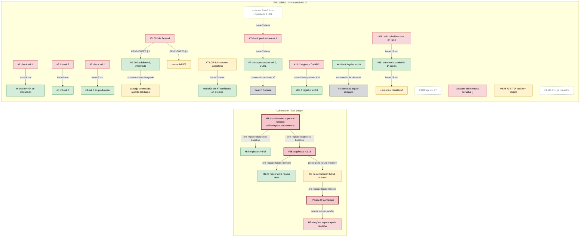

# Caso real: supervisión del sitio público de VinculaTerritorio

Registro observacional al 2026-09-30 sobre `vinculaterritorio.cl` (repositorio `vinculaterritorio/vt-landing`).
Población: **agentes de entorno**, que recuperan memoria, comprueban producción y cierran o bloquean issues. No
es una campaña del agente de biblioteca ni del solver acotado, no usa el grafo del Experimento 1 y no incorpora
datos a `evidence/` ni a `results/` del harness de experimento. Task Ledger sigue siendo la aplicación del
Experimento 1.

## Fuentes y límites

Leídas en la versión publicada de la landing (`origin/master`, `3c3415d`):

- `AGENTS.md`, `PENDIENTES.md`, `docs/agent-memory/runs/issue-7-verificacion-post-despliegue.run.json` y el
  cierre del #7, `docs/agent-memory/runs/issue-7-cierre.run.json`.
- El recibo de cierre del formulario que cita `PENDIENTES.md`:
  [`contacto-cierre-integrado.run.json`](https://github.com/vinculaterritorio/vt-landing/blob/master/docs/agent-memory/runs/contacto-cierre-integrado.run.json).
- [Cierre técnico 4332180](https://github.com/vinculaterritorio/vt-landing/commit/43321807c8bf5e0a0e8953a7ffad18bcbbb9e336)
  y la [revisión independiente de #5](https://github.com/vinculaterritorio/vt-landing/issues/5#issuecomment-5912714397):
  133 pruebas de contacto y 49 de bitácora, lint y build. Son comprobaciones de ingeniería, no métricas de
  aprendizaje, y no se repitieron para redactar este caso.
- [Project de la landing #2](https://github.com/users/vinculaterritorio/projects/2), consultado el 2026-09-30:
  10 Done. Los diez issues están cerrados. Que el #4 y el #7 estén cerrados no significa que esté hecho lo que
  depende del dueño (ver el registro visible).
- [Project de este repositorio #5](https://github.com/users/cherrera0001/projects/5). No confundir tableros ni
  IDs locales L-ISSUE con números de GitHub.

**No publicadas.** Las skills de la landing `.cursor/skills/resolver-issue/SKILL.md` y
`.cursor/skills/verificacion-seo-produccion/SKILL.md` no están en `origin/master` (`3c3415d`); el 2026-09-30 solo
existían como archivos locales sin seguimiento en una copia de trabajo. Este caso no las cita como fuente ni describe su contenido. La única
skill publicada es `.cursor/skills/revisor-privacidad-21719/SKILL.md`.

Hay un proceso auditable de corrección, comprobación independiente y despliegue. No hay ablación de memoria,
control pareado, asignación aleatoria ni medición de contaminación entre contextos. No se calcula LearningGain o
MemoryUtilityRate ni se demuestra la combinación histórica de variables, claves y despliegues que causó el fallo
inicial.

## Formulario de contacto (#5, cerrado)

- `pages/api/contacto.ts` es la API: no hay backend aparte.
- Primero respondía **503** (sin `RESEND_API_KEY`). Después respondió **502** con «No se pudo enviar el correo»,
  porque Resend rechazó la clave que tenía Vercel. El 502 está en `contacto-502-resend.run.json` (`status: 502`).
  El 503 observado **no está en ningún recibo**: solo la rama 503 del código (`contacto-cierre-integrado.run.json`).
  Los tamaños de 44 y 39 bytes se observaron en la sesión de diagnóstico y tampoco figuran en los recibos.
- El dueño rotó la clave en Vercel Production y redesplegó. El formulario respondió **200**, y Resend registra el
  mensaje `01a0f254…` a `contacto@vinculaterritorio.cl` con `last_event: delivered`. Lo **informó el supervisor**
  con una consulta de solo lectura; la sesión que escribió el recibo no lo verificó por su cuenta.
- `delivered` solo dice que el servidor de correo aceptó el mensaje. La llegada a la bandeja de entrada es un
  **reporte del dueño**, no una medición, y no se leyeron los resultados DKIM/DMARC de las cabeceras.
- La causa exacta del 502 anterior no está establecida, porque no hay logs de Production de ese momento.

## Verificación post-despliegue (#7, cerrado en ingeniería)

- `yarn check:produccion` sale con exit 0 contra producción: `www` → apex con 308, `sitemap.xml` con las **5** URL
  indexables (se añadió `/seguridad/`), `/pricing` y `/privacy` rastreables y con `noindex`, `Organization` en las
  indexables, `security.txt`, `og.png` y CSP. En el cierre, la comprobación salió **primero en 1**: la lista de URL
  estaba copiada en el script y no incluía `/seguridad/`. Ahora el script lee la lista blanca de `lib/routes.js`
  (`aefae75`, recibo `issue-7-cierre.run.json`).
- El LCP móvil de la portada se midió **en laboratorio** (Lighthouse con Chrome local): 4,4 s. No hay datos de campo.
- `FAQPage` no se repone: el rediseño del 2026-09-24 quitó la sección visible de preguntas.
- **Sin hacer, y del dueño:** en Search Console, verificar la propiedad, enviar el sitemap, inspeccionar las URL
  indexables, confirmar «Excluida por etiqueta noindex» y probar los resultados enriquecidos de `Organization`.
  El issue se cerró en su parte de ingeniería con esa lista en `PENDIENTES.md` § 5. Que esté cerrado no significa
  que Search Console esté hecho.

## Roles de la landing

| Rol | Estado | Qué hace según lo publicado |
|---|---|---|
| Resolver un issue | skill en borrador local, **no publicada** | — |
| Verificador SEO | skill en borrador local, **no publicada** | La comprobación publicada es `yarn check:produccion` (`scripts/check-produccion-seo.mjs`) |
| Revisor de privacidad | skill publicada (`revisor-privacidad-21719`) | Revisión frente a la Ley 21.719; no sustituye al abogado del #4 |

**Regla de cierre**, adoptada en este repositorio en [`agentes.md`](agentes.md) (*Cierre*): un issue se cierra o se
bloquea en el dueño con la etiqueta `human-decision`, y queda prohibido dejarlo en Todo después de una
comprobación en exit 0. En la landing, el #18 se cerró con el DNS corregido y `check:dmarc` en exit 0. El #4 y
el #7 se cerraron en su parte de ingeniería, con la etiqueta `human-decision` y lo que falta del dueño listado en
`PENDIENTES.md`.

## Qué se sabe y con qué fuerza

| Categoría | Contenido |
|---|---|
| **Implementado** en la landing | API `pages/api/contacto.ts` con diagnóstico `code` y `reference`; `yarn check:produccion`; `cf-dmarc.sh` y `yarn check:dmarc` (PR #19); memoria en `docs/agent-memory/` con recuperación, control y recibos sellados |
| **Observado** en producción | 200 del formulario y `delivered` en Resend (informados por el supervisor); `check:produccion` en exit 0 con 5 URL; DMARC de 2 registros (exit 1) a 1 registro (exit 0); LCP móvil de 4,4 s en laboratorio |
| **Inferido** | La causa del 502 fue de configuración: la rotación de la clave lo respalda, pero no lo prueba. En #18, la memoria recuperada cambió la primera acción frente a la línea de control (buzón `rua` y quién decide la política) |
| **Hipotético** | Que esa memoria mejore resultados; que el procedimiento de cierre evite issues olvidados; la bandeja frente al spam medida, no reportada |

La documentación de la landing llegó a afirmar que el repositorio no existía a partir de un 404. En esta sesión,
leer el Project #5 también falló con la identidad de VinculaTerritorio y funcionó con la de su propietario, sin
cambiar la cuenta activa persistente. Comprobar identidad y permisos antes de interpretar una respuesta de acceso.

[H4](../results/h4-associative-vs-history.md) sigue en pie: en el laboratorio, la memoria asociativa no superó al
historial textual. [H7](../results/failure-transfer.md) conserva su conclusión controlada: «contamina» sobre su
base C. Este caso no sustituye ninguna de las dos. Una skill de entorno cambia el contrato de trabajo, no el
algoritmo ni el modelo de la sesión. El ID del modelo de construcción se aplica al crear el subagente.

## Registro visible

Consumir tokens no es aprendizaje nuestro: el proveedor no devuelve qué decisión cambió después. Aquí solo cuenta
lo que está escrito en un archivo, se puede recuperar en la sesión siguiente y se ve sin leer el chat, incluidos
los resultados que no salieron verdes. **No hay un recibo de tokens en el repositorio**, así que no se estiman.

### Conteos medidos desde los archivos (2026-09-30)

Episodios, desde `learning/episodes/` de este repositorio (`daf2149`):

| Medida | Valor | Cómo se obtiene |
|---|---|---|
| Episodios | 30 (`seq` 1 a 31; falta el 29, que se renumeró a 31 por una colisión) | `ls learning/episodes/*.json` |
| Episodios meta del sitio real | 6: `019`, `020`, `021`, `022` y `030` (`meta-vt-landing-*`) y `031` (`caso-real-contacto-vt`) | `id` que empieza por `meta-vt-landing` o es `caso-real-contacto-vt` |
| Pasos verdes / rojos, todos los episodios | 238 / 80 | `success` de cada paso |
| Pasos verdes / rojos, meta del sitio real | 46 / 17 | ídem, solo esos 6 |

Resultados por clase. Cada fila de la tabla siguiente cita su archivo, comando o URL. Lo que no se puede citar no
entra.

| Clase | Número | Resultados |
|---|---|---|
| **verde** | 11 | #58 originales +6/18 · H6 no repetir en la misma tarea · formulario 200 y `delivered` (informado) · #6 · #8 · #3 · `check:produccion` exit 0 · DMARC en 1 registro · `check:legales` exit 0 · la memoria cambió la primera acción del #18 · la medición del #7 del 29-09 se reutilizó en su cierre |
| **rojo** | 9 | H7: ningún τ separa lo que ayuda de lo que daña · 502 de Resend · #6, #8 y #3 antes del arreglo · `check:produccion` exit 1 en el cierre · DMARC con 2 registros · el buscador de la memoria de la landing devuelve `[]` · recuperación del #18 declarada «sin coincidencias» en falso |
| **peor que el control** | 3 | H4 · #58 engañosas −2/18 · H7 base C «contamina» |
| **no verificado** | 6 | H6 no contaminar (0 de 351 registros cruzaron) · bandeja de entrada (reporte del dueño) · causa del 502 · LCP de campo · utilidad del cambio del #18 · uso de memoria en #6, #8, #3 y #7 (primera acción = control) |
| **bloqueado en el dueño** | 2 | Search Console · identidad legal y revisión del abogado (#4) |
| **obsoleto** | 3 | #9, #10 y #11 abiertos pero ya resueltos · «sitemap con 4 URL» (hoy 5) · `FAQPage` del #7 |
| **no está en el repo** | — | el 503 observado; los tamaños de 44 y 39 bytes; cualquier cifra de tokens |

Fuentes: laboratorio en [`h4`](../results/h4-associative-vs-history.md),
[`diagnostic-baseline`](../results/diagnostic-baseline.md), [`failure-memory`](../results/failure-memory.md) y
[`failure-transfer`](../results/failure-transfer.md). Sitio en `vinculaterritorio/vt-landing`:
`docs/agent-memory/runs/{contacto-502-resend, contacto-cierre-integrado, issue-3-canal-arcop,
issue-6-microsoft-identity-association, issue-8-eslint, issue-7-verificacion-post-despliegue, issue-7-cierre,
issue-18-dmarc, issue-4-identidad-legal}.run.json`, `PENDIENTES.md` §§ 1, 3 y 5, y los comentarios de cierre de
los issues #4, #7 y #18. `check:produccion` y `check:dmarc` se volvieron a correr contra producción el 2026-09-30:
exit 0 los dos. El episodio [`019`](../../learning/episodes/019-meta-vt-landing-issue-6.json) registra #9, #10 y #11.

### Diagrama

Cada nodo es un resultado con su clase. Una flecha existe solo si un archivo enlaza la causa con el desenlace, y
lleva el nombre de ese archivo. Un nodo sin flechas es una anotación suelta, no aprendizaje.

Leyenda: verde = verde · rosa = rojo · rosa con borde grueso = peor que el control · amarillo = no verificado ·
gris = bloqueado en el dueño · blanco con borde punteado = obsoleto.

Lectura del diagrama: las flechas del laboratorio encadenan una pregunta con la siguiente, porque cada
pre-registro cita el resultado anterior. En el sitio, las flechas van del rojo al verde de un mismo issue, o de un
verde de ingeniería a lo que sigue bloqueado en el dueño. Sin flecha quedan el buscador que devuelve `[]`, la
coincidencia con el control, `FAQPage` y los tres issues que ya estaban resueltos: están anotados, pero ningún
archivo los enlaza con un cambio de conducta.

## Un plan de continuación

1. Mantener el trabajo operativo en los issues existentes de la landing. Registrar verificaciones nuevas con fecha,
   origen y salida; cerrar tarjetas contra sus criterios. No simular decisiones legales, Search Console o DNS
   resueltos.
2. Antes del próximo incidente, registrar contexto, señal disponible, lección recuperada, acción propuesta y
   criterio de éxito. Después enlazar acción ejecutada, comprobación y fallos, conservando versiones previas.
3. Comparar incidentes compatibles con un control declarado antes de medir. Sin control, publicar procedencia e
   influencia observada, sin atribuir aprendizaje. Separar el campo de las campañas del harness de experimento.

Talla documental S: A2 + I1 + R2 + V1 = 6, 2 puntos. No crea versión, milestone ni protocolo experimental.

Talla del registro visible (2026-09-30), con la tabla de [`docs/estimation.md`](../estimation.md) § 1: A2 (el caso,
el diagrama y dos índices, sin código) + I2 (clasificar cada resultado es una decisión abierta) + R2 (publica
conteos sobre conclusiones sin tocar evidencia) + V1 (inspección y dos comprobaciones contra producción) = 7 →
**S**, 2 puntos. Sin tarjeta de Project ni milestone. La talla no cambia el modelo de la sesión.
