# Harness

Este repositorio usa dos harness distintos ([glosario](glosario.md), términos 6 y 7). Se describen por
separado y no se mezclan.

## 1. Harness de entorno

Es el contrato de quien edita el repositorio, es decir, de cualquier [agente de entorno](agentes.md).
Define qué puede leer, qué puede escribir, cuándo se detiene y qué evidencia deja.

### Lectura

Puede leer todo el repositorio. Excepción de rol: solo el **evaluador del experimento** usa
`benchmark/private/` para evaluar ([`agentes.md`](agentes.md)). La frontera que protege al solver acotado
es la del harness de experimento (sección 2).

### Escritura

| Permitido | Nunca |
|---|---|
| El código y la documentación que la tarea requiere | Editar a mano recibos existentes de `evidence/` |
| Tests nuevos, con su control o su mutación | Reescribir `results/` a mano: se generan con `python -m experiments evaluate` |
| Un episodio nuevo en `learning/episodes/` | Versionar o editar a mano `learning/dev_memory.json`: está ignorado por git y se genera con `rebuild` |
| Una campaña nueva, en un directorio nuevo e identificado | Sobrescribir una campaña publicada |

Si un recibo revela un defecto, se corrige el código, se conserva la evidencia antigua y se ejecuta una
campaña nueva identificada ([`evidence/README.md`](../../evidence/README.md)).

### Parada

Una entrega está lista para PR cuando pasan los tests y las comprobaciones de
[`CONTRIBUTING.md`](../../CONTRIBUTING.md). No se hace merge con CI en rojo ni pendiente.

### Evidencia que deja

- Un episodio en `learning/episodes/` con los fallos tal como ocurrieron, atribuidos a la acción que los causó.
- El resultado de las comprobaciones (tests y CI) en el PR.

### Flujo

Es el flujo ya documentado en [`CONTRIBUTING.md`](../../CONTRIBUTING.md) y
[`learning/README.md`](../../learning/README.md):

```mermaid
flowchart LR
    ES["ESTIMAR<br/>orquestador"] --> IP["In Progress"]
    IP --> R["recall<br/>devlog recall"]
    R --> B["rama<br/>issue-&lt;n&gt;-&lt;tema&gt;"]
    B --> I["implementar<br/>+ tests"]
    I --> PR["PR con<br/>Closes #&lt;n&gt;"]
    PR --> E["episodio<br/>learning/episodes/"]
    E --> RV["REVISAR<br/>revisor independiente"]
    RV --> M["merge del orquestador<br/>verificado por mergedAt"]
    M --> CF["CONFIRMAR<br/>criterio de cierre"]
    CF --> D["Done"]
```

1. ESTIMAR (orquestador): «Estimación v1» en el issue y campos del Project #5.
2. In Progress (implementador).
3. `python -m scripts.devlog recall "<título del issue>"`.
4. Rama `issue-<n>-<tema>`; implementar con tests y abrir el PR.
5. Registrar el episodio `learning/episodes/NNN-issue-<n>.json` (con `estimate` y `outcome`).
6. Nada que consolidar en el PR: `learning/dev_memory.json` no se versiona (se genera en local con
   `python -m scripts.devlog rebuild`; CI comprueba que la reconstrucción funciona y es determinista).
7. REVISAR: el orquestador encarga la revisión a un revisor independiente ([roles](agentes.md#revisor)) y,
   con su informe y el CI en verde, hace el merge **verificado** por `mergedAt`. Después, CONFIRMAR:
   comprueba el criterio de cierre de la tabla siguiente y registra *Verificación*, *Modelo usado* y
   *Escaló*.
8. *Done* no es el cierre confirmado: la automatización del tablero ya pone la tarjeta en *Done* al mergear
   un PR con `Closes`. El cierre confirmado es *Verificación* = *Verificada*, y CONFIRMAR termina con
   `python -m scripts.devlog board --since <n>` sin hallazgos.

El texto canónico, los responsables y las reglas del registro están en
[`CONTRIBUTING.md`](../../CONTRIBUTING.md#flujo-por-issue-la-vida-del-proyecto).

### Guardián de sesión

Cada sesión de Claude Code abierta en este repositorio empieza con un gancho `SessionStart`
(`.claude/settings.json`) que ejecuta `python "$CLAUDE_PROJECT_DIR/scripts/session_guard.py"`. Su salida entra en el contexto de
la sesión antes del primer mensaje:

- los **hallazgos** del chequeo del tablero (las mismas reglas que `python -m scripts.devlog board --since 76`):
  tarjeta en «Done» sin verificar, issue cerrado sin episodio, issue sin tarjeta;
- los **issues abiertos**, con su talla;
- los **PR abiertos**.

Para qué: que ninguna sesión abra un issue o una rama sin ver antes lo que ya está sin resolver. Un issue no
queda resuelto al fusionar su PR, sino cuando sus criterios están comprobados y su tarjeta dice «Verificada».

Límites, dichos sin rodeos:

- **Informa, no bloquea.** Sale siempre con 0. Con `--estricto` sale con 1 si hay hallazgos y con 2 si no pudo
  leer, para usarlo a mano o en CI.
- **Solo cubre Claude Code.** Codex, Cursor y agy no leen este gancho; para ellos vale el comando a mano.
- **Necesita `gh` con la cuenta del proyecto.** Si no puede leer el tablero lo dice, y eso no es «sin
  hallazgos». No imprime el token ni lo guarda.
- Solo usa la biblioteca estándar, para funcionar con el Python del sistema aunque el paquete no esté instalado.

### Vigía de Kaggle

El mismo `SessionStart` ejecuta un segundo gancho, `python "$CLAUDE_PROJECT_DIR/scripts/kaggle_vigia.py"`
(tope del gancho: 30 s; tope propio del guion: 15 s, más 3 s de la única llamada a `git`). Solo lee: pide por
la API los envíos y los notebooks propios, los compara con el `envios.json` del rescate más reciente (carpeta ignorada por git; la regla para
elegirlo está en el docstring del guion) y dice qué cambió y está **sin procesar**: «envío N pasó de `error`
a `complete` con nota X», «notebook M terminó y no está rescatado». Un rescate nuevo apaga el aviso. También
imprime los hallazgos de `experiments/gemma_developer_agent/hallazgos.json` que llevan más de una vuelta en
`medido`.

Límites, dichos sin rodeos:

- **Informa, no bloquea.** Sin token (`KAGGLE_API_TOKEN` o `.env` del árbol principal), sin red, con una
  respuesta ilegible o pasado su tope, lo dice en una línea y sale con 0. No imprime el token.
- **«Sin procesar» es «cambió desde el último rescate».** No sabe si la bitácora y la memoria ya lo dicen:
  eso lo cierra el orquestador.
- **Solo cubre Claude Code**, como el guardián. A mano: `python scripts/kaggle_vigia.py`.
- Lee la primera página de envíos (avisa si viene llena); los notebooks se comparan por `lastRunTime` y, si no
  puede compararlos, lo dice. Un rescate que solo trae `envios.json`, o con fecha futura, no se usa y se avisa.
- **No escribe en disco.** Para quitarlo, borrar el segundo elemento de `SessionStart` en `.claude/settings.json`.

### Criterios de cierre por tipo de trabajo

Cada issue declara su *Tipo de cierre* y su *Evidencia requerida* en la plantilla
([`issue.md`](../../.github/ISSUE_TEMPLATE/issue.md)). *Verificación* = *Verificada* solo cuando el criterio
de su tipo se cumple y la evidencia está enlazada en el issue.

| Tipo de trabajo | Criterio de cierre | Evidencia que se enlaza |
|---|---|---|
| Código | PR mergeado (`mergedAt`) y CI verde en main | PR y ejecución de CI en main |
| Experimento | Recibos, verificación independiente y lectura publicada | Recibos de `evidence/`, verificación hecha por un medio distinto del agente que ejecutó, y la lectura en `docs/` |
| Docs | PR mergeado (`mergedAt`) y CI verde en main | PR y ejecución de CI en main |
| Sistema externo | Observación en el sistema real, con comando y fecha | Comando, salida y fecha de la observación |

En un issue de **sistema externo**, mientras falte la observación el issue sigue abierto, el PR usa
`Refs #<n>` y no `Closes #<n>`, y *Verificación* = *Pendiente* ([rol Cierre](agentes.md#cierre)).

## 2. Harness de experimento

Es el controlador del Experimento 1 que ejecuta al [solver acotado](glosario.md). Esta sección lo resume
y enlaza; la definición canónica es [`specs/software_learning_protocol.md`](../../specs/software_learning_protocol.md).

| Aspecto | Resumen | Sección del protocolo |
|---|---|---|
| Qué recibe el solver | Solo la tarea pública (`PublicTask`), el código fuente actual de la aplicación y las lecciones elegibles para la condición | *Leakage boundary* |
| Qué queda fuera | `hidden_cause_id`, tareas futuras, la receta de mutación, parches dorados, etiquetas de relevancia, resultados de otras condiciones y el checkout completo del repositorio | *Leakage boundary* |
| Workspace | Copia de la aplicación, de los tests de negocio y solo del test de aceptación de la tarea actual; ediciones limitadas a archivos existentes de la aplicación; tests protegidos; solo variables de entorno permitidas | *Leakage boundary* |
| Fases | `ISSUE → RETRIEVE → INSPECT → HYPOTHESIZE → CHANGE → TEST → OBSERVE`, y después `DIAGNOSE → REFLECT → CONSOLIDATE` | *Execution and receipts* |
| Recibos | Solo se añaden: publicación atómica sin sobrescritura y SHA-256, que detecta alteraciones pero no es una firma | *Execution and receipts* |
| Normalización | Recibos v2 con `source_hash_normalization: "lf/v1"`; los v1 se leen como `checkout-bytes/v0` | *Source hash normalization* |

El harness de experimento **no es un sandbox del sistema operativo**. El protocolo exige aislamiento de
proceso o de contenedor, de red y de sistema de archivos antes de usar un adaptador de modelo no confiable.
