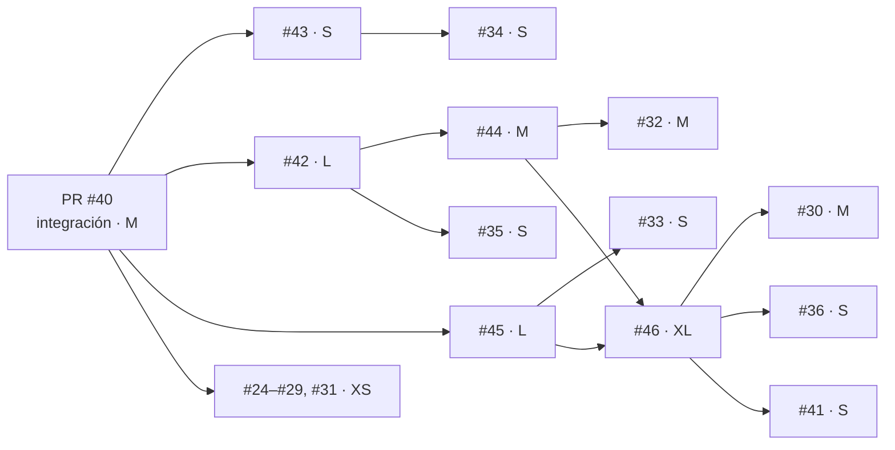

# Estimación por tallas y enrutamiento de modelos

Cada issue recibe una **talla** (XS · S · M · L · XL) que determina su esfuerzo relativo y **qué modelo de
Claude lo construye**. La talla se registra en el Project #5 y el registro por issue se describe en § 2.4.

## 1. Cómo se estima

Cuatro factores, cada uno de 1 (bajo) a 3 (alto):

| Factor | 1 | 2 | 3 |
|---|---|---|---|
| **Alcance** (A) | Sin código o un archivo | Un módulo y sus tests | Varios módulos, datos o evidencia nueva |
| **Incertidumbre** (I) | Solución conocida | Diseño acotado con decisiones abiertas | Pregunta de investigación; el resultado puede ser negativo |
| **Riesgo** (R) | Reversible, sin efecto en conclusiones | Afecta métricas o contratos | Afecta la integridad de la evidencia o las conclusiones científicas |
| **Verificación** (V) | Inspección | Tests unitarios | Réplica, mutación o experimento nuevo |

| Suma A+I+R+V | Talla | Puntos |
|---|---|---|
| 4–5 | XS | 1 |
| 6–7 | S | 2 |
| 8–9 | M | 3 |
| 10–11 | L | 5 |
| 12 | XL | 8 |

## 2. Qué modelo construye cada talla

Precios por millón de tokens (entrada / salida), tabla de modelos vigente al 2026-09-25:

| Talla | Modelo | ID | Esfuerzo | Precio | Por qué |
|---|---|---|---|---|---|
| XS | Claude Haiku 4.5 | `claude-haiku-4-5` | — | $1 / $5 | Trabajo mecánico y totalmente especificado (cerrar con evidencia ya verificada, cambios triviales). Rápido y barato. |
| S | Claude Sonnet 5.5 | `claude-sonnet-5-5` | `medium` | $2 / $10 | Cambios acotados con tests (un módulo). Buen equilibrio para código cotidiano. |
| M | Claude Sonnet 5.5 | `claude-sonnet-5-5` | `high` | $2 / $10 | Varios archivos o una campaña experimental con diseño ya definido. |
| L | Claude Opus 5.5 | `claude-opus-5-5` | `high` | $4 / $20 | Diseño con decisiones abiertas y riesgo sobre la evidencia; requiere juicio. |
| XL | Claude Opus 5.5 | `claude-opus-5-5` | `xhigh` | $4 / $20 | Investigación de horizonte largo. Escalar a **Claude Fable 5.1** (`claude-fable-5-1`, $10 / $50) solo si Opus no alcanza la barra de verificación. |

Reglas:

1. **Piso por riesgo**: si R = 3 (integridad de evidencia o conclusiones), el modelo nunca es inferior a Sonnet 5.5, sea cual sea la talla.
2. **Escalamiento**: si la entrega no supera su verificación (tests, mutaciones, réplica), se repite **un escalón más arriba**. No se baja de modelo para reintentar.
3. **Antes de sumar modelos, bajar el esfuerzo**: en tareas pequeñas, Opus 5.5 con esfuerzo bajo suele rendir igual que un modelo menor; la cascada solo se justifica si se mide un ahorro por tarea completada, no por solicitud.
4. **Orquestación**: el orquestador (Opus 5.5) define las especificaciones, revisa cada entrega y es el único que hace merge. Los agentes ([agentes de entorno](entorno/glosario.md)) trabajan en worktrees aislados y abren PR, sin hacer merge.

### 2.1 Qué decide cada factor

La **talla se asigna por alcance**, por comparación con un issue ancla ya cerrado y con episodio:

| Talla | Ancla | Criterio observable |
|---|---|---|
| XS | #24 | Sin código, o cierre con evidencia ya existente |
| S | #43 | Un módulo o documento con sus tests |
| M | #44 | Varios archivos, o campaña con diseño ya fijado |
| L | #42 | Varios módulos con decisiones de diseño abiertas |
| XL | #46 | Experimento nuevo con pre-registro y evidencia nueva |

Incertidumbre y riesgo se registran aparte (campos *Incertidumbre* y *Riesgo* del Project #5) y activan las excepciones de § 2.2; V determina el tipo de criterio de cierre. La suma A+I+R+V de § 1 se conserva como referencia. Si suma y ancla discrepan, **manda el ancla** y la discrepancia se registra en la estimación (ejemplo: #77, suma 7 → S, ancla → M).
Límites: los factores son ordinales, sumarlos supone pesos iguales y la escala **no está calibrada**: al 2026-10-02, antes del piloto, solo 5 issues tenían talla y episodio (un M, #56, y cuatro XL: #46, #58, #63 y #65).

### 2.2 Excepciones que mandan sobre la talla

El modelo es el mayor entre el de la fila de la talla y el mínimo de la excepción.

| Excepción | Regla | Estado | Caso |
|---|---|---|---|
| R = 3 | Mínimo Sonnet 5.5 (regla 1) | Vigente | #30 |
| I = 3 | Mínimo Opus 5.5, aunque la talla sea S | **Nueva** | S con A1, I3, R1, V1: suma 6 → S → Sonnet `medium`, sin efecto de la incertidumbre |
| Escritura en un sistema externo compartido (DNS, tablero, credenciales) | Nunca Haiku 4.5; la decide quien orquesta: la hace él o la encarga con el valor exacto a un subagente (§ 2.7) | **Nueva** | #76 |
| El orquestador implementa él mismo | Declara el modelo de su sesión como previsto | **Nueva** | #68 |

### 2.3 Agentes que no son Claude

Para Codex, agy u otro agente que no es un modelo de Claude: *Modelo* (previsto) queda vacío y la estimación nombra al agente; *Modelo usado* = «Otro agente» (caso #73). La política de modelos no les aplica; sí aplican talla, verificación y cierre.

### 2.4 Registro

- **Estimación v1** en el cuerpo del issue, antes de pasar a *In Progress*. Cada cambio es un comentario «Estimación v2…» con fecha, motivo y evidencia.
- La talla se copia en una etiqueta `talla:<talla>` del issue, para que se vea sin abrir el tablero. Es un espejo: si difiere del campo *Talla*, manda el campo.
- *Modelo* es el modelo **previsto** y nunca se sobrescribe (en #56 se sobrescribió con el final y el previsto solo quedó en el cuerpo).
- Al cerrar se completan *Modelo usado* y *Escaló*; el motivo del escalamiento va en un comentario (caso #56: Sonnet 5.5 `high` → Opus 5.5 por la regla 2).
- *Modelo usado* es **autoinformado**, salvo que exista transcripción: solo las transcripciones locales de Claude Code (la de la sesión y la de cada subagente) registran modelo y tokens, y solo de esa máquina. No hay telemetría del proveedor accesible.
- Límite: la herramienta que lanza subagentes permite fijar el modelo pero no el nivel de esfuerzo; el esfuerzo de la tabla hoy no es aplicable por esa vía.

### 2.5 Regla 3 frente a XS → Haiku 4.5

Ambas pueden contradecirse. **La tabla de § 2 manda como valor por defecto.** La regla 3 es una alternativa permitida (p. ej. Opus 5.5 con esfuerzo bajo en una tarea XS) que debe declararse en la estimación como desviación. Ninguna de las dos está respaldada todavía por una medición de costo por tarea completada en este repositorio: los 7 issues XS de § 5 fueron cierres sin código y no hay evidencia de Haiku 4.5 escribiendo código.

### 2.6 Brazo Haiku del piloto (hipótesis en evaluación, no regla vigente)

Los issues S con I = 1, R = 1 y criterios de aceptación claros empiezan con Haiku 4.5. Si la verificación falla, se escala un escalón (regla 2) y se registra. El brazo se detiene si dos entregas seguidas fallan la verificación. Diseño y medición: [`docs/piloto-estimacion.md`](piloto-estimacion.md).

Estado al 2026-10-02: **una entrega (#85), escalada a Sonnet 5.5.** El código de Haiku 4.5 era correcto en lo probado y pasó los tests y el CI; lo que falló fue la revisión independiente: cuatro tests existentes modificados contra el issue sin declararlo, seis de los dieciocho defectos que el revisor inyectó pasaban los tests, y el PR no llevaba `Closes`. Parte del hueco de cobertura venía de un encargo cuyo detalle no estaba en el issue (omisión del orquestador). **Queda por definir** qué cuenta aquí como «verificación fallida» cuando los tests pasan y la revisión no: el PR #91 (Sonnet 5.5) también recibió «cambios requeridos» y no se escaló. Hasta definirlo, una entrega no confirma ni refuta la hipótesis ni puede detener el brazo. Detalle: [lectura final](piloto-estimacion.md#lectura-final-8-de-8).

### 2.7 Subagentes que no construyen: revisores, gestor y staff de texto público (elección sin medir)

La tabla de § 2 asigna modelos a quien **construye**. Las definiciones `revisor-codigo`, `revisor-docs` y `gestor-proyecto` ([`enrutamiento.md`](entorno/enrutamiento.md) § 4), y las tres del staff de texto público (`investigador-papers`, `revisor-redactor` y `validador-estadistico`), no construyen: son medios del orquestador, que sigue siendo quien revisa, decide el merge y confirma (regla 4). Su modelo es una **elección inicial, no derivada de la tabla ni medida**:

| Definición | Modelo | Motivo de la elección |
|---|---|---|
| `revisor-codigo` | Opus 5.5 | Es el modelo con el que el orquestador revisaba a mano; no se ha probado uno menor |
| `revisor-docs` | Sonnet 5.5 | Comprueba afirmaciones contra sus fuentes con una lista escrita; no se ha probado uno menor ni uno mayor |
| `gestor-proyecto` | Sonnet 5.5 | Lee y redacta; solo escribe en GitHub campos de ESTIMAR con el valor que el orquestador le da (§ 2.2) |
| `investigador-papers` | Sonnet 5.5 | Abre identificadores y compara con el código; no se ha probado otro modelo |
| `revisor-redactor` | Sonnet 5.5 | Reescribe con una lista de reglas escrita; no se ha probado otro modelo |
| `validador-estadistico` | Sonnet 5.5 | Comprueba cada número contra su fuente; no se ha probado otro modelo |
| `arquitecto-ia` | Opus 5.5 | Juzga si un diseño cabe en un presupuesto con supuestos abiertos; no se ha probado uno menor |
| `forense-arnes` | Opus 5.5 | Lee código ajeno y arma un árbol de causas; no se ha probado uno menor |
| `auditor-metodo` | Opus 5.5 | Recalcula y contradice a los demás roles, incluido el orquestador; no se ha probado uno menor |
| `verificador-limpio` | Opus 5.5 | Trabaja solo y sin el relato; su recuento manda sobre el anterior; no se ha probado uno menor |
| `analista-datos` | Sonnet 5.5 | Cuenta desde archivos crudos con guiones propios; el auditor del método recalcula lo que decide |
| `qa-trayectorias` | Sonnet 5.5 | Clasifica trayectorias y parches con una lista escrita; no se ha probado otro modelo |
| `inteligencia-publica` | Sonnet 5.5 | Lee y cita fuentes abiertas; no se ha probado otro modelo |

Un revisor puede ser de un modelo menor que el autor de lo que revisa (caso: `revisor-docs` sobre el PR #92, escrito por el orquestador): por eso su informe no decide, lo decide el orquestador. Lo observado hasta el 2026-10-02 son cinco revisiones (PR #90, #91, #92, #93 y #95), las cinco con defectos reales no declarados por el autor; no bastan para decir si otro modelo habría hecho lo mismo.

## 3. Estimación de los issues abiertos (2026-09-29)

> Desde el 2026-10-02 el registro por issue vive en el cuerpo del issue y en el Project #5 (§ 2.4). Las secciones 3 a 5 son registro histórico y no se reescriben.

| Issue | A | I | R | V | Talla | Modelo | Depende de |
|---|---|---|---|---|---|---|---|
| Integración PR #40 (prerrequisito) | 2 | 2 | 3 | 2 | M | Opus 5.5 (orquestador; coordinación con otro agente) | — |
| #24 EXP-01 | 1 | 1 | 1 | 1 | XS | Haiku 4.5 | PR #40 |
| #25 EXP-02 | 1 | 1 | 1 | 1 | XS | Haiku 4.5 | PR #40 |
| #26 EXP-03 | 1 | 1 | 1 | 1 | XS | Haiku 4.5 | PR #40 |
| #27 EXP-04 | 1 | 1 | 1 | 1 | XS | Haiku 4.5 | PR #40 |
| #28 EXP-05 | 1 | 1 | 1 | 1 | XS | Haiku 4.5 | PR #40 |
| #29 EXP-06 | 1 | 1 | 1 | 1 | XS | Haiku 4.5 | PR #40 |
| #31 Experimento 0 | 1 | 1 | 1 | 1 | XS | Haiku 4.5 | PR #40 |
| #33 Benchmark causal | 1 | 2 | 2 | 1 | S | Sonnet 5.5 | #45 |
| #34 Grafo tipado | 1 | 1 | 2 | 2 | S | Sonnet 5.5 | #43 |
| #35 Recibos | 1 | 1 | 2 | 2 | S | Sonnet 5.5 | #42 |
| #36 Métricas | 1 | 2 | 2 | 1 | S | Sonnet 5.5 | #46 |
| #41 Hallazgo | 1 | 2 | 2 | 1 | S | Sonnet 5.5 | #46 |
| #43 Tests de salvaguardas | 2 | 1 | 1 | 2 | S | Sonnet 5.5 | PR #40 |
| #30 Hipótesis | 2 | 2 | 3 | 2 | M | Sonnet 5.5 (piso por riesgo) | #44, #46 |
| #32 Experimento 1 | 2 | 2 | 2 | 3 | M | Sonnet 5.5 | #42, #44 |
| #44 Baseline de 6 permutaciones | 2 | 2 | 2 | 2 | M | Sonnet 5.5 | #42 |
| #42 Hashes portables | 3 | 2 | 3 | 3 | L | Opus 5.5 | PR #40 |
| #45 Par engañoso sin pistas léxicas | 3 | 3 | 2 | 2 | L | Opus 5.5 | PR #40 |
| #46 Memoria asociativa vs historial | 3 | 3 | 3 | 3 | XL | Opus 5.5 (`xhigh`) | #42, #44, #45 |

**Total: 46 puntos** (7 XS · 6 S · 3 M · 2 L · 1 XL), más el prerrequisito M.

## 4. Orden de ejecución

Los issues sin dependencias entre sí (#42, #43 y #45) se ejecutan en paralelo, cada uno en su worktree.

## 5. Resultado (2026-09-29)

**46/46 puntos cerrados**, 0 issues abiertos. Ninguna entrega necesitó escalar de modelo (regla 2).

| Talla | Issues | Modelo | Entrega | Verificación del orquestador antes de cerrar |
|---|---|---|---|---|
| XS | #24–#29, #31 | Haiku 4.5 | Cierre con evidencia ya verificada | Estado, razón y comentario de cada issue |
| S | #43 | Sonnet 5.5 | PR #48 | 13/13 mutaciones re-ejecutadas |
| S | #33, #34, #35, #36, #41 | Sonnet 5.5 | Cierre con evidencia fresca | Estado final; se corrigió un BOM en #33 |
| M | #44 | Sonnet 5.5 | PR #51 | Verificador independiente (396 recibos) y manifiesto 76/76 contra `62d6ff7` |
| M | #30, #32 | Sonnet 5.5 | Cierre de síntesis | Números re-verificados por comando, sin discrepancias |
| L | #42 | Opus 5.5 | PR #49 | Corrida propia idéntica a la referencia, hashes incluidos |
| L | #45 | Opus 5.5 | PR #50 | Ausencia de pistas léxicas confirmada con otra medida de similitud |
| XL | #46 | Opus 5.5 (orquestador) | PR #53 | Pre-registro y código de análisis comprometidos antes de los datos |

Lección de proceso (episodio `018`): la delegación por talla fue segura porque cada entrega se verificó con
medios independientes del agente que la produjo.
