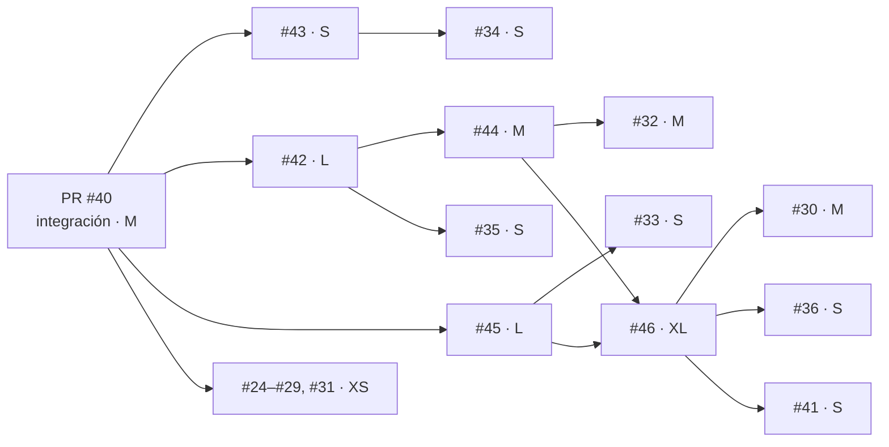

# Estimación por tallas y enrutamiento de modelos

Cada issue recibe una **talla** (XS · S · M · L · XL) que determina su esfuerzo relativo y **qué modelo de
Claude lo construye**. La talla se registra en el Project #5 (campos *Talla*, *Modelo* y *Puntos*).

## 1. Cómo se estima

Cuatro factores, cada uno de 1 (bajo) a 3 (alto):

| Factor | 1 | 2 | 3 |
|---|---|---|---|
| **Alcance** (A) | Sin código o un archivo | Un módulo y sus tests | Varios módulos, datos o evidencia nueva |
| **Incertidumbre** (I) | Solución conocida | Diseño acotado con decisiones abiertas | Pregunta de investigación; el resultado puede ser negativo |
| **Riesgo** (R) | Reversible, sin efecto en conclusiones | Afecta métricas o contratos | Afecta la integridad de la evidencia o las conclusiones científicas |
| **Verificación** (V) | Inspección | Tests unitarios | Réplica, mutación o experimento nuevo |

| Suma A+I+R+V | Talla | Puntos |
|---|---|---|
| 4–5 | XS | 1 |
| 6–7 | S | 2 |
| 8–9 | M | 3 |
| 10–11 | L | 5 |
| 12 | XL | 8 |

## 2. Qué modelo construye cada talla

Precios por millón de tokens (entrada / salida), tabla de modelos vigente al 2026-09-25:

| Talla | Modelo | ID | Esfuerzo | Precio | Por qué |
|---|---|---|---|---|---|
| XS | Claude Haiku 4.5 | `claude-haiku-4-5` | — | $1 / $5 | Trabajo mecánico y totalmente especificado (cerrar con evidencia ya verificada, cambios triviales). Rápido y barato. |
| S | Claude Sonnet 5.5 | `claude-sonnet-5-5` | `medium` | $2 / $10 | Cambios acotados con tests (un módulo). Buen equilibrio para código cotidiano. |
| M | Claude Sonnet 5.5 | `claude-sonnet-5-5` | `high` | $2 / $10 | Varios archivos o una campaña experimental con diseño ya definido. |
| L | Claude Opus 5.5 | `claude-opus-5-5` | `high` | $4 / $20 | Diseño con decisiones abiertas y riesgo sobre la evidencia; requiere juicio. |
| XL | Claude Opus 5.5 | `claude-opus-5-5` | `xhigh` | $4 / $20 | Investigación de horizonte largo. Escalar a **Claude Fable 5.1** (`claude-fable-5-1`, $10 / $50) solo si Opus no alcanza la barra de verificación. |

Reglas:

1. **Piso por riesgo**: si R = 3 (integridad de evidencia o conclusiones), el modelo nunca es inferior a Sonnet 5.5, sea cual sea la talla.
2. **Escalamiento**: si la entrega no supera su verificación (tests, mutaciones, réplica), se repite **un escalón más arriba**. No se baja de modelo para reintentar.
3. **Antes de sumar modelos, bajar el esfuerzo**: en tareas pequeñas, Opus 5.5 con esfuerzo bajo suele rendir igual que un modelo menor; la cascada solo se justifica si se mide un ahorro por tarea completada, no por solicitud.
4. **Orquestación**: el orquestador (Opus 5.5) define las especificaciones, revisa cada entrega y es el único que hace merge. Los agentes trabajan en worktrees aislados y abren PR, sin hacer merge.

## 3. Estimación de los issues abiertos (2026-09-29)

| Issue | A | I | R | V | Talla | Modelo | Depende de |
|---|---|---|---|---|---|---|---|
| Integración PR #40 (prerrequisito) | 2 | 2 | 3 | 2 | M | Opus 5.5 (orquestador; coordinación con otro agente) | — |
| #24 EXP-01 | 1 | 1 | 1 | 1 | XS | Haiku 4.5 | PR #40 |
| #25 EXP-02 | 1 | 1 | 1 | 1 | XS | Haiku 4.5 | PR #40 |
| #26 EXP-03 | 1 | 1 | 1 | 1 | XS | Haiku 4.5 | PR #40 |
| #27 EXP-04 | 1 | 1 | 1 | 1 | XS | Haiku 4.5 | PR #40 |
| #28 EXP-05 | 1 | 1 | 1 | 1 | XS | Haiku 4.5 | PR #40 |
| #29 EXP-06 | 1 | 1 | 1 | 1 | XS | Haiku 4.5 | PR #40 |
| #31 Experimento 0 | 1 | 1 | 1 | 1 | XS | Haiku 4.5 | PR #40 |
| #33 Benchmark causal | 1 | 2 | 2 | 1 | S | Sonnet 5.5 | #45 |
| #34 Grafo tipado | 1 | 1 | 2 | 2 | S | Sonnet 5.5 | #43 |
| #35 Recibos | 1 | 1 | 2 | 2 | S | Sonnet 5.5 | #42 |
| #36 Métricas | 1 | 2 | 2 | 1 | S | Sonnet 5.5 | #46 |
| #41 Hallazgo | 1 | 2 | 2 | 1 | S | Sonnet 5.5 | #46 |
| #43 Tests de salvaguardas | 2 | 1 | 1 | 2 | S | Sonnet 5.5 | PR #40 |
| #30 Hipótesis | 2 | 2 | 3 | 2 | M | Sonnet 5.5 (piso por riesgo) | #44, #46 |
| #32 Experimento 1 | 2 | 2 | 2 | 3 | M | Sonnet 5.5 | #42, #44 |
| #44 Baseline de 6 permutaciones | 2 | 2 | 2 | 2 | M | Sonnet 5.5 | #42 |
| #42 Hashes portables | 3 | 2 | 3 | 3 | L | Opus 5.5 | PR #40 |
| #45 Par engañoso sin pistas léxicas | 3 | 3 | 2 | 2 | L | Opus 5.5 | PR #40 |
| #46 Memoria asociativa vs historial | 3 | 3 | 3 | 3 | XL | Opus 5.5 (`xhigh`) | #42, #44, #45 |

**Total: 46 puntos** (7 XS · 6 S · 3 M · 2 L · 1 XL), más el prerrequisito M.

## 4. Orden de ejecución

Los issues sin dependencias entre sí (#42, #43 y #45) se ejecutan en paralelo, cada uno en su worktree.
