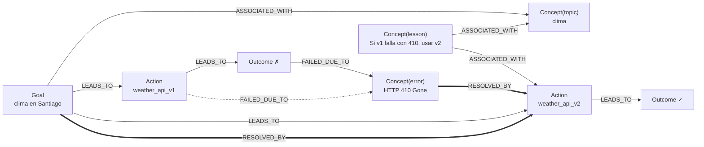
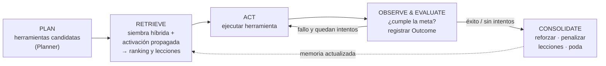

# Historical Experiment 0 reference

The text below is preserved from the pre-experiment README. Its learning language refers only to associative action reuse under controlled simulated conditions, not autonomous software-engineering learning. See the root README for current scientific claims.

# associative-agent-loop

[](https://github.com/cherrera0001/Agents_Learning_Loops/actions/workflows/ci.yml)

Implementación mínima y didáctica de una **memoria asociativa en grafo** para
el bucle de aprendizaje de un agente ([agente de biblioteca](entorno/glosario.md)): el agente registra sus trayectorias,
extrae lecciones, las enlaza en un grafo semántico y las recupera por
**activación propagada** para no repetir errores.

- Núcleo liviano: `networkx` + `pydantic`; embeddings semánticos locales opcionales (`fastembed`, ONNX).
- Determinista: reloj lógico y semillas fijas, así las pruebas son reproducibles.
- Guiado por especificación: [`specs/memory_schema.json`](specs/memory_schema.json) y [`specs/loop_protocol.md`](specs/loop_protocol.md).

## Inicio rápido

Requiere Python ≥ 3.11.

```bash
python -m venv .venv
.venv/Scripts/activate        # Windows  (Linux/macOS: source .venv/bin/activate)

pip install -e .[dev]               # núcleo (networkx, pydantic) + herramientas de desarrollo
pip install -e .[dev,embeddings]    # + embeddings locales con fastembed (ONNX, sin PyTorch)

aal-benchmark                 # benchmark legible (= python -m associative_agent_loop.main)
aal-benchmark --json          # reporte determinista (misma semilla ⇒ mismo JSON)
aal-benchmark -vv             # con logging DEBUG de cada transición (stderr)
pytest                        # unit + integration; los marcados `embeddings` se omiten sin el extra
```

| Instalación | Incluye |
|---|---|
| `pip install -e .` | Núcleo: `networkx`, `pydantic`. Similitud léxica, sin descarga de modelos |
| `.[embeddings]` | `fastembed` para búsqueda semántica (#3) |
| `.[dev]` | `pytest`, `pytest-cov`, `hypothesis`, `jsonschema`, `ruff`, `mypy` |

Salida del benchmark:

```text
=== Escenario 1: misma meta repetida (API deprecada) ===
  [OK ] #1 'clima en Santiago'  intentos=2  weather_api_v1✗ → weather_api_v2✓
  [OK ] #2 'clima en Santiago'  intentos=1  weather_api_v2✓
         memoria: weather_api_v2=+0.201, weather_api_v1=-0.038
         lección recordada: 'weather_api_v1' falló con 'HTTP 410 Gone: endpoint deprecated'
  ...
  fallos repetidos tras el primer episodio: 0

=== Escenario 2: metas parafraseadas ===
  [OK ] #2 'pronóstico del clima en Madrid'  intentos=1  weather_api_v2✓
  ...
=== Escenario 3: errores intermitentes, 20 episodios ===
  sin memoria  éxito al 1er intento=2/20  llamadas totales=38  latencia total=5100 ms
  con memoria  éxito al 1er intento=19/20  llamadas totales=21  latencia total=5030 ms
```

## Modelo

### Entidades



| Nodo | Significado |
|---|---|
| `Goal` | Meta de un episodio (texto de la tarea) |
| `Action` | Herramienta; **compartida** entre episodios, por lo que concentra la experiencia |
| `Outcome` | Resultado de una ejecución concreta (`success`, `latency_ms`, `error`) |
| `Concept` | `topic` (término de la meta), `error` (causa de fallo) o `lesson` (lección extraída) |

Nodos y aristas son modelos Pydantic ([`src/memory/models.py`](src/memory/models.py)), validados al crear y al asignar.
Cada arista tiene `weight ∈ [0,1]`, su propio `decay_factor` (λ) y `last_updated`; su peso efectivo es
`weight · recency_factor`, con `recency_factor = exp(-λ · Δt)`. Los nodos guardan `embedding`,
`metadata`, `last_accessed_at` y `activation_level`.

### El ciclo



### Recuperación asociativa

1. **Siembra híbrida**: todo nodo con texto (metas, acciones, errores, lecciones) cuya similitud `α·coseno(embeddings) + (1−α)·léxica` supere el umbral, más los `Concept(topic)` presentes literalmente en la consulta. Por defecto los embeddings son léxicos (hashing, sin dependencias); con `pip install -e .[embeddings]` y `FastEmbedEmbedder` se recuperan paráfrasis sin palabras en común («temperatura prevista para Lima» → experiencia de «clima en Santiago»).
2. **Propagación**: 3 saltos; cada salto transmite `a · 0.7 · peso_efectivo` (hacia atrás, atenuado).
3. **Score**: `relevancia(a) · tanh(Σ RESOLVED_BY − Σ FAILED_DUE_TO)`.
   - Acción exitosa → score > 0; nunca probada → 0; con fallos previos → < 0.
   - La **valencia es contextual**: se calcula con los episodios cuyas metas se parecen a la consulta (núcleo sobre su activación), de modo que un fallo en el dominio «clima» no penaliza la misma herramienta en «noticias». Sin evidencia contextual, se usa la valencia global.
   - Por eso la ruta que falló pasa al final del plan y se descarta en la práctica.

### Consolidación

`w ← w + η · (objetivo − w)`: los caminos exitosos se refuerzan hacia 1 y las
asociaciones contradichas se debilitan hacia 0. Con errores intermitentes, la
valencia de cada herramienta converge a su fiabilidad observada. Las aristas no
usadas decaen con el tiempo y la poda las elimina. Tabla completa en
[`specs/loop_protocol.md`](specs/loop_protocol.md#4-consolidación-consolidate).

## Estructura

```text
├── specs/
│   ├── memory_schema.json   # JSON Schema GENERADO desde los modelos (scripts/export_schema.py)
│   └── loop_protocol.md     # estados, transiciones, fórmulas, invariantes
├── src/associative_agent_loop/
│   ├── agent/
│   │   ├── core.py          # Agent: Plan → Retrieve → Act → Observe → Consolidate (máquina de estados)
│   │   └── tools.py         # herramientas simuladas + escenarios (weather, flaky, domain)
│   ├── memory/
│   │   ├── models.py        # Node, Edge, GraphDocument (Pydantic v2)
│   │   ├── graph.py         # MemoryGraph (NetworkX MultiDiGraph, JSON v2 + migración v1)
│   │   ├── associative.py   # siembra híbrida, activación propagada, valencia contextual
│   │   ├── embeddings.py    # LexicalEmbedder (hashing) y FastEmbedEmbedder (ONNX)
│   │   ├── consolidation.py # aprendizaje hebbiano + EMA, lecciones, decaimiento, poda
│   │   ├── store.py         # GraphStore / JsonGraphStore (escritura atómica)
│   │   └── text.py, fsutil.py
│   ├── config.py            # AppConfig desde TOML + variables AAL_*
│   └── main.py              # benchmark (aal-benchmark)
├── scripts/                 # devlog (memoria del propio repo), export_schema, mutation_check
├── learning/                # episodios de desarrollo (dev_memory.json se genera, no se versiona)
└── tests/
    ├── unit/                # componentes, valores calculados a mano, propiedades (hypothesis)
    └── integration/         # agente completo, benchmark, CLI, bitácora
```

## Uso como librería

```python
from associative_agent_loop import Agent, JsonGraphStore, Tool, ToolResult, load_config

store = JsonGraphStore("memory_graph.json")
tools = [Tool("mi_api", "descripción", lambda q: ToolResult(True, output="..."))]
agent = Agent.from_config(tools, load_config("aal.toml"), memory=store.load_or_new())

episode = agent.run("mi tarea")
episode.plan  # candidatas re-rankeadas por la memoria
episode.retrieval.lessons  # lecciones para inyectar en el prompt de un LLM
episode.retrieval.ranked_actions[0].path  # por qué: camino semilla → acción
store.save(agent.memory)  # escritura atómica
```

Configuración (`aal.toml`, o variables de entorno `AAL_<SECCIÓN>__<CAMPO>`, que tienen prioridad):

```toml
[agent]
max_attempts = 3

[retrieval]
damping = 0.7
fan_out = "sqrt"

[consolidation]
max_edges = 5000
```

## La vida del proyecto: el repo aprende de sí mismo

El desarrollo de este repositorio usa su propio bucle de aprendizaje. Cada issue
es un episodio en [`learning/episodes/`](learning/episodes/) (meta, pasos con sus
fallos reales, lecciones), y `learning/dev_memory.json` (no versionado; se genera con
`devlog rebuild`) es la memoria asociativa derivada. Antes de empezar un issue se consulta:

```bash
python -m scripts.devlog recall "Spreading Activation: umbral de disparo y fan-out"
python -m scripts.devlog rebuild
```

Detalles y vocabulario de acciones en [`learning/README.md`](learning/README.md).

## Extensiones naturales

- **Otros modelos de embeddings**: cualquier objeto con `name`, `dim` y `embed(texts)` sirve como `Retriever(memory, embedder=...)` o `Agent(tools, embedder=...)` (p. ej. `sentence-transformers`).
- **LLM planner**: usar `retrieval.lessons` y `ranked_actions` como contexto del prompt en lugar de ejecutar el ranking tal cual.
- **Backend persistente**: implementar el protocolo `GraphStore` (`load`/`save`) para SQLite o Neo4j.

## Licencia

MIT, ver [LICENSE](LICENSE).
