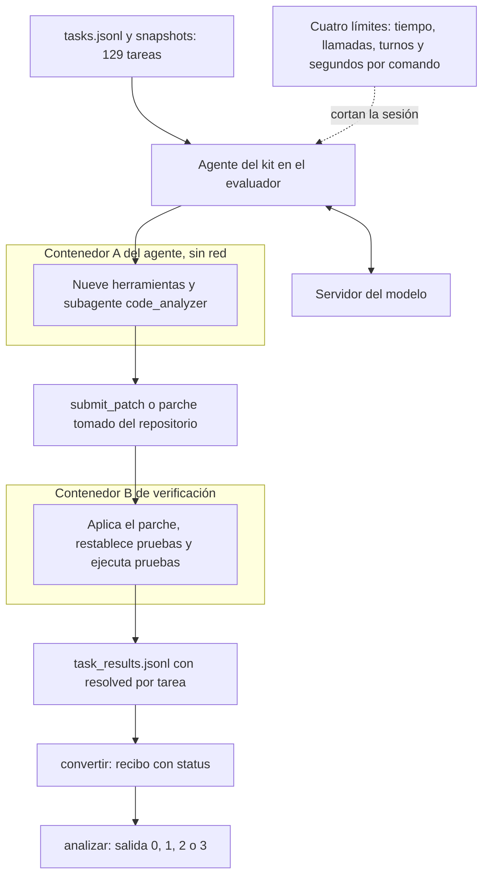
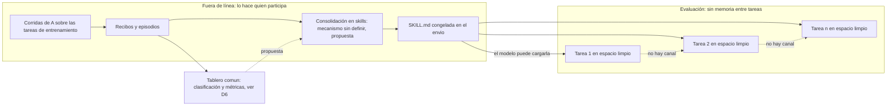
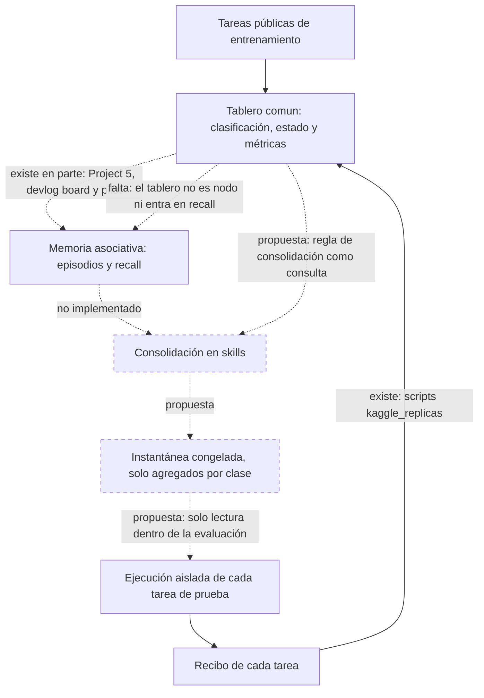
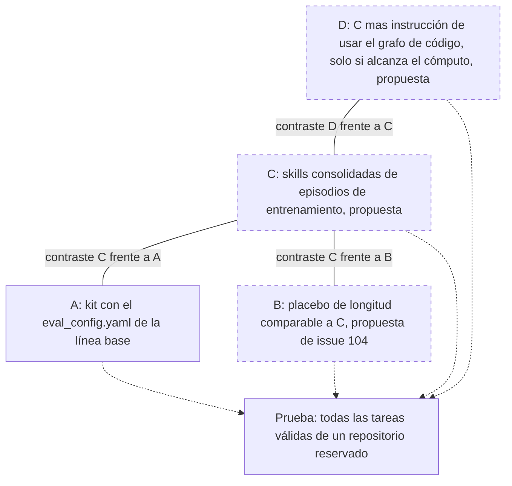
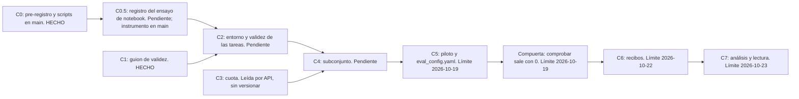
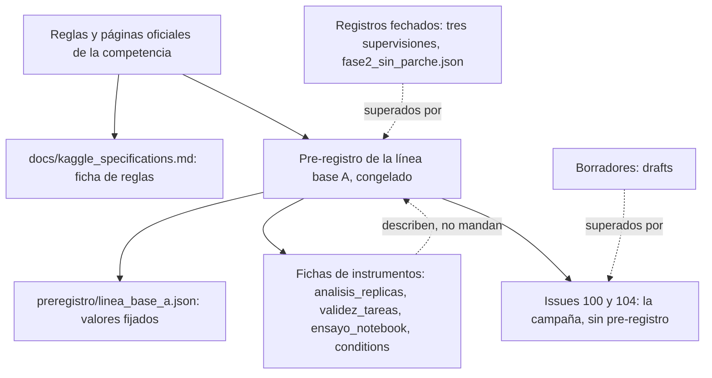

# Experimento Kaggle Gemma 4 Developer Agent

Documento de entrada del experimento. Está escrito para quien no conoce ni el proyecto ni el concurso.
Dice qué se quiere saber, qué reglas pone el concurso, qué se sabe ya en el área, qué está medido y qué no,
y qué documento manda sobre cuál.

**Contenido.**
[1. En pocas líneas](#1-en-pocas-líneas) ·
[2. El desafío y sus reglas](#2-el-desafío-y-sus-reglas) ·
[3. Estado del área](#3-estado-del-área) ·
[4. Definición del problema](#4-definición-del-problema) ·
[5. Lo que se parece a la práctica cotidiana][s5] ·
[6. El tablero como punto de control](#6-el-tablero-como-punto-de-control) ·
[7. Preguntas](#7-preguntas) ·
[8. Hipótesis](#8-hipótesis) ·
[9. Objetivos](#9-objetivos) ·
[10. Alcance y fuera de alcance](#10-alcance-y-fuera-de-alcance) ·
[11. Qué está medido hoy y qué no](#11-qué-está-medido-hoy-y-qué-no) ·
[12. Mapa de documentos](#12-mapa-de-documentos) ·
[13. Cómo reproducir lo que hay](#13-cómo-reproducir-lo-que-hay) ·
[14. Referencias](#14-referencias)

[s5]: #5-lo-que-se-parece-a-la-práctica-cotidiana-de-desarrollo-y-lo-que-no-permite-afirmar

**Dos términos de este documento que el [glosario](../../docs/entorno/glosario.md) no define.** Se proponen
para el glosario en el pull request que introduce este texto; hasta que se acepten, valen solo aquí.

| Término | Qué es | Qué no es |
|---|---|---|
| **Arnés de la competencia** | El paquete `swegemma` (versión 0.2.7) con que la competencia ejecuta y puntúa los envíos | No es el *harness de experimento* ni el *harness de entorno* del glosario (términos 6 y 7) |
| **Agente del envío** | El agente que describe el archivo comprimido que se entrega a la competencia: un YAML, prompts, subagentes, skills y, si se quiere, adaptadores | No es el *agente de biblioteca* ni el *solver acotado* (términos 1 y 2). Sus «skills» son archivos `SKILL.md` del envío: no son *skills de memoria* ni *skills de entorno* (términos 4 y 5) |

---

## 1. En pocas líneas

Google ofrece en Kaggle un concurso con dos pistas, una de código y una de artículo, para el modelo Gemma 4.
Este experimento usa ese marco para hacer una pregunta estrecha y que pueda salir mal: si unas guías escritas
a partir de intentos anteriores (skills) mejoran la tasa de tareas resueltas frente al kit oficial, medido en
local sobre tareas públicas. Es un trabajo de [Agents Learning Loops](../../README.md) (ALL), un proyecto
sobre agentes que reutilizan su experiencia.

**Qué está hecho.** El diseño de la medición, escrito y congelado antes de correr nada: el
[pre-registro de la línea base A](../../docs/preregistration/kaggle-baseline-a.md). Los guiones que lo
acompañan (partición de las tareas, análisis de réplicas, validez de tareas, ensayo de notebook, compuerta
de parámetros) están en `main` y probados con datos sintéticos. La cuota semanal de GPU de la cuenta se leyó
por API.

**Qué no está hecho.** **Hoy no hay ninguna corrida con el modelo ni ningún resultado.** No se sabe qué tasa
alcanza el kit oficial, cuánto varía entre repeticiones, qué tareas son válidas ni si la cuenta puede usar
el acelerador L4×4. Las condiciones B, C y D (placebo, skills consolidadas, instrucción de usar el grafo de
código) son una propuesta del issue #104 sin pre-registro. Los resultados que ALL tiene hoy
([H4, #58, H6 y H7](../../README.md#qué-presenta-este-experimento)) son de un solver acotado sin modelo de
lenguaje y no dicen nada sobre Gemma.

---

## 2. El desafío y sus reglas

Este experimento se apoya en un concurso de Google alojado en Kaggle, con dos pistas. **El reglamento del
concurso manda sobre cualquier interés propio del proyecto.** Las fuentes son las páginas oficiales de cada
pista y el `HARNESS_README` del arnés, leídos el 2026-10-02; son copias locales que no se versionan, así que
este repositorio las cita por página y sección (por ejemplo «Rules § 2.4.b») y no las reproduce. Un lector
puede comprobar cada cita en las páginas de la competencia
([Code Track](https://www.kaggle.com/competitions/gemma-4-developer-agent),
[Paper Track](https://www.kaggle.com/competitions/gemma-4-developer-agent-paper)).

**Pista de código.** Se entrega un archivo comprimido con la configuración de un agente: un archivo YAML,
instrucciones en texto, subagentes, «skills» (carpetas con una guía, guiones en Python y notas de consulta)
y, si se quiere, adaptadores entrenados. No se entrega un programa propio: el arnés arma el agente a partir
de esos archivos (HARNESS § 2.1 y § 2.2). Todos los agentes usan un único modelo, la variante
`gemma-4-31b-it-qat-w4a16-ct` de Gemma 4 (página *Model Selection, Budget, and Harness Rules*). El agente
recibe el enunciado de un problema real de un proyecto en Python, trabaja en un contenedor sin internet con
nueve herramientas (leer, editar, ejecutar comandos, consultar un grafo del código) y entrega un parche
(HARNESS § 4 y § 6). La nota es el porcentaje de tareas cuyo parche pasa unas pruebas que el agente no ve
(página *Evaluation*; HARNESS § 8.2). Se puntúa con unas 120 tareas de repositorios privados, repartidas por
mitades entre una tabla pública y una privada, y gana la tabla privada (página *Data*; Foundational § 7.a).
El envío dispone de 12 horas para todas las tareas, con el montaje del contenedor incluido y sin contar la
validación de los parches (*Evaluation*). Se admite un envío al día y dos envíos finales (Rules § 2.2). Cierra
el 2 de diciembre de 2026 a las 23:59 UTC (*Timeline*). Los premios son de 37 000, 18 000 y 10 000 USD.

**Pista de artículo.** Se entrega un texto de hasta 3 000 palabras con investigación original y no
publicada, antes del 12 de noviembre de 2026 a las 23:59 UTC; hay que pulsar «Submit». Debe llevar título y
subtítulo, resumen, introducción, métodos y experimentos, y trabajo relacionado con citas. No exige participar
en la pista de código (páginas *Submission Requirements*, *Description* y *Timeline* del Paper Track). Un
jurado lo califica de 0 a 5 en cinco criterios de igual peso, cada uno con 20 %:

| Criterio | Qué pregunta la página *Evaluation* del Paper Track |
|---|---|
| Novelty | Si aporta ideas nuevas, profundiza la comprensión o destaca propiedades de métodos existentes |
| Quality | Qué tan general es el enfoque fuera de la competencia |
| Relevance | Qué impacto tiene en ingeniería de software y en el aprendizaje de agentes |
| Verifiability | Si se entiende cómo funciona y cómo se obtuvieron, analizaron e interpretaron los datos |
| Clarity | Si está bien presentado y escrito |

Entre los temas sugeridos están las tareas y los benchmarks nuevos. El premio de la pista es de 35 000 USD.

**Lo que condiciona este experimento.**

- Cada tarea corre en un espacio de trabajo limpio, en un contenedor sin red; el espacio se borra al
  reutilizarlo (HARNESS § 4.1 y § 5.1). Ninguna página describe un canal de memoria entre tareas. Pesos,
  prompts y skills quedan fijos en el envío. Lo aprendido antes de enviar solo puede estar escrito en esos
  archivos.
- Google publica 129 tareas de cuatro proyectos abiertos para desarrollar y probar en local (HARNESS § 9.1).
  Con ellas se hace todo lo que aquí se mide. No son las tareas con que se puntúa y un resultado local no
  predice la nota.
- Los datos del concurso se pueden usar, también con fines académicos, pero no publicar ni pasar a quien no
  participa; «datos» incluye el código que da el sitio (Rules § 2.4.a y § 2.4.b; Foundational § 18.a). Por
  eso este repositorio no contiene tareas, parches, pruebas ni el texto del arnés.
- Se pueden usar datos y modelos externos si son públicos y de costo razonable para todos (Rules § 2.6).
  Quien gana licencia su envío y el código que lo generó bajo licencia abierta y entrega una descripción
  reproducible (Rules § 1.6, § 2.5 y § 2.8).
- Cada equipo tiene como máximo cinco personas (Rules § 2.1).

**Qué mide el concurso y qué mide este experimento.** Son observaciones distintas.

| | El concurso | Este experimento |
|---|---|---|
| Qué se compara | Una corrida de un envío fijo | Diferencias pareadas entre condiciones, con réplicas |
| Tareas | Unas 60 privadas de la tabla ganadora, de repositorios que nadie ve | Las tareas válidas de un repositorio público reservado |
| Cómo se corre | El guion de puntuación de Kaggle, con 12 h para todo | La CLI local `swegemma eval`, con un presupuesto por tarea derivado de las 12 h |
| Contexto del modelo | El guion compacta y cachea el contexto (HARNESS § 7.2) | La CLI ni compacta ni cachea (pre-registro, sección H) |
| Qué responde | Cuántas tareas resuelve el envío | Si unas skills cambian esa tasa frente al kit, en un repositorio reservado |

Un resultado local es un ensayo de transferencia a un repositorio abierto que el modelo pudo ver en su
entrenamiento. No estima la nota de la tabla, y no hay forma de comparar condiciones en el conjunto oculto,
porque se admite un envío al día y no hay datos por tarea.

**Lo que las páginas dejan ambiguo** y está pendiente de preguntar a los organizadores. Si un repositorio
público de GitHub con scripts, agregados e identificadores de tarea cumple la regla de compartir código en
el foro o en los notebooks de Kaggle (Foundational § 6.b), y si esos agregados o identificadores cuentan como
«datos» (Rules § 2.4.b). Qué significa «no publicado» frente a un repositorio público con resultados (Paper
Track). Con qué concurrencia corre la puntuación y qué pasa si se superan las 12 h. Cómo se asignan los tres
premios del Paper Track. Si se puede gastar cuota de L4×4 en experimentos que solo alimentan el artículo. No
se consultaron las páginas vivas ni el foro. Mientras tanto este repositorio publica solo agregados y
nombres de hashes, no contenido de tareas.

El concurso no pregunta si un agente aprende de su experiencia. Pregunta cuántas tareas resuelve un envío
fijo dentro de un presupuesto.

---

## 3. Estado del área

Qué sabemos de fuentes abiertas, y qué no. Cada obra está en las [referencias](#14-referencias) con su
identificador; se leyó el resumen de cada una, no el cuerpo. El código de este repositorio no implementa
ninguna de ellas, y la consolidación fuera de línea de #104 es un diseño, no código.

**Lo que ya es práctica conocida.** Aprender de la propia experiencia sin cambiar los pesos del modelo:
Reflexion, Voyager, ExpeL, Agent Workflow Memory y Memp convierten trayectorias en texto o código
reutilizable, y SWE-Exp lo aplica a SWE-bench Verified con un modelo propietario. Casi todos son de otros
dominios (funciones aisladas, Minecraft, web, planificación) y en sus resúmenes no vimos controles con un
texto de relleno. Los archivos `SKILL.md` con metadatos y carga por niveles están descritos en la
documentación de Anthropic y en la especificación Agent Skills, y la competencia los usa con sus propias
herramientas; no se verificó quién mantiene esa especificación ni que su formato sea idéntico al del arnés.
Evaluar agentes con tareas reales de repositorios y pruebas es la forma de SWE-bench; la página *Evaluation*
describe la competencia como una evaluación similar, no idéntica, así que **las 129 tareas no son tareas de
SWE-bench**. Instrumentos como los de este experimento (pre-registrar, repetir corridas, comparar de forma
pareada) también son conocidos.

**Evidencia cercana adversa o mixta.** Un estudio de memoria de agentes halló que los errores pasados se
propagan cuando se reutilizan registros parecidos (Xiong et al.). En SkillsBench v1, con skills curadas por
personas, las skills generadas por el propio modelo bajaron 1,3 puntos de media y las curadas subieron 4,5
puntos en ingeniería de software (de 34,4 % a 38,9 %), con 16 de 84 tareas peor (Li et al., v1; una revisión
posterior da otras cifras, por eso se cita siempre la v1). Archivos de contexto generados por un LLM
empeoraron 5 de 8 configuraciones en SWE-bench Lite y AGENTbench, con la tasa de resolución 0,5 y 2 puntos
más baja de media y el costo 20 % y 23 % más alto; los escritos por desarrolladores mejoraron de forma
marginal (Gloaguen et al.). Sin retroalimentación externa, la autocorrección de un modelo a veces empeora
(Huang et al.). Nuestro resultado previo va en el mismo sentido: con tareas con señuelo, las dos memorias
empeoraron el primer intento, de 6/18 sin memoria a 0/18 con cada una (H4, solver acotado sin modelo de
lenguaje; [informe](../../docs/results/h4-associative-vs-history.md)). Nada de esto prueba que las skills
consolidadas mejoren o dañen a Gemma: la evidencia abierta que vimos es mixta.

**Validez de las tareas y ruido.** Hay problemas documentados en SWE-bench: entre los parches exitosos de un
agente, 32,67 % tenían la solución filtrada en el issue o en sus comentarios y 31,08 % eran sospechosos por
pruebas débiles (Aleithan et al.); otro estudio estimó que 7,8 % de los parches «correctos» fallan las
pruebas de los desarrolladores (Wang et al.); hay indicios de memorización (Liang et al.) y conjuntos
renovados con tareas recientes (SWE-bench-Live, SWE-rebench). Este experimento no corrige nada de eso. Mide
por su cuenta qué tareas públicas discriminan (fallan sin parche y pasan con el de referencia) y excluye las
demás, una depuración del mismo tipo aplicada a otro conjunto, que hoy no se ha ejecutado. En cuanto al
ruido, una sola corrida varió entre 2,2 y 6,0 puntos en SWE-bench Verified con tres modelos y dos arneses, y
la desviación superó 1,5 puntos aun con temperatura cero (Bjarnason et al.); no son cifras de Gemma ni de 48
a 67 tareas. Por eso este experimento mide primero a A contra sí misma. McNemar sirve para comparar de
forma pareada cuando cada algoritmo se corre una vez por tarea (Dietterich, 1998); no se afirma que sea «el
estándar» para agentes, ni que tres réplicas basten.

**Donde no hay fuente.**

- No encontramos un trabajo abierto que compare skills con un texto de la misma longitud en agentes de
  código. La evidencia indirecta es de otros contextos: en clasificación, etiquetas al azar en las
  demostraciones apenas cambian el resultado y pesan el formato y la distribución (Min et al.); texto de
  relleno degrada el razonamiento (Levy et al.) y el contexto irrelevante baja la precisión aritmética (Shi
  et al.). La condición B, el placebo, es una respuesta propia a esa duda, no una receta tomada de la
  literatura.
- Los grafos de código informan mejoras al localizar archivos (RepoGraph, LocAgent, CodexGraph), en otros
  modelos y sin placebo. No hay evidencia abierta de que ayuden a Gemma 4. La condición D reutiliza las
  herramientas de grafo que el arnés ya ofrece al kit; su novedad es una instrucción obligatoria de usarlas.
- Ninguna obra abierta evalúa dejar un repositorio entero fuera en agentes con skills. La regla
  `leave_one_repo_out` es propia del pre-registro.
- La tarjeta de Gemma 4 declara un corte de preentrenamiento en enero de 2025 y no dice qué repositorios
  entraron. No sabemos si el modelo vio las tareas; las más antiguas podrían haber estado en su
  entrenamiento. La tarjeta tampoco menciona la cuantización de la variante que exige el concurso, así que no
  afirmamos que conserve la calidad del modelo sin cuantizar.

**Qué añade este experimento.** Consolidar skills desde episodios ya existe. Lo propio es la combinación: A
contra A para medir el ruido, un placebo de igual longitud, partición por repositorio y reglas declaradas
antes de ver datos. Replica en otro arnés ideas conocidas. No demuestra que un agente adquiera una habilidad
nueva. La línea base es exploratoria y no confirmatoria; pre-registrar separa la predicción del análisis
posterior, pero no elimina por sí solo el sesgo (Nosek et al.).

---

## 4. Definición del problema

**Qué se mide.** La tasa de resolución de una condición: tareas resueltas entre tareas del subconjunto, con
numerador y denominador, por réplica. Una tarea cuenta como resuelta si el parche del agente hace pasar las
pruebas del arnés; un parche vacío, un tiempo agotado, un presupuesto agotado o una petición rechazada por
exceder el contexto cuentan como no resueltas (pre-registro, sección F.2). Los errores de infraestructura se
repiten y no entran en la tasa.

**En qué tareas.** Las 129 tareas públicas son de cuatro repositorios: fastapi 67, rich 48, requests 13,
httpx 1 (`python -m scripts.kaggle_eda resumen`, sección 13). Solo sirve para medir una tarea que
discrimina: sus pruebas fallan sin arreglo y pasan con el parche de referencia en el mismo entorno. Esa
validez no está medida (sección 11). La regla de partición es `leave_one_repo_out`: la prueba son todas las
tareas válidas de un repositorio y el entrenamiento son las de los demás. El repositorio preferido es
fastapi y el segundo rich; lo decide la escalera de cómputo del pre-registro (sección E) con la validez y la
cuota ya medidas. La campaña de #104 hereda esa partición.

**Con qué presupuesto.** El que cabe en las 12 horas del envío real, no el valor por defecto del arnés. El
pre-registro lo deriva con la fórmula `b = min(60, floor(c · (T · (1 − r) − m) / N − s))` minutos por tarea
(sección D.1), con T = 720 min, N = 120, r = 0,10 y tres símbolos por cerrar: la concurrencia c, la carga del
modelo m y el montaje s. Con c = 1 da entre 3 y 5 minutos (`python -m scripts.kaggle_prereg presupuesto`).
Las 100 llamadas a herramientas, los 500 turnos y los 300 s por comando son los valores por defecto del
guion de puntuación (HARNESS § 7.1) y cada participante puede cambiarlos; los «60 minutos» que citan algunos
borradores son solo el tope de la fórmula, no una regla del concurso.

**Tres observaciones distintas.** Conviene no confundirlas, porque ninguna implica a las otras:

1. *Resolver tareas públicas.* Cuántas de las tareas públicas resuelve un agente en local.
2. *Mejorar frente al kit.* Si una condición resuelve más tareas que A, sobre las mismas tareas y descontado
   el ruido de repetir la corrida.
3. *Puntuar en el conjunto oculto.* La nota de la tabla de Kaggle, con tareas de repositorios privados.

Un agente puede resolver muchas tareas públicas porque el modelo las vio al entrenarse y aun así no mejorar
frente al kit; una mejora frente al kit en un repositorio público no dice qué pasará en uno privado.

### Diagrama D1. Qué ocurre con una tarea en el arnés



El arnés evalúa cada tarea en dos ciclos de vida separados: el contenedor A, donde el agente del kit usa sus
herramientas, y el contenedor B, que se arranca limpio para verificar el parche (HARNESS § 4). El modelo lo
sirve un proceso aparte, que en el experimento arrancamos nosotros con los parámetros de HARNESS § 3.1. Cuatro
límites cortan la sesión del agente: `--max-time-minutes`, `--max-tool-calls`, `--max-turns` y
`--timeout-seconds`. Después, `scripts/kaggle_replicas.py convertir` traduce cada fila de `task_results.jsonl`
a un recibo con `status` igual a `resolved`, `unresolved` o `infra_error`, y `analizar` calcula las tasas, las
tareas que cambian de resultado y los pares de réplicas, y sale con 0 (completo), 1 (incompleto), 2 (entrada
inválida) o 3 (error del script). Un parche vacío, un tiempo agotado del agente, un presupuesto agotado y un
rechazo por exceder el contexto terminan en `unresolved`. Un `infra_error` obliga a repetir la réplica entera.
La verificación de la validez de las tareas (parche vacío y parche de referencia, dos veces cada uno, con
cinco clases posibles) es otro flujo, descrito en [`docs/validez_tareas.md`](docs/validez_tareas.md);
`scripts/kaggle_validez.py` existe pero nunca se ha ejecutado con el verificador real.

---

## 5. Lo que se parece a la práctica cotidiana de desarrollo y lo que no permite afirmar

Las ideas de este experimento se parecen a cosas que hacen los equipos de desarrollo: una guía de
contribución que resume cómo se arregla un tipo de problema, una lista de comprobación de depuración, unas
notas de fallos anteriores, un tablero donde se clasifican y se siguen las tareas. **Ese parecido motiva una
hipótesis; no es evidencia.** Que esas prácticas ayuden a personas no dice nada sobre este modelo en este
arnés. Aquí el texto compite por una ventana de contexto de 32 768 tokens que se compacta, y leerlo gasta
turnos de un presupuesto de pocos minutos (el pre-registro calcula entre 3 y 5 con concurrencia 1). El modelo
decide si carga la skill. La analogía de «revisar antes de integrar» no tiene equivalente: el agente entrega
una vez y nadie revisa. La frase del borrador del manuscrito según la cual ALL trae a los agentes el ciclo de
las organizaciones humanas (`drafts/paper/manuscript_draft.md`) no está medida.

**Donde choca el marco de ALL con el diseño del concurso.** El bucle de ALL es registrar lo ocurrido,
recordarlo antes de actuar y consolidarlo. En el concurso la ejecución de cada tarea es aislada: un
contenedor limpio, sin red y sin memoria. Registrar y consolidar solo pueden ocurrir **antes del envío** y
los hace quien participa; «recordar» se reduce a que el modelo lea un archivo fijo. Ninguna tarea se
beneficia de la anterior, el orden no importa y nada se corrige tras un fallo. Y la recuperación no la hace
el grafo asociativo de ALL, sino el propio modelo. La vía que el concurso ofrece para congelar aprendizaje son
los adaptadores LoRA, que #104 deja fuera de alcance.

**La distinción precisa.** Que la *ejecución* de cada tarea sea aislada no significa que no haya
comunicación entre tareas. Las tareas se **clasifican, se siguen y se evalúan en un tablero común, fuera de
la ejecución**. Ahí es donde ALL puede comunicar una tarea con otra: la información del tablero (clases de
tarea, resultados, motivos de fallo, métricas) puede servir para decidir qué se consolida y para evaluar
avances. La sección 6 dice qué parte de eso existe hoy, qué falta y qué se propone.

Por eso lo que se prueba es si **unos documentos estáticos derivados de experiencia ayudan**, no si un agente
aprende. La experiencia viene de las tareas públicas de otros repositorios y se aplica a un repositorio
reservado.

### Diagrama D5. El bucle de ALL fuera de línea frente a la evaluación sin memoria



A la izquierda está lo que ALL sí puede hacer, antes de enviar: correr A sobre las tareas de entrenamiento,
guardar recibos y episodios, y consolidar. Hoy no existe la consolidación a skills (el esquema de memoria
declara el tipo de nodo `Skill` y la relación `promoted_to_skill`, que el protocolo deja sin implementar), ni
el redactor de skills. A la derecha está la evaluación: cada tarea parte de un espacio limpio y solo comparte
con las demás los archivos congelados del envío. Las flechas discontinuas que unen las tareas indican que no
hay canal entre ellas. La máquina `PLAN → RETRIEVE → ACT → OBSERVE → CONSOLIDATE` del agente de biblioteca es
solo una analogía de la fase fuera de línea: no corre en Kaggle. El tablero común se desarrolla en la
sección siguiente.

---

## 6. El tablero como punto de control

Para el dueño del proyecto el tablero común, con metodología ágil, es lo que comunica el trabajo de unas
tareas con el de otras: todas llegan y se clasifican en el mismo tablero, de modo que sus métricas sirven
para resolver y para evaluar avances y resultados. Para un equipo de desarrollo el tablero no es solo
declarativo, es un punto de control. Esta sección separa tres cosas: lo que existe, lo que falta y lo que se
propone. Solo la primera está hecha.

### 6.1 Qué existe hoy

El Project #5 de GitHub guarda, por tarjeta de issue, los campos *Status*, *Talla*, *Puntos*,
*Incertidumbre*, *Riesgo*, *Modelo* (el previsto), *Modelo usado*, *Escaló* y *Verificación*
([`docs/piloto-estimacion.md`](../../docs/piloto-estimacion.md); el ciclo de vida está en
[`CONTRIBUTING.md`](../../CONTRIBUTING.md#flujo-por-issue-la-vida-del-proyecto)). Dos comandos lo leen sin
escribir nada:

- `python -m scripts.devlog board --since <n>` es un chequeo de coherencia entre issues, tarjetas y
  episodios (salida 0 sin hallazgos, 1 con hallazgos, 2 sin lectura). Con `--since 100` sale con 0 y dice
  «sin hallazgos».
- `python -m scripts.devlog pilot --since <n>` calcula medidas del piloto de estimación: estimación completa
  en el tablero, *Done* con *Verificación* verificada, escalamientos, modelo previsto distinto del usado, PR
  adicionales, revisiones de estimación y pasos fallidos de los episodios, estos últimos autoinformados. No
  interpreta.

Con `--since 100`, la población son tres issues (#102, #111 y #114). Estimación completa: 3 de 3. *Done* con
*Verificación* verificada: 3 de 3. Escalamientos: 0 de 3. Pasos fallidos, talla S, autoinformado: 11 de 34
(#102: 8 de 15; #111: 0 de 7; #114: 3 de 12). Los tokens por issue figuran como «no medido». Son tres issues
de talla S: no calibran nada ni dicen algo sobre Gemma.

### 6.2 Qué falta

Dos brechas, dichas sin adornos.

**El tablero no es un nodo de la memoria asociativa ni entra en `recall`.** El grafo de memoria del
repositorio, `learning/dev_memory.json`, tenía el 2026-10-03, antes del episodio de este cambio, 1 369 nodos
de cuatro tipos (Concept 828, Outcome 472, Goal 46, Action 23) y 7 165 aristas; ninguno lleva datos del tablero: ni talla, ni puntos, ni riesgo, ni
verificación, ni modelo usado. `python -m scripts.devlog recall` no los consulta. El tablero se lee para
auditar; no alimenta la memoria ni la decisión siguiente. Así, el componente que según el dueño debería ser
un punto de control del bucle **no está integrado en él**.

**Los tramos de un issue grande no tienen tarjeta ni episodio.** El issue #103 es una sola tarjeta de talla L
y bajo ella se mergearon cinco PR con `Refs` (#113, #116, #117, #118 y #119), con un sexto abierto (#120).
Los comentarios de #103 registran revisión independiente de #117, #118 y #119, con el veredicto «aprobar con
cambios» y correcciones aplicadas. Nada de eso tiene tarjeta, estimación ni episodio propios, y
`devlog pilot --since 100` ve una población de tres issues. El tablero no registra el trabajo real ni los
KPI de revisión de esos tramos.

### 6.3 Propuesta de diseño para el pre-registro de #104 (no implementada ni pre-registrada)

**Esta subsección es una propuesta, a fijar en el pre-registro de #104.** Ningún elemento de ella existe en
el repositorio ni está en el pre-registro de la línea base. Si se adopta, se fija en el pre-registro de #104
antes de cualquier episodio.

La idea es un **tablero de tareas del lado de entrenamiento**. Cada tarea pública de entrenamiento es una
tarjeta con su clase: el repositorio, el tercil de líneas del parche de referencia y el tercil de longitud del
enunciado (cortes que el pre-registro de la línea base ya fija sobre las 129 tareas, sección «Datos»), y
con su resultado por réplica, los turnos usados y el motivo de fallo. Esos campos ya los da el recibo de
`scripts/kaggle_replicas.py` (`status`, `failure_reason`, `tool_calls`, `harness_raw`), salvo la clase, que se
calcula desde `tasks.jsonl` sin leer su contenido. De ese tablero saldrían:

- **KPI por clase de tarea**: tasa de resolución, motivos de fallo y turnos por clase.
- **La regla de consolidación.** «Tres éxitos independientes», que #104 deja abierto, pasaría a ser una
  consulta al tablero: por ejemplo, tres tarjetas de una misma clase con resultado resuelto, sin tarea de
  prueba. Eso daría una definición operativa; qué cuenta como «independiente» sigue por fijar.

Lo que viajaría en el envío es una **instantánea congelada** de ese tablero, con solo agregados por clase y
nunca contenido de tareas (regla de no redistribución, Rules § 2.4.b), como recurso de una skill. Al empezar
una tarea, el agente la clasificaría y consultaría qué funcionó en esa clase. Dentro de la evaluación el
tablero **se lee y no se escribe**: el aprendizaje entre tareas ocurre fuera de línea, gobernado por el
tablero. Esto respeta el reglamento tal como lo leímos (el envío es declarativo y los recursos de las skills
son archivos), y no depende de ningún canal de memoria del arnés, que no existe.

**Qué habría que medir para saber si ayuda.** Si la instantánea es una condición más (con su propio placebo:
una instantánea con las mismas clases y agregados barajados) o parte de la definición de C, lo decide #104. En
cualquier caso, la pregunta es si la tasa de resolución mejora frente a A y frente a un control de longitud
comparable, con las mismas reglas de margen que el resto de la campaña.

**Riesgos.** Consultar la instantánea gasta turnos y contexto de un presupuesto de pocos minutos. Con 62 u 81
tareas de entrenamiento repartidas en clases de repositorio por tercil, habrá clases con muy pocas tareas, y
un agregado de pocas tareas es ruido. El modelo puede no consultarla; carga o no la skill por decisión
propia. Y lo que se aprende en tres repositorios de entrenamiento puede no valer en el repositorio
reservado.

### Diagrama D6. El tablero en el bucle de ALL



Los trazos continuos son lo que existe hoy: las tareas se clasifican en un tablero (el Project #5 para los
issues; `kaggle_replicas.py` para los recibos de las corridas) y cada ejecución deja un recibo. Todo lo que
va con trazo discontinuo, y los dos nodos con borde discontinuo, falta o es propuesta. La flecha del tablero
a la memoria aparece dos veces para separar lo que existe en parte (el tablero se lee y se audita) de lo que
falta (que alimente la memoria y `recall`). Dentro de la ejecución aislada no hay escritura al tablero: los
recibos vuelven al tablero después, fuera de la evaluación.

---

## 7. Preguntas

Son dos y no se mezclan.

**Pregunta de la línea base** (pre-registrada, sección 1 del
[pre-registro](../../docs/preregistration/kaggle-baseline-a.md)). Con el kit oficial sin cambios de prompt ni
de herramientas, ¿cuánto varía el resultado de la condición A al repetir la misma corrida sobre las mismas
tareas? ¿Qué diferencia entre dos condiciones no se distingue de esa variación? La respuesta decide cuántas
réplicas y qué margen necesita la campaña, o si esa campaña puede afirmar algo.

**Pregunta de la campaña** (issue #104; **todavía sin pre-registro**). ¿Unas skills consolidadas fuera de
línea a partir de episodios con Gemma mejoran la resolución de tareas de otro repositorio frente al kit y
frente a un placebo de longitud comparable, dentro del presupuesto del envío? La condición D, con una
instrucción de usar el grafo de código, exige una comparación adicional que separe su efecto del de las
skills.

**La pregunta que se retira.** La versión anterior de este documento preguntaba si una memoria episódica en
grafo asociativo mejora la selección de contexto de un agente Gemma 4 sin transferencia negativa. No es
contestable en este arnés: ninguna condición implementa un grafo asociativo, y la recuperación no la hace
ese grafo sino el propio modelo, que decide si lee un archivo fijo (sección 5). Tampoco coincide con la
pregunta del issue #100. La pregunta asociativa sigue abierta en otro lugar: la condición «siembra con señales
no léxicas» del solver acotado es el issue #98 (H8), que el #100 califica de «relacionado, no hijo».

---

## 8. Hipótesis

### 8.1 Línea base A: predicciones y reglas pre-registradas

El pre-registro no formula hipótesis nulas y alternativas. Formula cuatro predicciones del autor, cada una
con lo que la refutaría, y unas reglas de decisión hacia #104. Se citan por sección; su texto exacto está en
el [pre-registro](../../docs/preregistration/kaggle-baseline-a.md):

| Dónde | Qué fija |
|---|---|
| Sección «Predicciones», P1 | Habrá tareas que cambian de resultado entre réplicas. La refuta un 0 en «tareas que cambian» |
| Sección «Predicciones», P2 | En todas las réplicas, más de la mitad de las no resueltas serán por tiempo agotado o presupuesto agotado. La refuta cualquier réplica donde no lo sean |
| Sección «Predicciones», P3 | La tasa principal de A quedará por debajo de la mitad en todas las réplicas. La refuta una réplica con la mitad o más de las tareas resueltas |
| Sección «Predicciones», P4 | Sin predicción sobre el caso de G2 |
| Sección G (G1 a G6) | Reglas de lectura: qué se publica si dos réplicas de A discrepan, cuándo el ruido impide la campaña, qué pasa con un suelo o un techo, cuál es el brazo A de la campaña |

### 8.2 Campaña (C frente a A, C frente a B, D frente a C)

**Propuesta, a fijar en el pre-registro de #104 antes de cualquier episodio; no están pre-registradas.** No se
inventa ningún umbral: donde el pre-registro de la línea base tiene una regla, se remite a ella, y donde no,
dice «por fijar».

| Hipótesis | Enunciado | Qué la refutaría | Con qué margen se leería |
|---|---|---|---|
| H(C, A) | Las skills consolidadas (C) resuelven más tareas del repositorio reservado que el kit (A) | Que C no resuelva más que A, o que la diferencia no supere el margen | `M*` de la sección G del pre-registro de la línea base, calculado con la variación medida de A. Estimador de varias corridas por condición: por fijar |
| H(C, B) | Las skills consolidadas (C) resuelven más que el placebo (B) | Que C no supere a B: la mejora, si la hay frente a A, no se atribuiría a la experiencia consolidada | Mismo `M*`; definición de B por fijar |
| H(D, C) | La instrucción de usar el grafo de código (D) añade a C | Que D no supere a C | Mismo `M*`; D solo se corre si alcanza el cómputo (G6) |

En los tres casos, la lectura final distingue tres desenlaces (apoyada, sin diferencia, refutada) con una
regla escrita antes de ver datos, como pide #104. Para ellos `M*` es solo un umbral de significación, no de
potencia (pre-registro, G2): un efecto real de ese tamaño se declararía significativo más o menos la mitad de
las veces. Si la línea base cae en el caso de ruido dominante, la campaña no se corre como confirmatoria. La
predicción de la campaña (una sola, como pide #104) está por fijar.

**B y D tienen hoy varias definiciones en los borradores.** La del issue #104 es la que valdrá para el
pre-registro, y aun así deja una elección abierta.

| Condición | Definiciones en circulación | La del issue #104 |
|---|---|---|
| B | «Skills escritas a mano» (`drafts/preregistration_abcd.md`, `drafts/paper/manuscript_draft.md`); «texto neutro de longitud igual a C, escrito después de congelar C» (`drafts/README.md`, `drafts/skills/all_core/SKILL.md`) | «Placebo escrito a mano, misma longitud que C» |
| D | «Grafo AST más traza de excepción» (`drafts/preregistration_abcd.md`) | «C con una instrucción que obliga a ubicar el código con las herramientas de grafo antes de aplicar una skill» |

El texto de #104 sobre B puede leerse como un texto neutro o como unas heurísticas humanas, que un comentario
de #100 distingue como controles diferentes: el pre-registro de #104 debe elegir uno. En cuanto a D, el kit
ya declara las tres herramientas de grafo y el arnés las anuncia en el prompt (HARNESS § 5.2), así que D no
añade herramientas: añade una instrucción.

### Diagrama D2. Las condiciones de la campaña (propuesta de #104, no fijada)



La condición A es la línea base: el kit con un solo archivo cambiado, `eval_config.yaml`, y el brazo A de la
campaña son todas las réplicas completas de la línea base (pre-registro, G5). B, C y D son propuestas del
issue #104 y por eso llevan borde discontinuo: B se escribiría después de congelar C, con una longitud
comparable; C son skills `SKILL.md` consolidadas de episodios de un pase de A sobre las tareas de
entrenamiento, y falta definir «tres éxitos independientes» y quién las redacta (si fuera un LLM, se guardan
prompt, modelo y salida); D añade la instrucción literal. Los tres contrastes son los de las hipótesis de la
tabla. Los señuelos (enunciados reescritos) se escribirían después de congelar C, por alguien que no vio resultados de C,
y se analizarían aparte del benchmark original; reescribir un enunciado modifica el benchmark.

---

## 9. Objetivos

**Científico.** Obtener un resultado **medido**: cuánto varía A contra sí misma y, si el cómputo y el ruido lo
permiten, si las skills consolidadas mejoran la resolución. Es un objetivo cumplido también si el resultado es
nulo o en contra. No es un puntaje.

**Del concurso.** Qué se entrega en cada pista y cuándo (sección 2). En la pista de artículo, un texto de
hasta 3 000 palabras antes del 2026-11-12 23:59 UTC, escrito desde los resultados; si no hay resultados con
Gemma a tiempo, se presenta como diseño y resultado previo negativo, y el resumen lo dice (issue #105). En la
pista de código, un envío de la condición A aceptado por Kaggle y anotado (issue #106, sin empezar); como se
admite un envío al día, no sirve para comparar condiciones.

**De método.** Que el tablero sea un punto de control **medible** del bucle: KPI de avance y de resultado que
alimenten la decisión siguiente (sección 6). Hoy se mide lo de la sección 6.1 y no se integra con la memoria.

**Operativos.** La cadena de compuertas del pre-registro, con sus fechas límite (sección I.1).

### Diagrama D3. La cadena de compuertas, con su estado de hoy



Cada nodo es un commit o un paso del pre-registro (sección I.1). C0 y C1 están hechos y mergeados (PR #117 y
#118). Del ensayo de notebook, C0.5, solo existe el instrumento (PR #119): nadie lo ha corrido en Kaggle. C2
necesita el ensayo y el guion de validez; C4 necesita la validez y la cuota; la compuerta se abre cuando
`python -m scripts.kaggle_prereg comprobar` sale con 0 sobre un commit de `main`, y hoy sale con 1 porque
quedan nueve parámetros abiertos. Fechas que no están en el diagrama: la fecha mínima de la compuerta es el
2026-10-12; el corte de la campaña (último recibo) es el 2026-11-05; el cierre de la pista de artículo es el
2026-11-12. La cuota de GPU se leyó por API el 2026-10-03: 30 h semanales (comentario en #101), sin
versionar y sin confirmar que la cuenta pueda elegir L4×4; se reinicia el 2026-10-10 a las 00:00 UTC. Si la
compuerta se abre después del 2026-10-19, la campaña ya no tiene sus dos semanas y el dueño decide entre
seguir solo con la línea base o detener (decisión `compuerta_tardia`); después del 2026-10-22 no se abre.

---

## 10. Alcance y fuera de alcance

**Entra.** La línea base A, es decir, medir el kit oficial contra sí mismo en un repositorio público
reservado; y la campaña de skills si el ruido y el cómputo alcanzan, con el diseño que fije #104.

**No entra.**

- Entrenar adaptadores LoRA y enviar a Kaggle para elegir entre condiciones (issue #104).
- Cualquier afirmación sobre el conjunto oculto de la competencia o sobre la nota de la tabla.
- Generalizar a otros repositorios: un solo repositorio de prueba no separa «repositorio no visto» de
  «dominio distinto».
- Afirmar algo sobre el aprendizaje de un agente. Se prueba si unos documentos estáticos ayudan.
- El manuscrito del Paper Track (issue #105) y las figuras que salgan de resultados (issue #109).
- Modificar el pre-registro de la línea base, que solo cambia por enmienda.
- Integrar el tablero en la memoria asociativa: es trabajo posterior, aparte de este experimento.

---

## 11. Qué está medido hoy y qué no

| Qué | Estado | Fuente |
|---|---|---|
| Agregados de las 129 tareas públicas (repositorios, años, tamaños) | Medido | `python -m scripts.kaggle_eda resumen` (sección 13); pre-registro, sección «Datos» |
| Partición `leave_one_repo_out` (por ejemplo, fastapi reservado: 67 de prueba, 62 de entrenamiento) | Calculado por un guion determinista; no es una medición del modelo | `python -m scripts.kaggle_split` (sección 13) |
| Cuota semanal de GPU: 30,00 h, reinicio 2026-10-10 00:00 UTC | Leída por API el 2026-10-03; no versionada; sin confirmar que la cuenta elija L4×4 | Comentario en #101 |
| Inscripción en las dos pistas | Confirmada por API | Comentario en #101 |
| Resultados del solver acotado sin modelo de lenguaje (H4, #58, H6, H7) | Medidos; no dicen nada sobre Gemma | [`README.md` de la raíz](../../README.md#qué-presenta-este-experimento) y `docs/results/` |
| KPI del tablero, `devlog pilot --since 100`: población 3 (#102, #111, #114); estimación completa 3 de 3; *Done* verificado 3 de 3; escalamientos 0 de 3; pasos fallidos autoinformados 11 de 34 | Medido; tres issues de talla S | `python -m scripts.devlog pilot --since 100` (sección 13) |
| Tasa de A con el kit oficial | **Sin medir** | — |
| Variación entre réplicas de A | **Sin medir** | — |
| Validez de cada tarea (`discrimina` o no) | **Sin medir.** `scripts/kaggle_validez.py` nunca se ejecutó con el verificador real | [`docs/validez_tareas.md`](docs/validez_tareas.md) |
| Ensayo de notebook: backend, carga del modelo, tokens por segundo, rechazos por contexto | **Sin medir.** El instrumento nunca se ejecutó en Kaggle | [`docs/ensayo_notebook.md`](docs/ensayo_notebook.md) |
| Concurrencia de la puntuación real | **Sin medir** | — |
| Acceso a L4×4 desde la cuenta | **Sin medir** | Comentario en #101 |
| Efecto de B, C o D | **Sin medir.** Las condiciones no existen | — |
| Corridas con el arnés y sin modelo (tres tareas locales sin parche) | Hecho, pero el registro tiene conclusiones cuestionadas y no es una fuente de exclusiones | [`calibracion/fase2_sin_parche.json`](calibracion/fase2_sin_parche.json); pre-registro, A.4 |
| El tablero como nodo de la memoria asociativa | **No existe** | `learning/dev_memory.json` (sección 6.2) |

---

## 12. Mapa de documentos

El orden de autoridad es: las **reglas y páginas oficiales de la competencia**; después el **pre-registro de
la línea base A** con su archivo de valores; después los issues #100 y #104 (la campaña aún no tiene
pre-registro). Las fichas de instrumentos describen cómo se lee lo que el pre-registro fija. Los registros
fechados y los borradores no mandan sobre nada: cada uno lleva una nota de estado que dice qué lo supera.

### Diagrama D4. Qué documento manda sobre cuál



| Documento | Qué es | Estado |
|---|---|---|
| [`docs/preregistration/kaggle-baseline-a.md`](../../docs/preregistration/kaggle-baseline-a.md) | Pre-registro de la línea base A | **Congelado**: cambia solo por enmienda (Enmienda 1 del 2026-10-03) |
| [`preregistro/linea_base_a.json`](preregistro/linea_base_a.json) | Valores fijados y nueve parámetros abiertos | **Congelado** |
| [`docs/kaggle_specifications.md`](docs/kaggle_specifications.md) | Ficha de fechas, reglas y presupuesto | Vigente; manda la página oficial |
| [`docs/kaggle_api_2026-10-02.json`](docs/kaggle_api_2026-10-02.json) | Instantánea de la API del 2026-10-02 | Registro fechado: dice que la cuenta no estaba inscrita en la pista de artículo; hoy sí lo está |
| [`docs/entorno_local.md`](docs/entorno_local.md) | Procedencia e instalación del arnés | Vigente, con partes sin recibo rotuladas |
| [`docs/compilacion_condicion_a.md`](docs/compilacion_condicion_a.md) | Que el kit compila con el arnés | Vigente, con la salida sin recibo rotulada |
| [`docs/analisis_replicas.md`](docs/analisis_replicas.md) | Ficha de `scripts/kaggle_replicas.py` | Vigente; describe el pre-registro |
| [`docs/validez_tareas.md`](docs/validez_tareas.md) | Ficha de `scripts/kaggle_validez.py` | Vigente; nunca ejecutado con el verificador real |
| [`docs/ensayo_notebook.md`](docs/ensayo_notebook.md) | Paso a paso del ensayo de notebook | Vigente; nunca ejecutado |
| [`conditions/a_kit/README.md`](conditions/a_kit/README.md) | Cómo reconstruir el kit desde un manifiesto | Vigente |
| [`conditions/a_linea_base/README.md`](conditions/a_linea_base/README.md) | Cómo armar el envío de la línea base | Vigente |
| [`docs/supervision-claude-2026-10-02.md`](docs/supervision-claude-2026-10-02.md), [`-v2`](docs/supervision-claude-2026-10-02-v2.md), [`-v3`](docs/supervision-claude-2026-10-02-v3.md) | Revisiones del orquestador | Registros fechados; no se reescriben |
| [`calibracion/fase2_sin_parche.json`](calibracion/fase2_sin_parche.json) | Piloto local de tres tareas sin parche | Registro fechado; no es fuente de exclusiones |
| [`drafts/README.md`](drafts/README.md) | Catálogo de borradores | Vigente como catálogo; su nota de estado dice qué lo supera |
| [`drafts/preregistration_abcd.md`](drafts/preregistration_abcd.md) | Diseño A/B/C/D | Borrador, en parte superado por el pre-registro y por #104 |
| [`drafts/paper/manuscript_draft.md`](drafts/paper/manuscript_draft.md) | Manuscrito (en inglés) | Borrador, sin trabajo relacionado ni citas; lo reescribe #105 |
| [`drafts/NOTES_DISYUNTOR_Y_PRESUPUESTO.md`](drafts/NOTES_DISYUNTOR_Y_PRESUPUESTO.md) | Apuntes | Borrador, superado en el presupuesto |
| [`drafts/agent.yaml`](drafts/agent.yaml), [`drafts/skills/all_core/SKILL.md`](drafts/skills/all_core/SKILL.md) | Configuración y directivas exploratorias | Borradores; no son condición alguna |
| [`drafts/architecture_explainer.html`](drafts/architecture_explainer.html) | Diagrama de intención | Borrador con aviso; partes superadas |

---

## 13. Cómo reproducir lo que hay

Todo lo siguiente se ejecutó el 2026-10-03 desde la raíz del repositorio, con `PYTHONPATH=src`. Los datos de
la competencia no están versionados: `tasks.jsonl` se descarga con la API de Kaggle y queda en
`experiments/gemma_developer_agent/data/`, que git ignora.

**Agregados de las tareas** (no imprime enunciados, parches, pruebas ni identificadores):

```bash
python -m scripts.kaggle_eda resumen --tasks experiments/gemma_developer_agent/data/tasks.jsonl
```

Sale con 0 y devuelve un JSON con, entre otros, `"tareas": 129`, 127 `base_commit` distintos,
`"desde_2025_T4": 86`, `"hints_text_vacio": 129`, y por repositorio las tareas: fastapi 67, rich 48,
requests 13, httpx 1; los cortes de los terciles son 5 y 26 líneas de parche y 237 y 739 caracteres de
enunciado.

**Partición** (imprime también los identificadores de tarea; guarda el JSON si se pasa `--output`):

```bash
python -m scripts.kaggle_split --tasks experiments/gemma_developer_agent/data/tasks.jsonl \
  --rule leave_one_repo_out --held-out-repo fastapi/fastapi
```

Sale con 0. Avisa de que el archivo de calibración no trae `tareas_invalidas`, así que no excluye ninguna
tarea, y reparte 67 de prueba (todas de fastapi) y 62 de entrenamiento (rich 48, requests 13, httpx 1), con
`exclusiones_origen: calibracion:sin_clave_tareas_invalidas`.

**Compuerta del pre-registro:**

```bash
python -m scripts.kaggle_prereg comprobar
```

Sale con **1**, que es lo correcto hoy: lista nueve parámetros abiertos (`ensayo_notebook`,
`entorno_sandbox`, `validez_tareas`, `cuota`, `subconjunto`, `piloto`, `presupuesto`, `corrida`,
`decisiones_dueno`) y el resumen
`fijos_sha256: 588bf1aad8e7d944c3c545363acb4e2da22d6901ee31243f75bfd8045b45d8f7`.
Con `--tasks <tasks.jsonl>` también sale con 1.

**Fórmulas del pre-registro:**

```bash
python -m scripts.kaggle_prereg presupuesto      # minutos por tarea: 5,40 de reloj; con c = 1 da 3 a 5
python -m scripts.kaggle_prereg computo --validas fastapi/fastapi=67 Textualize/rich=48 psf/requests=13 encode/httpx=1
python -m scripts.kaggle_prereg ruido --tareas 40 48 67
```

El primero devuelve la tabla de `max_time_minutes` por concurrencia, carga del modelo y montaje; el segundo,
la escalera de ocho escalones (de 59,85 h de L4×4 el escalón 1, a 17,28 h el escalón 8); el tercero, para 40,
48 y 67 tareas, el suelo (6/n) y los discordantes que admite el caso de ruido bajo (1, 2 y 10) y el
intermedio (11, 18 y 44).

**No se versiona contenido de la competencia:**

```bash
python scripts/verify_no_competition_data.py
```

Sale con 0. Sin los datos locales de `data/` solo compara contra el manifiesto del kit (8 hashes) y lo dice:
«VERIFICADO PARCIAL». Con los datos descargados compara además contra ellos.

**Tablero:**

```bash
python -m scripts.devlog board --since 100     # sin hallazgos; salida 0
python -m scripts.devlog pilot --since 100     # población de 3 issues (#102, #111 y #114); cifras en la sección 6.1
python -c "import json,collections as c;d=json.load(open('learning/dev_memory.json',encoding='utf-8'));print(len(d['nodes']),c.Counter(n['type'] for n in d['nodes']),len(d['edges']))"
```

Los dos primeros leen GitHub con `gh`; el tercero imprimía 1 369 nodos (Concept 828, Outcome 472, Goal 46,
Action 23) y 7 165 aristas sobre `main` en aa25aee; cada episodio nuevo cambia esas cifras.

**Sin comando que funcione hoy.** No hay forma de reproducir una tasa de A, una variación entre réplicas ni
una validez de tareas: no se han medido.

---

## 14. Referencias

Solo obras cuyo identificador se abrió al preparar este documento (arXiv: la página del resumen; DOI: el
registro de Crossref). No se leyeron los cuerpos de los artículos: lo que se dice de cada obra es lo que
muestra su resumen.

**Evaluación de issues reales y validez.**

- Jimenez et al. (2024), SWE-bench, ICLR 2024. [arXiv:2310.06770](https://arxiv.org/abs/2310.06770).
- Aleithan et al. (2024), SWE-Bench+. [arXiv:2410.06992](https://arxiv.org/abs/2410.06992).
- Wang, Pradel y Liu (2025). [arXiv:2503.15223](https://arxiv.org/abs/2503.15223).
- Liang et al. (2025), The SWE-Bench Illusion. [arXiv:2506.12286](https://arxiv.org/abs/2506.12286).
- SWE-bench-Live. [arXiv:2505.23419](https://arxiv.org/abs/2505.23419). SWE-rebench.
  [arXiv:2505.20411](https://arxiv.org/abs/2505.20411).

**Aprender de la experiencia sin cambiar pesos.**

- Reflexion. [arXiv:2303.11366](https://arxiv.org/abs/2303.11366). Voyager.
  [arXiv:2305.16291](https://arxiv.org/abs/2305.16291). ExpeL, AAAI-24.
  [arXiv:2308.10144](https://arxiv.org/abs/2308.10144). Agent Workflow Memory.
  [arXiv:2409.07429](https://arxiv.org/abs/2409.07429). Memp.
  [arXiv:2508.06433](https://arxiv.org/abs/2508.06433).
- SWE-Exp. [arXiv:2507.23361](https://arxiv.org/abs/2507.23361).
- Xiong et al. (2025). [arXiv:2505.16067](https://arxiv.org/abs/2505.16067).
- Huang et al. (2024), ICLR 2024. [arXiv:2310.01798](https://arxiv.org/abs/2310.01798).

**Skills como archivos declarativos.**

- Anthropic, «Agent Skills», documentación oficial:
  [platform.claude.com](https://platform.claude.com/docs/en/agents-and-tools/agent-skills/overview).
- Especificación Agent Skills: [agentskills.io](https://agentskills.io/specification).
- Li et al. (2026), SkillsBench, **versión v1**. [arXiv:2602.12670v1](https://arxiv.org/abs/2602.12670v1).
- Gloaguen et al. (2026), Evaluating AGENTS.md. [arXiv:2602.11988](https://arxiv.org/abs/2602.11988).

**Texto de relleno y contexto irrelevante.**

- Min et al. (2022). [arXiv:2202.12837](https://arxiv.org/abs/2202.12837).
- Levy, Jacoby y Goldberg (2024). [arXiv:2402.14848](https://arxiv.org/abs/2402.14848).
- Shi et al. (2023). [arXiv:2302.00093](https://arxiv.org/abs/2302.00093).

**Grafos de código.**

- RepoGraph, ICLR 2025. [arXiv:2410.14684](https://arxiv.org/abs/2410.14684). LocAgent.
  [arXiv:2503.09089](https://arxiv.org/abs/2503.09089). CodexGraph.
  [arXiv:2408.03910](https://arxiv.org/abs/2408.03910).

**Variación entre corridas y estadística.**

- Bjarnason, Silva y Monperrus (2026), On Randomness in Agentic Evals.
  [arXiv:2602.07150](https://arxiv.org/abs/2602.07150).
- Dietterich (1998), Neural Computation 10(7).
  [doi:10.1162/089976698300017197](https://doi.org/10.1162/089976698300017197).
- Clopper y Pearson (1934), Biometrika 26(4).
  [doi:10.1093/biomet/26.4.404](https://doi.org/10.1093/biomet/26.4.404): origen del intervalo exacto que
  usa el análisis de réplicas.

**Modelo.**

- Tarjeta de Gemma 4 (Google): [ai.google.dev](https://ai.google.dev/gemma/docs/core/model_card_4).

**Pre-registro.**

- Nosek et al. (2018), PNAS 115(11).
  [doi:10.1073/pnas.1708274114](https://doi.org/10.1073/pnas.1708274114).
