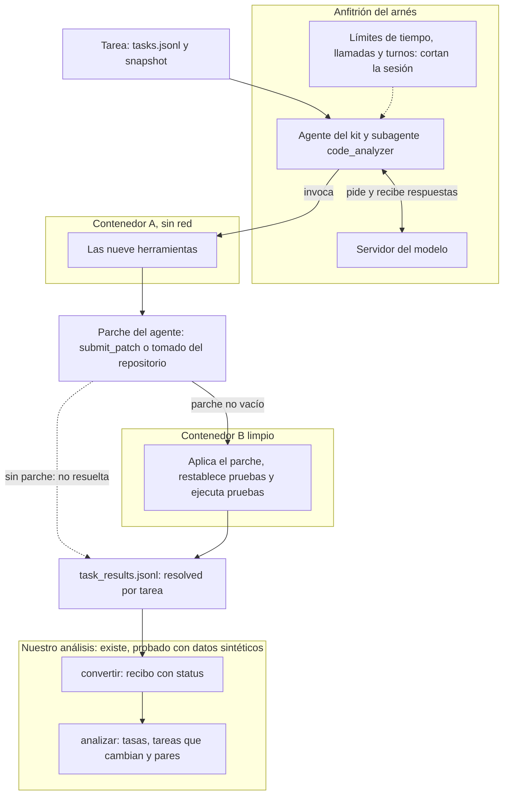
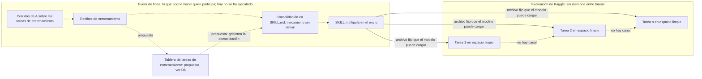
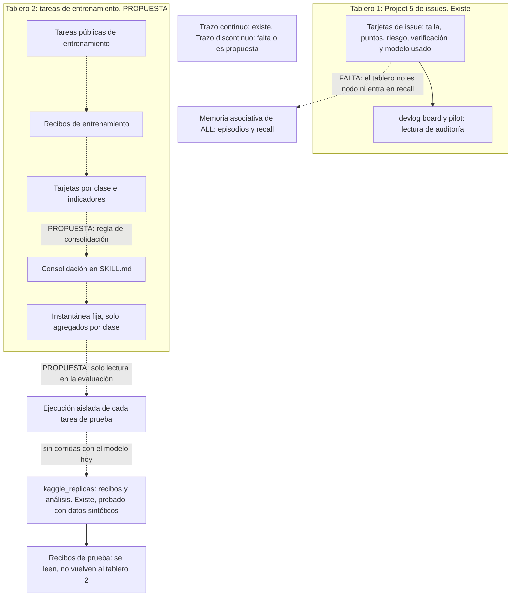
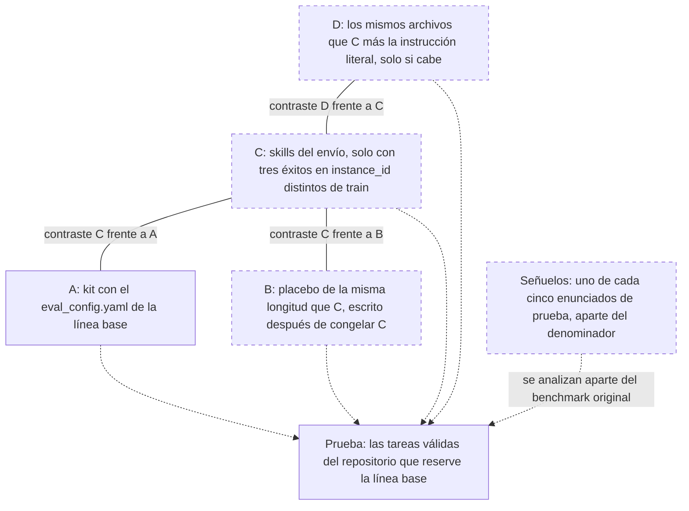
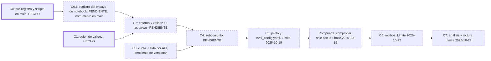
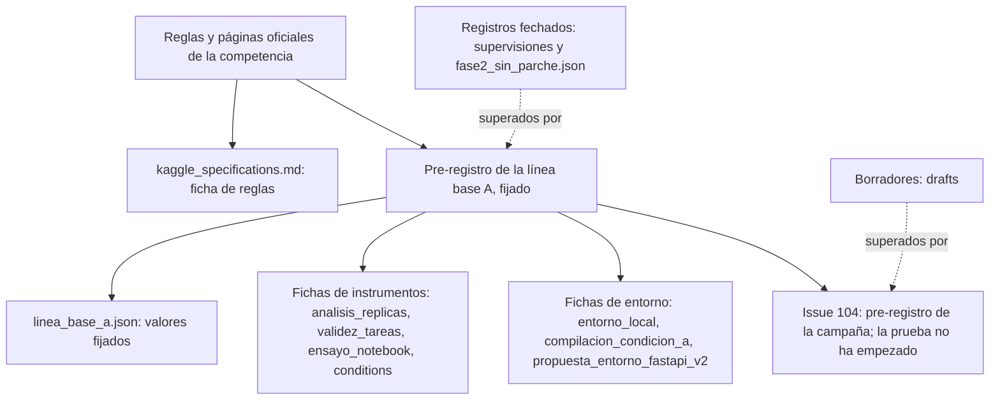

# Experimento Kaggle Gemma 4 Developer Agent

Documento de entrada del experimento. Está escrito para quien no conoce ni el proyecto ni el concurso.
Explica qué se quiere saber, qué reglas impone el concurso, qué se sabe del área, qué se ha medido y qué no,
y qué documento prevalece sobre cuál.

**Contenido.**
[1. En pocas líneas](#1-en-pocas-líneas) ·
[2. El desafío y sus reglas](#2-el-desafío-y-sus-reglas) ·
[3. Estado del área](#3-estado-del-área) ·
[4. Definición del problema](#4-definición-del-problema) ·
[5. Parecido con la práctica cotidiana][s5] ·
[6. El tablero como punto de control](#6-el-tablero-como-punto-de-control) ·
[7. Preguntas](#7-preguntas) ·
[8. Hipótesis](#8-hipótesis) ·
[9. Objetivos](#9-objetivos) ·
[10. Alcance y fuera de alcance](#10-alcance-y-fuera-de-alcance) ·
[11. Qué está medido hoy y qué no](#11-qué-está-medido-hoy-y-qué-no) ·
[12. Mapa de documentos](#12-mapa-de-documentos) ·
[13. Cómo reproducir lo que hay](#13-cómo-reproducir-lo-que-hay) ·
[14. Referencias](#14-referencias)

[s5]: #5-parecido-con-la-práctica-cotidiana-y-qué-no-prueba

---

## 1. En pocas líneas

**Hoy no hay ninguna corrida con el modelo ni ningún resultado.** Lo que sigue describe un diseño y lo que se
ha hecho para poder medirlo.

Google ofrece en Kaggle un concurso con dos pistas, una de código y una de artículo, para el modelo Gemma 4.
Este experimento usa ese concurso como marco para una pregunta acotada, que puede responderse en contra: si
unas guías escritas a partir de intentos anteriores (las *skills*, carpetas con instrucciones que el agente
puede leer) mejoran la proporción de tareas resueltas frente al kit oficial (el agente de ejemplo que
entrega la organización). La medición es local, con tareas públicas. Lo desarrolla
[Agents Learning Loops](../../README.md) (ALL), un proyecto que estudia si los agentes pueden reutilizar su
experiencia.

Las condiciones que se compararían son cuatro: **A**, el kit oficial; **B**, un texto de relleno de longitud
comparable a las skills; **C**, las skills; y **D**, las skills con la instrucción de usar el grafo de código.

**Qué está hecho.** El diseño de la medición: el
[pre-registro de la línea base A](../../docs/preregistration/kaggle-baseline-a.md), escrito y fijado antes de
cualquier corrida con el modelo y antes de medir A (fijado: solo cambia por enmienda). Antes hubo controles
locales sin modelo y sin parche, que el propio pre-registro describe y que no miden a Gemma. Los guiones que
lo acompañan (partición de las tareas, análisis de réplicas, validez de tareas, ensayo de notebook,
compuerta de parámetros) están en `main` y se probaron con datos sintéticos. La cuota semanal de GPU de la
cuenta se leyó por API.

**Qué no está hecho.** No se sabe qué proporción de tareas resuelve el kit oficial, cuánto varía entre
repeticiones, qué tareas son válidas ni si la cuenta puede usar el acelerador L4×4. Las reglas de B, C y D
están en el [pre-registro de la campaña](../../docs/preregistration/kaggle-campaign-abcd.md); la prueba no
ha empezado, porque falta la variación de A. Los resultados que ALL tiene hoy
([H4, #58, H6 y H7](../../README.md#qué-presenta-este-experimento)) son de un solver acotado que no usa modelo
de lenguaje: no permiten concluir nada sobre Gemma.

**Términos que el [glosario](../../docs/entorno/glosario.md) no define.** No están en el glosario; se
definen aquí, y se propone añadirlos.

| Término | Qué es | Qué no es |
|---|---|---|
| **Arnés de la competencia** | El programa que ejecuta el agente del envío y puntúa su parche. Es la pila de tres paquetes que describe HARNESS § 1 (`adk-submission`, `adk-eval-core` y `swegemma`); la CLI que usamos es `swegemma` 0.2.7 | No es el *harness de experimento* ni el *harness de entorno* del glosario (términos 6 y 7) |
| **Agente del envío** | El agente que describe el archivo comprimido que se entrega a la competencia: un YAML, prompts, subagentes, skills y, si se quiere, adaptadores | No es el *agente de biblioteca* ni el *solver acotado* (términos 1 y 2). Sus «skills» son archivos `SKILL.md` del envío: no son *skills de memoria* ni *skills de entorno* (términos 4 y 5) |

**Otras palabras de uso frecuente.** *Recibo*: el registro de una tarea ejecutada, con su resultado y los
hashes que identifican las entradas. *Réplica*: una repetición completa de la misma corrida. *Tercil*: cada
tercio de un reparto ordenado (aquí, por longitud del enunciado o del parche). `leave_one_repo_out`: reservar
para prueba todas las tareas de un repositorio. *Episodio*: el registro de un issue en la bitácora de ALL.
`recall`: la consulta de esa bitácora antes de empezar un issue. `M*`: el umbral de decisión del
pre-registro para leer una diferencia (sección 8.2). LoRA: un adaptador entrenado que se suma al modelo.
L4×4: la máquina con cuatro GPU NVIDIA L4 que usan los notebooks de la competencia.

---

## 2. El desafío y sus reglas

Este experimento se apoya en un concurso de Google alojado en Kaggle, con dos pistas. **El reglamento del
concurso manda sobre cualquier interés propio del proyecto.** Las fuentes son las páginas oficiales de cada
pista y el `HARNESS_README`, leídos el 2026-10-02 en copias locales que no se versionan. Este repositorio las
cita por página y sección (por ejemplo «Rules § 2.4.b») y no las reproduce; la tabla completa de fuentes está
en la [ficha de reglas](docs/kaggle_specifications.md). Un lector puede comprobar cada cita en las páginas de
la competencia ([Code Track](https://www.kaggle.com/competitions/gemma-4-developer-agent),
[Paper Track](https://www.kaggle.com/competitions/gemma-4-developer-agent-paper)).

### 2.1 Lo que condiciona este experimento

**Cada tarea corre aislada.** Un contenedor limpio, sin red, y el espacio de trabajo se borra al reutilizarlo
(HARNESS § 4.1 y § 5.1). Ninguna página describe un canal de memoria entre tareas. Pesos, prompts y skills
quedan fijos en el envío: lo aprendido antes de enviar solo puede estar escrito en esos archivos.

**Las tareas públicas no son las de la nota.** Google publica 129 tareas de cuatro proyectos abiertos para
desarrollar y probar en local (página *Data*). Con ellas se hace todo lo que aquí se mide. No son las tareas
con que se puntúa y un resultado local no predice la nota.

**Los datos no se pueden publicar.** Se pueden usar, también con fines académicos, pero no publicar ni pasar a
quien no participa; «datos» incluye el código que da el sitio (Rules § 2.4.a y § 2.4.b; Foundational § 18.a).
Por eso este repositorio no contiene tareas, parches, pruebas ni el texto del arnés.

### 2.2 Pista de código

Se entrega un archivo comprimido con la configuración de un agente: un YAML, instrucciones en texto,
subagentes, skills (carpetas con una guía, guiones y notas de consulta) y, si se quiere, adaptadores
entrenados. No se entrega un programa propio: el arnés arma el agente a partir de esos archivos (HARNESS § 2.1
y § 2.2). Todos los agentes usan un único modelo, la variante `gemma-4-31b-it-qat-w4a16-ct` de Gemma 4 (página
*Model Selection, Budget, and Harness Rules*).

El agente recibe el enunciado de un problema real de un proyecto en Python, trabaja en un contenedor sin
internet con nueve herramientas, entre ellas una para consultar un grafo del código, y entrega un parche
(HARNESS § 4 y § 6). La nota es el porcentaje de tareas cuyo parche pasa unas pruebas que el agente no ve
(página *Evaluation*; HARNESS § 8.2). Se puntúa con unas 120 tareas de repositorios privados, repartidas por
mitades entre una tabla pública y una privada, y gana la tabla privada, es decir, unas 60 tareas (cifra
derivada: la mitad de las 120; páginas *Data* y Foundational § 7.a).

El envío dispone de 12 horas para todas las tareas, con el montaje del contenedor incluido y sin contar la
validación de los parches (*Evaluation*). Se admite un envío al día y dos envíos finales (Rules § 2.2). Cierra
el 2 de diciembre de 2026 a las 23:59 UTC (*Timeline*). Los premios son de 37 000, 18 000 y 10 000 USD.

### 2.3 Pista de artículo

Se entrega un texto de hasta 3 000 palabras con investigación original y no publicada, antes del 12 de
noviembre de 2026 a las 23:59 UTC. El envío no es automático: hay que pulsar «Submit». Debe llevar título y
subtítulo, resumen, introducción, métodos y experimentos, y trabajo relacionado con citas. No exige participar
en la pista de código (páginas *Submission Requirements*, *Description* y *Timeline* del Paper Track). Un
jurado lo califica de 0 a 5 en cinco criterios de igual peso (cada uno vale 20 %, cifra derivada del promedio
de cinco):

| Criterio | Qué pregunta la página *Evaluation* del Paper Track |
|---|---|
| Novelty (novedad) | Si aporta ideas nuevas, profundiza la comprensión o destaca propiedades de métodos existentes |
| Quality (calidad) | Cuán general es el enfoque fuera de la competencia |
| Relevance (relevancia) | Qué impacto tiene en ingeniería de software y en el aprendizaje de agentes |
| Verifiability (verificabilidad) | Si se entiende cómo funciona y cómo se obtuvieron, analizaron e interpretaron los datos |
| Clarity (claridad) | Si está bien presentado y escrito |

Entre los temas sugeridos están las tareas y los benchmarks nuevos. El premio de la pista es de 35 000 USD.

### 2.4 Qué mide el concurso y qué mide este experimento

Son observaciones distintas.

| | El concurso | Este experimento |
|---|---|---|
| Qué se compara | Una corrida de un envío fijo | Diferencias pareadas entre condiciones, con réplicas |
| Tareas | Unas 60 privadas (cifra derivada) de repositorios que nadie ve | Las tareas válidas de un repositorio público reservado |
| Cómo se corre | El guion de puntuación de Kaggle, con 12 h para todo | La CLI local `swegemma eval`, con un presupuesto por tarea derivado de las 12 h |
| Contexto del modelo | El guion compacta y cachea el contexto (HARNESS § 7.2) | La CLI ni compacta ni cachea (pre-registro, sección H) |
| Qué responde | Cuántas tareas resuelve el envío | Si unas skills cambian esa tasa frente al kit, en un repositorio reservado |

Un resultado local mide si las skills ayudan en un repositorio público; como el modelo pudo ver ese
repositorio al entrenarse, el resultado no estima la nota de la tabla. Además, una nota por envío, sin
réplicas del mismo envío ni datos por tarea que consten en las páginas, no permite separar el efecto de una
condición del ruido de repetir; por eso las condiciones se comparan en local.

### 2.5 Lo que las páginas dejan ambiguo

Preguntas pendientes para los organizadores, sin respuesta hasta hoy:

- ¿Un repositorio público de GitHub con scripts, agregados e identificadores de tarea cumple la regla de
  compartir código en el foro o en los notebooks de Kaggle (Foundational § 6.b)?
- ¿Esos agregados o identificadores cuentan como «datos» (Rules § 2.4.b)?
- ¿Qué significa «no publicado» frente a un repositorio público con resultados (Paper Track)? La
  sección sobre los datos es, en la copia local de la página *Rules* del Paper Track, «4. Competition Data»,
  apartados a y b (Rules §§ 4.a y 4.b); en la del Code Track es la misma sección, que este documento cita
  como Rules § 2.4.a y § 2.4.b.
- ¿Con qué concurrencia corre la puntuación y qué pasa si se superan las 12 h?
- ¿Cómo se asignan los tres premios del Paper Track?
- ¿Se puede gastar cuota de L4×4 en experimentos que solo alimentan el artículo?

No se consultaron las páginas vivas ni el foro. Mientras no haya respuesta, este repositorio publica solo
agregados y hashes, y no contenido de tareas, y el artículo de #105 queda sin publicación externa hasta
aclararlo.

El concurso no pregunta si un agente aprende de su experiencia. Pregunta cuántas tareas resuelve un envío fijo
dentro de un presupuesto.

---

## 3. Estado del área

Qué dicen las fuentes abiertas, y qué queda sin fuente. Cada obra está en las [referencias](#14-referencias)
con su identificador. Se leyó el resumen de cada una; salvo las cifras de la Tabla 4 de SkillsBench v1 y de la
§ 4.2 de Gloaguen et al., que se tomaron del cuerpo. El código de este repositorio no implementa ninguna de
ellas, y la consolidación fuera de línea de #104 es un diseño, no código.

### 3.1 Lo que ya es práctica conocida

**Aprender de la propia experiencia sin cambiar los pesos del modelo.** Reflexion, Voyager, ExpeL, Agent
Workflow Memory y Memp convierten trayectorias en texto o código reutilizable. SWE-Exp lo aplica a SWE-bench
Verified con Claude 4 Sonnet y no tiene un control con placebo, solo ablaciones. Casi todos los demás
son de otros dominios (funciones aisladas, Minecraft, web, planificación), y en sus resúmenes no vimos
controles con un texto de relleno.

**Skills como archivos.** Los archivos `SKILL.md` con metadatos y carga por niveles están descritos en la
documentación de Anthropic y en la especificación Agent Skills, y la competencia los usa con sus propias
herramientas. No comprobamos quién mantiene esa especificación ni si su formato coincide con el del arnés
(la ficha del concurso nombra una carpeta `resources/`; la especificación abierta nombra `references/` y
`assets/`).

**Evaluar con tareas reales y pruebas.** Es la forma de SWE-bench (Jimenez et al., 2024). La página
*Evaluation* describe la competencia como una evaluación similar, no idéntica: **las 129 tareas no son tareas
de SWE-bench**. Preregistrar (Nosek et al., 2018), repetir las corridas (Bjarnason et al., 2026, recomiendan
varias corridas por tarea) y comparar de forma pareada (Dietterich, 1998) son prácticas descritas en esas
obras. No encontramos un trabajo que las combine para agentes de código con skills.

### 3.2 Evidencia cercana adversa o mixta

- **Memoria de agentes.** Un estudio halló que los errores pasados se propagan cuando se reutilizan registros
  parecidos (Xiong et al., 2025; en agentes en general, no de código).
- **SkillsBench v1.** En 84 tareas de 11 dominios, con modelos que no son Gemma, las skills autogeneradas
  bajaron 1,3 puntos porcentuales de media; las curadas subieron 16,2 puntos de media y, en ingeniería de
  software, 4,5 puntos (de 34,4 % a 38,9 %), con 16 de 84 tareas peor con skills curadas (Li et al., 2026,
  v1; una revisión posterior da otras cifras, por eso se cita siempre la v1).
- **Archivos de contexto de repositorio.** En SWE-bench Lite y en un segundo benchmark creado por los
  autores, los archivos generados por un LLM empeoraron 5 de 8 configuraciones; la tasa de resolución bajó
  0,5 % y 2 % de media (porcentajes tal como los reporta la obra, uno por benchmark) y el costo subió
  20 % y 23 % (Gloaguen et al., 2026; § 4.2). Según el resumen de su v3, los archivos no mejoran de forma
  general, sean de una IA o de personas; en el cuerpo, los escritos por desarrolladores superaron por poco a
  los generados, con más costo.
- **Autocorrección.** En tareas de razonamiento, sin retroalimentación externa la autocorrección a veces
  empeora (Huang et al., 2024).
- **Resultado propio previo.** Con tareas con señuelo, las dos memorias empeoraron el primer intento, de 6/18
  sin memoria a 0/18 con cada una, con el agente por defecto (3 tareas con señuelo × 6 permutaciones
  deterministas; conteo exacto, sin muestra; H4, solver acotado sin modelo de lenguaje;
  [informe](../../docs/results/h4-associative-vs-history.md)). Con un diagnóstico público común (#58) la
  diferencia fue de −2/18, sin diferencia según el criterio pre-registrado
  ([informe](../../docs/results/diagnostic-baseline.md)).

Nada de esto prueba que las skills consolidadas mejoren o dañen a Gemma. Lo que vimos en los resúmenes es
mixto.

### 3.3 Validez de las tareas y ruido

- **Validez.** Hay problemas documentados en SWE-bench. En un análisis manual de los parches exitosos de
  SWE-Agent con GPT-4, 32,67 % tenían la solución filtrada en el issue o en sus comentarios y 31,08 % eran
  sospechosos por pruebas débiles (Aleithan et al., 2024); son cifras de esa configuración, no una propiedad
  general de SWE-bench. Otro estudio estimó que 7,8 % de los parches «correctos» fallan las pruebas de los
  desarrolladores, en los tres sistemas y el conjunto SWE-bench Verified que estudia (Wang et al., 2025).
  Hay indicios de memorización (Liang et al., 2025) y conjuntos renovados con tareas recientes
  (SWE-bench-Live, SWE-rebench).
- **Lo que hace este experimento.** No corrige nada de eso. Mide por su cuenta qué tareas públicas
  discriminan (fallan sin parche y pasan con el de referencia) y excluye las demás. Es un filtro más estrecho
  que las auditorías citadas: comprueba que la tarea discrimina, no que su enunciado esté libre de
  filtraciones ni que sus pruebas sean fuertes. Hoy no se ha ejecutado.
- **Ruido.** En SWE-bench Verified, con tres modelos y dos scaffolds, la estimación pass@1 de una corrida
  varía entre 2,2 y 6,0 puntos según la corrida elegida, con desviación superior a 1,5 puntos aun a
  temperatura 0 (Bjarnason et al., 2026). No son cifras de Gemma ni de 48 a 67 tareas. Por eso el
  experimento mide primero cuánto varía el kit oficial (condición A) al repetirlo.
- **Prueba pareada.** Dietterich (1998) recomienda McNemar para comparar algoritmos de clasificación que se
  corren una sola vez. Trasladarlo a agentes con réplicas es un supuesto nuestro: no afirmamos que sea el
  estándar ni que tres réplicas basten.

### 3.4 Donde no hay fuente

- **Placebo.** No encontramos un trabajo abierto que compare skills con un texto de longitud comparable en
  agentes de código. La evidencia indirecta es de otros contextos: en clasificación, etiquetas al azar en las
  demostraciones apenas cambian el resultado y pesan el formato y la distribución (Min et al., 2022); el
  texto de relleno degrada el razonamiento (Levy et al., 2024) y el contexto irrelevante baja la precisión
  aritmética (Shi et al., 2023). La condición B es una respuesta propia a esa duda, no una receta tomada de
  la literatura.
- **Grafos de código.** LocAgent informa mejoras en la localización de archivos; RepoGraph, al integrarse en
  cuatro métodos de resolución en SWE-bench; CodexGraph propone consultar un grafo para recuperar contexto.
  Son otros modelos, y en los resúmenes no vimos un control con placebo. No encontramos evidencia abierta de
  que ayuden a Gemma 4. La condición D reutiliza las herramientas de grafo que el arnés ya ofrece al kit; su
  novedad es una instrucción obligatoria de usarlas.
- **Reservar un repositorio entero.** No encontramos una obra abierta que evalúe esto en agentes con skills.
  La regla `leave_one_repo_out` es propia del pre-registro.
- **El modelo.** La tarjeta de Gemma 4 declara un corte de preentrenamiento en enero de 2025 y no dice qué
  repositorios entraron. No sabemos si el modelo vio las tareas; las más antiguas podrían haber estado en su
  entrenamiento. La tarjeta tampoco menciona la cuantización de la variante que exige el concurso, así que no
  afirmamos que conserve la calidad del modelo sin cuantizar.

---

## 4. Definición del problema

**Qué se mide.** La tasa de resolución de una condición: el número de tareas resueltas dividido por el número
de tareas del subconjunto, calculado en cada réplica. Una tarea cuenta como resuelta si el parche del agente
hace pasar las pruebas del arnés. Un parche vacío, un tiempo agotado, un presupuesto agotado o una petición
rechazada por exceder el contexto cuentan como no resueltas (pre-registro, sección F.2). Un error de
infraestructura obliga a repetir la réplica, y una tarea que lo sufre en dos réplicas deja de repetirse y
cuenta como no resuelta con el motivo `infra_repetida` (sección F.3).

**En qué tareas.** Las 129 tareas públicas son de cuatro repositorios: fastapi 67, rich 48, requests 13,
httpx 1 (página *Data*; `python -m scripts.kaggle_eda resumen`, sección 13). Solo sirve para medir una tarea
que discrimina, y esa validez no está medida (sección 11). La prueba son las tareas válidas de un repositorio
reservado y el entrenamiento son las de los demás (`leave_one_repo_out`). El repositorio preferido es fastapi
y el segundo rich; lo decide la escalera de cómputo del pre-registro con la validez y la cuota medidas.

**Con qué presupuesto.** El que cabe en las 12 horas del envío real. Con concurrencia 1, que es lo que se
supone mientras la concurrencia real no esté medida, el pre-registro lo deriva en 3 a 5 minutos por tarea
(fórmula en la sección D.1; `python -m scripts.kaggle_prereg presupuesto`). Las 100 llamadas a herramientas,
los 500 turnos y los 300 s por comando son valores por defecto del guion de puntuación (HARNESS § 7.1) y cada
participante puede cambiarlos; desde la Enmienda 2 del pre-registro, A usa 4 minutos, 40 llamadas, 100 turnos y
60 s. Los 60 minutos por tarea que citan algunos borradores son el valor por defecto
del arnés y el tope de la fórmula, no una regla del concurso.

**Tres observaciones distintas.** Son tres cosas distintas; ninguna implica a las otras.

1. *Resolver tareas públicas.* Cuántas de las tareas públicas resuelve un agente en local.
2. *Mejorar frente al kit.* Si una condición resuelve más tareas que A, sobre las mismas tareas y descontado
   el ruido de repetir la corrida.
3. *Puntuar en el conjunto oculto.* La nota de la tabla de Kaggle, con tareas de repositorios privados.

Un agente puede resolver muchas tareas públicas si el modelo las vio al entrenarse y aun así no mejorar frente
al kit; una mejora frente al kit en un repositorio público no dice qué pasará en uno privado.

### Diagrama D1. Qué ocurre con una tarea en el arnés (según HARNESS; no ejecutado con el modelo)



El arnés trata cada tarea en dos pasos separados (HARNESS § 4). En el primero, el agente del kit y su
subagente corren en el proceso anfitrión; solo las nueve herramientas se ejecutan dentro de un contenedor sin
red. El modelo lo sirve un proceso aparte, que en este experimento arrancamos nosotros con los parámetros de
HARNESS § 3.1. Tres límites cortan la sesión: `--max-time-minutes`, `--max-tool-calls` y `--max-turns`. El
cuarto, `--timeout-seconds`, es el tiempo por comando: un comando que lo excede falla, pero la sesión sigue
(HARNESS § 5.2). En el segundo paso, un contenedor nuevo y limpio aplica el parche del agente y ejecuta las
pruebas; según HARNESS § 4 y § 8.1, un parche vacío no llega a esa verificación. Hasta aquí es el arnés.

Lo que sigue es del repositorio: `scripts/kaggle_replicas.py convertir` traduce cada fila de
`task_results.jsonl` a un recibo con `status` igual a `resolved`, `unresolved` o `infra_error`, y `analizar`
calcula tasas, tareas que cambian de resultado y pares de réplicas; sale con 0 si está completo, 1 si
incompleto, 2 si la entrada es inválida y 3 si falla el script. Un parche vacío, un tiempo o presupuesto
agotado y un rechazo por exceder el contexto cuentan como `unresolved`. Un `infra_error` obliga a repetir la
réplica entera. La validez de las tareas es otro flujo, descrito en
[`docs/validez_tareas.md`](docs/validez_tareas.md); su guion existe pero nunca se ejecutó con el verificador
real.

---

## 5. Parecido con la práctica cotidiana, y qué no prueba

Varias ideas de este experimento se parecen a lo que los equipos de desarrollo ya hacen: una guía de
contribución que resume cómo se arregla un tipo de problema, una lista de comprobación para depurar, unas
notas de fallos anteriores, un tablero donde se clasifican y se siguen las tareas. Ese parecido es real y
explica por qué las ideas se probaron. **Pero el concurso es de Google y manda su reglamento, no esa
práctica.** Que algo funcione en equipos de personas no permite concluir que funcione con este modelo y este
arnés. Aquí un texto compite por una ventana de contexto de 32 768 tokens que se compacta (HARNESS § 3.1 y
§ 7.2), y leerlo gasta turnos de un presupuesto que, con concurrencia 1, es de 3 a 5 minutos por tarea (la
concurrencia real no está medida). Es el modelo quien decide si carga la skill. La práctica de «revisar antes
de integrar» no tiene equivalente: el agente entrega una vez y nadie revisa. Una frase del borrador del
manuscrito (`drafts/paper/manuscript_draft.md`) dice que ALL trae a los agentes el ciclo de las
organizaciones humanas; esa afirmación no está medida.

**Dónde choca el marco de ALL con el concurso.** El bucle de ALL consiste en registrar lo ocurrido,
recordarlo antes de actuar y consolidarlo. En el concurso cada tarea corre aislada: contenedor limpio, sin red
y sin memoria. Registrar y consolidar solo pueden hacerse antes del envío, y los hace quien participa.
«Recordar» se reduce a que el modelo lea un archivo fijo. Ninguna tarea se beneficia de la anterior, el
orden no importa y nada se corrige tras un fallo. La recuperación tampoco la hace el grafo asociativo de ALL,
sino el modelo. La vía que el concurso ofrece para fijar un aprendizaje son los adaptadores LoRA, que #104
deja fuera de alcance. Esto es un límite del experimento y una posible desalineación entre la pregunta de ALL,
que trata de una memoria que se consulta, y el diseño del concurso, que evalúa archivos fijos (fuentes:
HARNESS § 4.1 y § 5.1, y la página *Model Selection, Budget, and Harness Rules*). No cambia ninguna
predicción ni regla fijada del pre-registro.

**Dónde sí hay comunicación entre tareas.** Que la ejecución de cada tarea sea aislada no significa que las
tareas no se comuniquen en ningún sitio. Se clasifican, se siguen y se evalúan en un tablero común, fuera de
la ejecución. Ahí ALL puede relacionar una tarea con otra: las clases de tarea, los resultados, los motivos de
fallo y las métricas pueden servir para decidir qué se consolida y para evaluar avances. La sección 6 dice qué
parte de eso existe, qué falta y qué se propone.

Por eso lo que se pone a prueba es si **unos documentos estáticos derivados de experiencia ayudan**, no si un
agente aprende. La experiencia viene de las tareas públicas de otros repositorios y se aplica a uno
reservado.

### Diagrama D5. El bucle de ALL fuera de línea frente a la evaluación sin memoria



La máquina `PLAN → RETRIEVE → ACT → OBSERVE → CONSOLIDATE` del agente de biblioteca es una analogía de la fase
fuera de línea y no se ejecuta en Kaggle. A la izquierda está lo que quien participa podría hacer antes de
enviar: correr A sobre las tareas de entrenamiento, guardar recibos y episodios, y consolidarlos en una
`SKILL.md`. Hoy no se ha hecho nada de esto con Gemma, y la consolidación no existe ni hay redactor de skills.
Esa `SKILL.md` es la del envío y no es la *skill de memoria* del glosario: el esquema de memoria declara el
tipo de nodo `Skill` y la relación `promoted_to_skill`, pero el protocolo los deja sin implementar. A la
derecha está la evaluación de Kaggle: cada tarea parte de un espacio limpio y solo comparte con las demás los
archivos fijos del envío. Las flechas discontinuas entre tareas indican que no hay canal entre ellas. El
tablero de tareas de entrenamiento es una propuesta, desarrollada en la sección 6 y en el diagrama D6; todo lo
que lo toca va con trazo discontinuo.

---

## 6. El tablero como punto de control

En ALL el tablero común, con metodología ágil, es donde las tareas se clasifican, se siguen y se evalúan. Un
registro solo anota lo ocurrido; un punto de control, además, hace que lo anotado cambie lo que se hace
después. La intención del proyecto es que el tablero sea esto último, y que sea un punto de control de la
memoria asociativa. Hoy es un registro: esta sección separa lo que existe, lo que falta y lo que se propone.
Solo lo primero está hecho.

### 6.1 Qué existe hoy

El Project #5 de GitHub guarda, por tarjeta de issue, los campos *Status*, *Talla*, *Puntos*,
*Incertidumbre*, *Riesgo*, *Modelo* (el previsto), *Modelo usado*, *Escaló* y *Verificación*
([`docs/piloto-estimacion.md`](../../docs/piloto-estimacion.md); el ciclo de vida está en
[`CONTRIBUTING.md`](../../CONTRIBUTING.md#flujo-por-issue-la-vida-del-proyecto)). Dos comandos lo leen sin
escribir nada:

- `python -m scripts.devlog board --since <n>` es un chequeo de coherencia entre issues, tarjetas y
  episodios (salida 0 sin hallazgos, 1 con hallazgos, 2 sin lectura). Con `--since 100` sale con 0 y dice
  «sin hallazgos».
- `python -m scripts.devlog pilot --since <n>` calcula medidas del piloto de estimación: estimación completa
  en el tablero, *Done* con *Verificación* verificada, escalamientos, modelo previsto distinto del usado, PR
  adicionales, revisiones de estimación y pasos fallidos de los episodios, estos últimos autoinformados. No
  interpreta.

Con `--since 100`, la población son tres issues (#102, #111 y #114). Estimación completa: 3 de 3. *Done* con
*Verificación* verificada: 3 de 3. Escalamientos: 0 de 3. Pasos fallidos, talla S, autoinformado: 11 de 34
(#102: 8 de 15; #111: 0 de 7; #114: 3 de 12). Los tokens por issue figuran como «no medido». Son tres issues
de talla S: no calibran nada ni permiten concluir algo sobre Gemma.

### 6.2 Qué falta

**El tablero entra en la memoria solo en parte.** El grafo de memoria de la bitácora
(`learning/dev_memory.json`, derivado de los episodios y no versionado: se genera en local con
`python -m scripts.devlog rebuild`) tiene cuatro tipos de nodo (Concept, Outcome, Goal y Action). Desde la
primera entrega de [#122](https://github.com/cherrera0001/Agents_Learning_Loops/issues/122), cada nodo `Goal`
lleva en su metadata la estimación y el resultado que el episodio copia del tablero (talla, puntos,
incertidumbre, riesgo, modelo previsto y usado, si escaló, PR), y `python -m scripts.devlog recall` los
muestra para los issues parecidos; con una instantánea del tablero añade estado y verificación. Lo que
sigue faltando: no hay nodos ni aristas propios del tablero, esos datos no influyen en qué se recupera ni en
la decisión siguiente, y `recall` no lee el tablero en vivo. El tablero se consulta, pero todavía no decide:
no cumple aún como punto de control de la memoria asociativa. Los conteos del grafo cambian con cada
episodio, por eso no se fijan aquí: se obtienen con el comando de la sección 13.

**Los tramos de un issue grande no quedan registrados como datos.** El issue #103 es una sola tarjeta de talla
L. Bajo ella se fusionaron seis PR con `Refs #103`: #113, #116, #117, #118, #119 y #120. Solo el tramo de #120
tiene episodios en `learning/episodes/` (048 a 050); los de #113, #116, #117, #118 y #119 no tienen episodio
propio. Las revisiones independientes de esos tramos constan en comentarios de #103, escritos por quien
orquesta («aprobar con cambios» en #118 y #119; dos revisiones independientes en #117), y no en el tablero ni
en la memoria. La política vigente, de la
[supervisión del 2026-10-03](docs/supervision-codex-2026-10-03.md), es no crear una tarjeta por cada
interacción: las tareas de coordinación y los puntos de comprobación se registran dentro de los issues
existentes. Es una decisión razonable; lo que falta es que esos registros, hoy comentarios, puedan leerse como
datos y no solo como texto. `devlog pilot --since 100` ve una población de tres issues y no ve esos tramos.

### 6.3 Propuesta de diseño para el pre-registro de #104

**Propuesta, a fijar en el pre-registro de #104 antes de cualquier episodio. No está implementada ni
pre-registrada, y ningún elemento de ella existe en el repositorio.**

La idea es un **tablero de tareas del lado de entrenamiento**. Cada tarea pública de entrenamiento es una
tarjeta con su clase, su resultado por réplica, los campos de llamadas a herramientas (`tool_calls`) y de
llamadas al modelo (`total_llm_calls`, dentro de `harness_raw`) y el motivo de fallo. Esos campos ya los da el
recibo de `scripts/kaggle_replicas.py` (`status`, `failure_reason`, `tool_calls`, `harness_raw`). Hay cuatro
condiciones de diseño:

1. **Solo vuelven recibos de entrenamiento.** Los recibos de las tareas de prueba se leen y no vuelven al
   tablero que gobierna la consolidación. Si volvieran, los resultados de prueba alimentarían las skills:
   sería una fuga, y contradice la frontera del pre-registro de la línea base (sección A) y el criterio de
   #104 de que ninguna tarea de prueba aparece en los episodios ni en las skills.
2. **La clase solo puede usar lo que el agente ve.** El agente ve el enunciado, de modo que una clase útil es,
   por ejemplo, el tercil de longitud del enunciado (cortes en 237 y 739 caracteres, ya fijados en la sección
   «Datos» del pre-registro). El tamaño del parche de referencia es del evaluador y no entra en prompts ni en
   skills (misma sección): sirve para el análisis del evaluador, no para clasificar una tarea dentro de la
   evaluación.
3. **La clase «repositorio» no transfiere con esta partición.** Con un repositorio entero reservado, la tarea
   de prueba pertenece a un repositorio que no tiene ninguna tarjeta de entrenamiento: es así por
   construcción, no solo un riesgo.
4. **Falta una consulta a los organizadores.** Si una instantánea de agregados por clase es admisible bajo la
   regla de no redistribución (Rules § 2.4.b) está sin preguntar (sección 2.5). La propuesta queda
   condicionada a esa respuesta.

De ese tablero saldrían **indicadores por clase** (tasa de resolución, motivos de fallo y llamadas por clase)
y una **regla de consolidación**: «tres éxitos independientes», que #104 deja abierto, pasaría a ser una
consulta al tablero, por ejemplo tres tarjetas de entrenamiento de una misma clase con resultado resuelto.
Eso daría una definición operativa; qué cuenta como «independiente» sigue por fijar.

Lo que viajaría en el envío sería una **instantánea fija** de ese tablero, con solo agregados por clase y
nunca contenido de tareas, como recurso de una skill. Al empezar una tarea, el agente la clasificaría por su
enunciado y consultaría qué funcionó en esa clase. Dentro de la evaluación el tablero **se lee y no se
escribe**: el aprendizaje entre tareas ocurre fuera de línea, gobernado por el tablero. Según nuestra lectura
del reglamento esto no choca con lo que dice: el envío es declarativo y los recursos de las skills son
archivos. No depende de un canal de memoria del arnés; ese canal no existe.

**Antecedentes y sus límites.** SWE-Exp infiere un tipo de issue y recupera experiencias previas por
similitud de tipo y atributos antes de resolver (Chen et al., 2025, § 3.3.2 y § 3.4.1); no tiene control con
placebo. Se ha llevado la metodología ágil (roles y sprints) a sistemas multiagente de generación de software
(AgileCoder; Nguyen et al., 2024, trabajo en curso). Esa obra solo respalda que el antecedente existe; no que
un tablero mejore nada. No encontramos trabajo académico sobre tableros de tareas para agentes: **esta
propuesta es nuestra**.

**Qué habría que medir.** Si la instantánea es una condición más, con su propio placebo (una instantánea con
las mismas clases y agregados barajados), o parte de la definición de C, lo decide #104. En cualquier caso, la
pregunta es si la tasa de resolución mejora frente a A y frente a un control de longitud comparable, con las
reglas de margen de la sección 8.2.

**Riesgos.** Consultar la instantánea gasta turnos y contexto de un presupuesto que, con concurrencia 1, es
de 3 a 5 minutos por tarea. Con 62 u 81 tareas de entrenamiento repartidas en clases, habrá clases con muy
pocas tareas, y un agregado de pocas tareas puede no distinguirse del ruido; el ruido de A aún no está
medido. El modelo puede no consultarla: carga o no la skill por decisión propia. Y lo que se aprende en tres
repositorios de entrenamiento puede no valer en el repositorio reservado.

### Diagrama D6. Dos tableros y el bucle de ALL



El diagrama tiene dos tableros. El de los issues del proyecto (Project #5) existe: se lee con `devlog board` y
`devlog pilot`, y no alimenta la memoria. El de las tareas de entrenamiento del concurso es una propuesta
(sección 6.3): hoy los recibos de `kaggle_replicas.py` existen como instrumento, pero ningún tablero los
recibe. Todo lo discontinuo falta o es propuesta. Solo los recibos de entrenamiento irían al tablero 2; los de
prueba se leen y no vuelven. Dentro de la ejecución aislada no se escribe en ningún tablero.

---

## 7. Preguntas

Son dos preguntas distintas. Una pregunta es abierta; la hipótesis (sección 8) es la respuesta que se pone a
prueba.

**Pregunta de la línea base** (pre-registrada, sección 1 del
[pre-registro](../../docs/preregistration/kaggle-baseline-a.md)). Con el kit oficial sin cambios de prompt ni
de herramientas, ¿cuánto varía el resultado de la condición A al repetir la misma corrida sobre las mismas
tareas? ¿Qué diferencia entre dos condiciones no se distingue de esa variación? La respuesta decide cuántas
réplicas y qué margen necesita la campaña, o si esa campaña puede afirmar algo.

**Pregunta de la campaña** (issue #104; reglas en el [pre-registro de la campaña](../../docs/preregistration/kaggle-campaign-abcd.md); la prueba no ha empezado). ¿Unas skills consolidadas fuera de
línea a partir de episodios con Gemma mejoran la resolución de tareas de otro repositorio frente al kit y
frente a un placebo de longitud comparable, dentro del presupuesto del envío? La condición D, con una
instrucción de usar el grafo de código, exige una comparación adicional que separe su efecto del de las
skills.

**La pregunta que se retira.** Una versión anterior de este documento preguntaba si una memoria episódica en
grafo asociativo mejora la selección de contexto de un agente Gemma 4 sin transferencia negativa. Se retiró
porque no es contestable en este arnés: ninguna condición implementa un grafo asociativo, y la recuperación no
la hace ese grafo sino el propio modelo, que decide si lee un archivo fijo (sección 5). Tampoco coincide con
la pregunta del issue #100. La pregunta asociativa sigue abierta en otro lugar: la siembra con señales no
léxicas del solver acotado es el issue #98 (H8), que el #100 califica de «relacionado, no hijo».

---

## 8. Hipótesis

### 8.1 Línea base A: predicciones y reglas pre-registradas

El pre-registro no formula hipótesis nulas y alternativas. Formula cuatro predicciones del autor, cada una
con lo que la refutaría, y unas reglas de decisión hacia #104. Se citan por sección; su texto exacto está en
el [pre-registro](../../docs/preregistration/kaggle-baseline-a.md):

| Dónde | Qué fija |
|---|---|
| Sección «Predicciones», P1 | Habrá tareas que cambian de resultado entre réplicas. La refuta un 0 en «tareas que cambian» |
| Sección «Predicciones», P2 | En todas las réplicas, más de la mitad de las no resueltas serán por tiempo agotado o presupuesto agotado. La refuta cualquier réplica donde no lo sean |
| Sección «Predicciones», P3 | La tasa principal de A quedará por debajo de la mitad en todas las réplicas. La refuta una réplica con la mitad o más de las tareas resueltas |
| Sección «Predicciones», P4 | Sin predicción sobre el caso de G2 |
| Sección G (G1 a G6) | Reglas de lectura: qué se publica si dos réplicas de A discrepan, cuándo el ruido impide la campaña, qué pasa con un suelo o un techo, cuál es el brazo A de la campaña |

### 8.2 Campaña (C frente a A, C frente a B, D frente a C)

**Fijadas en el [pre-registro de la campaña](../../docs/preregistration/kaggle-campaign-abcd.md), antes de
cualquier episodio.** El texto que manda es ese. Esta sección lo resume y no añade umbrales. `M*` es el de
la sección G del pre-registro de la línea base: el mayor entre el suelo 6/n y la diferencia mínima calculada
con la variación medida de A. Aquí solo se usa como umbral de lectura; no se anticipa con qué frecuencia una
diferencia real lo superaría.

Cada hipótesis se lee con tres desenlaces que no se solapan. Se comparan tareas resueltas de dos condiciones
sobre las mismas tareas:

| Hipótesis | Apoyada si | Sin diferencia si | Refutada si |
|---|---|---|---|
| H(C, A): las skills (C) resuelven más que el kit (A) | C resuelve más que A por más de `M*` | La diferencia, en cualquier sentido, es menor que `M*` | C resuelve menos que A por más de `M*`. Solo se puede leer si A resuelve al menos 6 tareas en cada réplica (G3); si no, «refutada por empeorar» queda fuera de alcance |
| H(C, B): las skills (C) resuelven más que el texto de relleno (B) | C resuelve más que B por más de `M*` | La diferencia es menor que `M*`. Entonces una mejora frente a A, si la hubiera, no se atribuiría a la experiencia consolidada | C resuelve menos que B por más de `M*` |
| H(D, C): la instrucción de usar el grafo (D) añade a C | D resuelve más que C por más de `M*` | La diferencia es menor que `M*` | D resuelve menos que C por más de `M*` |

Supuestos: para C frente a B y D frente a C se usa el mismo `M*`, lo que supone que la variación entre
corridas es la de A (la de B, C y D no se ha medido). El estimador es mayoría estricta y la predicción, una,
es que H(C, A) no queda apoyada: las dos están en el pre-registro de la campaña. D solo se corre si alcanza
el cómputo (G6). Si A resuelve casi todas las tareas del subconjunto (menos de 6 sin resolver, G3), la
campaña no puede declarar mejora sobre ese subconjunto; si la línea base cae en el caso de ruido dominante,
la campaña no se corre, ni como confirmatoria ni como descriptiva.

**B y D tenían varias definiciones en los borradores.** La elección quedó en el pre-registro de la campaña:
B es el placebo de longitud, no unas heurísticas, y D es la instrucción literal, sin herramientas nuevas.

| Condición | Definiciones en circulación | La del issue #104 |
|---|---|---|
| B | «Skills escritas a mano» (`drafts/preregistration_abcd.md`, `drafts/paper/manuscript_draft.md`); «texto neutro de longitud igual a C, escrito después de congelar C» (`drafts/README.md`, `drafts/skills/all_core/SKILL.md`) | «Placebo escrito a mano, misma longitud que C» |
| D | «Grafo AST más traza de excepción» (`drafts/preregistration_abcd.md`) | «C con una instrucción que obliga a ubicar el código con las herramientas de grafo antes de aplicar una skill» |

La tabla de arriba conserva las definiciones que circularon. El comentario de #100 distingue el texto neutro
de las heurísticas humanas: el pre-registro eligió el texto neutro. El kit ya declara las tres herramientas
de grafo y el arnés las anuncia en el prompt (HARNESS § 5.2), así que D no añade herramientas.

### Diagrama D2. Las condiciones de la campaña (fijadas; ninguna corrida)



La condición A es la línea base: desde la Enmienda 2, el kit ajustado que se envió (sin adaptadores, 8 192 tokens
de salida, razonamiento desactivado y `eval_config.yaml` propio), y el brazo A de la
campaña son todas las réplicas completas de la línea base (pre-registro, G5). B, C, D y los señuelos llevan
borde discontinuo porque no hay corrida. El pre-registro de la campaña fija el resto: B es el placebo de
longitud, escrito después de congelar C; C exige tres éxitos en `instance_id` distintos y los redacta una
persona; D añade la instrucción literal; los señuelos se escriben después de congelar C, aparte del
denominador, y reescribir un enunciado modifica el benchmark.

---

## 9. Objetivos

**Científico.** Obtener un resultado medido: cuánto varía A contra sí misma y, si el cómputo y el ruido lo
permiten, si las skills consolidadas mejoran la resolución. El objetivo se cumple también si el resultado es
nulo o en contra. No se busca una nota alta en la tabla.

**Aporte esperado.** Consolidar skills desde episodios ya existe. Lo propio es la combinación: medir el ruido
de A, un placebo de longitud comparable, partición por repositorio y reglas declaradas antes de ver datos.
Es un diseño propuesto para aplicar en otro arnés ideas conocidas: no hay ninguna corrida que las replique, y
no demostraría que un agente adquiera una habilidad nueva. La línea
base es exploratoria y no confirmatoria. Preregistrar distingue la predicción del análisis posterior (Nosek
et al., 2018); que no elimine por sí solo el sesgo es una opinión nuestra, no un resultado de esa obra.

**Del concurso.** Qué se entrega en cada pista y cuándo (sección 2). En la pista de artículo, un texto de
hasta 3 000 palabras antes del 2026-11-12 23:59 UTC, escrito desde los resultados; si no hay resultados con
Gemma a tiempo, se presenta como diseño y resultado previo negativo, y el resumen lo dice (issue #105). En la
pista de código, un envío de la condición A aceptado por Kaggle y anotado (issue #106, sin empezar); como se
admite un envío al día, no sirve para comparar condiciones.

**De método.** Que el tablero sirva como punto de control del bucle, con indicadores de avance y de resultado
que se puedan leer y usar para la decisión siguiente (sección 6). Hoy se leen los de la sección 6.1 y no se
integran con la memoria (issue #122).

**Operativos.** La cadena de compuertas del pre-registro, con sus fechas límite (sección I.1).

### Diagrama D3. La cadena de compuertas, con su estado de hoy



Cada nodo es un commit o un paso del pre-registro (sección I.1). Trazo grueso: hecho. Trazo de rayas largas:
pendiente. Trazo punteado: pendiente y con fecha límite o dependencia de otra medición. C0 y C1 están hechos
y fusionados (PR #117 y #118). Del ensayo de notebook, C0.5, solo existe el instrumento (PR #119): nadie lo ha
corrido en Kaggle. C2 necesita el ensayo y el guion de validez; la propuesta de entorno v2 que integró el PR
#120 es una lista candidata de arreglos, no el entorno del experimento. C3: la cuota la leyó por API otra
sesión el 2026-10-03; el pre-registro exige que la lea el dueño y la versione el orquestador, y eso está
pendiente. C4 necesita la validez y la cuota. La compuerta se abre cuando
`python -m scripts.kaggle_prereg comprobar` sale con 0 sobre un commit de `main`; hoy sale con 1 porque quedan
nueve parámetros abiertos.

| Fecha | Qué es |
|---|---|
| 2026-10-10 00:00 UTC | Reinicio de la cuota semanal de GPU, según la API |
| 2026-10-12 | Fecha mínima de la compuerta |
| 2026-10-19 | Límite de la compuerta y de C5 |
| 2026-10-22 | Límite de los recibos (C6); después de esta fecha la compuerta no se abre |
| 2026-10-23 | Límite del análisis y la lectura de la línea base (C7) |
| 2026-11-05 | Corte de la campaña: último recibo de #104 |
| 2026-11-12 23:59 UTC | Cierre de la pista de artículo |

La cuota de GPU se leyó por API el 2026-10-03: 30 h semanales (comentario en #101), sin versionar y sin
confirmar que la cuenta pueda elegir L4×4. Si la compuerta se abre después del 2026-10-19, la campaña ya no
tiene sus dos semanas y el dueño decide entre seguir solo con la línea base o detener (decisión
`compuerta_tardia`).

---

## 10. Alcance y fuera de alcance

**Entra.** La línea base A, es decir, medir el kit oficial contra sí mismo en un repositorio público
reservado; y la campaña de skills si el ruido y el cómputo alcanzan, con el diseño que fije #104.

**No entra.**

- Entrenar adaptadores LoRA y enviar a Kaggle para elegir entre condiciones (issue #104).
- Cualquier afirmación sobre el conjunto oculto de la competencia o sobre la nota de la tabla.
- Generalizar a otros repositorios: un solo repositorio de prueba no separa «repositorio no visto» de
  «dominio distinto».
- Afirmar algo sobre el aprendizaje de un agente. Se prueba si unos documentos estáticos ayudan.
- El manuscrito del Paper Track (issue #105) y las figuras que salgan de resultados (issue #109).
- Modificar el pre-registro de la línea base, que solo cambia por enmienda.
- Integrar el tablero en la memoria asociativa: es trabajo posterior, issue #122.

---

## 11. Qué está medido hoy y qué no

**Del proyecto, no de Gemma.**

| Qué | Estado | Fuente |
|---|---|---|
| Resultados del solver acotado sin modelo de lenguaje (H4, #58, H6, H7) | Medidos; no permiten concluir nada sobre Gemma | [`README.md` de la raíz](../../README.md#qué-presenta-este-experimento) y `docs/results/` |
| Indicadores del tablero, `devlog pilot --since 100`: población 3 (#102, #111, #114); estimación completa 3 de 3; *Done* verificado 3 de 3; escalamientos 0 de 3; pasos fallidos autoinformados 11 de 34 | Medidos; tres issues de talla S | `python -m scripts.devlog pilot --since 100` (sección 13) |
| El tablero como parte de la memoria asociativa | **No existe** (issue #122) | Sección 6.2 |

**Del experimento Kaggle.**

| Qué | Estado | Fuente |
|---|---|---|
| Agregados de las 129 tareas públicas (repositorios, años, tamaños) | Medido | `python -m scripts.kaggle_eda resumen` (sección 13); pre-registro, sección «Datos» |
| Partición `leave_one_repo_out` (por ejemplo, fastapi reservado: 67 de prueba, 62 de entrenamiento) | Calculada por un guion determinista; no es una medición del modelo | `python -m scripts.kaggle_split` (sección 13) |
| Cuota semanal de GPU: 30,00 h, reinicio 2026-10-10 00:00 UTC | Leída por API el 2026-10-03 por otra sesión; no versionada; sin confirmar que la cuenta elija L4×4 | Comentario en #101 |
| Inscripción en las dos pistas | Confirmada por API | Comentario en #101 |
| Tasa de A con el kit oficial | **Sin medir** | — |
| Variación entre réplicas de A | **Sin medir** | — |
| Validez de cada tarea (`discrimina` o no) | **Sin medir.** `scripts/kaggle_validez.py` nunca se ejecutó con el verificador real | [`docs/validez_tareas.md`](docs/validez_tareas.md) |
| Ensayo de notebook: backend, carga del modelo, tokens por segundo, rechazos por contexto | **Sin medir.** El instrumento nunca se ejecutó en Kaggle | [`docs/ensayo_notebook.md`](docs/ensayo_notebook.md) |
| Entorno del sandbox: una variante local v2 (constructor `scripts/build_sandbox.py`, PR #120) con controles vacíos de dos tareas | Ensayo local, sin parche de referencia: no fija el entorno del experimento ni acredita la validez de ninguna tarea; su diagnóstico es una lectura estática del arnés, sin ejecutarlo | [`docs/propuesta_entorno_fastapi_v2.md`](docs/propuesta_entorno_fastapi_v2.md) |
| Concurrencia de la puntuación real | **Sin medir** | — |
| Acceso a L4×4 desde la cuenta | **Sin medir** | Comentario en #101 |
| Efecto de B, C o D | **Sin medir.** Las condiciones no existen | — |
| Corridas con el arnés y sin modelo (tres tareas locales sin parche) | Hecho, pero el registro tiene conclusiones cuestionadas y no es una fuente de exclusiones | [`calibracion/fase2_sin_parche.json`](calibracion/fase2_sin_parche.json); pre-registro, A.4 |

---

## 12. Mapa de documentos

El orden de autoridad es: las **reglas y páginas oficiales de la competencia**; después el **pre-registro de
la línea base A** con su archivo de valores; después los issues #100 y #104 (la campaña aún no tiene
pre-registro). El pre-registro de la línea base fija la partición que la campaña hereda (sección B). Las
fichas de instrumentos describen cómo se lee lo que el pre-registro fija. Los registros fechados y los
borradores no mandan sobre nada: cada uno lleva una nota de estado que dice qué lo supera.

### Diagrama D4. Qué documento manda sobre cuál



Una flecha «A → B» significa que B está sujeto a A. Las flechas discontinuas dicen qué supera a qué: los
registros y borradores se conservan sin reescribir. Las fichas de entorno describen un ensayo local, no el
entorno del experimento, que fija el ensayo de notebook.

| Documento | Qué es | Estado |
|---|---|---|
| [`docs/preregistration/kaggle-baseline-a.md`](../../docs/preregistration/kaggle-baseline-a.md) | Pre-registro de la línea base A | **Fijado**: cambia solo por enmienda (Enmiendas 1 a 3, del 2026-10-03 y 04) |
| [`preregistro/linea_base_a.json`](preregistro/linea_base_a.json) | Valores fijados y nueve parámetros abiertos | **Fijado** |
| [`docs/kaggle_specifications.md`](docs/kaggle_specifications.md) | Ficha de fechas, reglas y presupuesto | Vigente; manda la página oficial |
| [`docs/kaggle_api_2026-10-02.json`](docs/kaggle_api_2026-10-02.json) | Instantánea de la API del 2026-10-02 | Registro fechado: dice que la cuenta no estaba inscrita en la pista de artículo; hoy sí lo está |
| [`docs/entorno_local.md`](docs/entorno_local.md) | Procedencia e instalación del arnés | Vigente, con partes sin recibo rotuladas |
| [`docs/compilacion_condicion_a.md`](docs/compilacion_condicion_a.md) | Que el kit compila con el arnés | Vigente, con la salida sin recibo rotulada |
| [`docs/propuesta_entorno_fastapi_v2.md`](docs/propuesta_entorno_fastapi_v2.md) | Diagnóstico y variante v2 del entorno del sandbox, medida sobre dos tareas sin parche de referencia | Lista candidata de arreglos; ensayo local, no es el entorno del experimento ni prueba que sirva para las demás tareas |
| [`docs/desviaciones_entorno_wheels.lock`](docs/desviaciones_entorno_wheels.lock) | Cuatro ruedas adicionales de PyPI con su SHA-256 y las ruedas de starlette apartadas del wheelhouse | Lista candidata de ese ensayo local |
| `scripts/build_sandbox.py` | Reconstruye la imagen Docker del sandbox verificando hashes y tamaños; no decide qué ruedas instala el arnés | Instrumento de ensayo local; la imagen que produce no es por sí sola el entorno del experimento |
| [`docs/analisis_replicas.md`](docs/analisis_replicas.md) | Ficha de `scripts/kaggle_replicas.py` | Vigente; describe el pre-registro |
| [`docs/validez_tareas.md`](docs/validez_tareas.md) | Ficha de `scripts/kaggle_validez.py` | Vigente; nunca ejecutado con el verificador real |
| [`docs/ensayo_notebook.md`](docs/ensayo_notebook.md) | Paso a paso del ensayo de notebook | Vigente; nunca ejecutado |
| [`conditions/a_kit/README.md`](conditions/a_kit/README.md) | Cómo reconstruir el kit desde un manifiesto | Vigente |
| [`conditions/a_linea_base/README.md`](conditions/a_linea_base/README.md) | Cómo armar el envío de la línea base | Vigente |
| [`docs/supervision-codex-2026-10-03.md`](docs/supervision-codex-2026-10-03.md) | Supervisión de Codex: reparto de responsables y política de registro | Registro fechado; no se reescribe |
| [`docs/supervision-claude-2026-10-02.md`](docs/supervision-claude-2026-10-02.md), [`-v2`](docs/supervision-claude-2026-10-02-v2.md), [`-v3`](docs/supervision-claude-2026-10-02-v3.md) | Revisiones del orquestador | Registros fechados; no se reescriben |
| [`calibracion/fase2_sin_parche.json`](calibracion/fase2_sin_parche.json) | Piloto local de tres tareas sin parche | Registro fechado; no es fuente de exclusiones |
| [`drafts/README.md`](drafts/README.md) | Catálogo de borradores | Vigente como catálogo; su nota de estado dice qué lo supera |
| [`docs/preregistration/kaggle-campaign-abcd.md`](../../docs/preregistration/kaggle-campaign-abcd.md) | Pre-registro de la campaña A/B/C/D | Fijado en las reglas; los tres parámetros que salen de A siguen abiertos y la prueba no ha empezado |
| [`drafts/preregistration_abcd.md`](drafts/preregistration_abcd.md) | Diseño A/B/C/D | Borrador, superado por el pre-registro de la campaña |
| [`drafts/paper/manuscript_draft.md`](drafts/paper/manuscript_draft.md) | Manuscrito (en inglés) | Borrador, sin trabajo relacionado ni citas; lo reescribe #105 |
| [`drafts/NOTES_DISYUNTOR_Y_PRESUPUESTO.md`](drafts/NOTES_DISYUNTOR_Y_PRESUPUESTO.md) | Apuntes | Borrador, superado en el presupuesto |
| [`drafts/agent.yaml`](drafts/agent.yaml), [`drafts/skills/all_core/SKILL.md`](drafts/skills/all_core/SKILL.md) | Configuración y directivas exploratorias | Borradores; no son condición alguna |
| [`drafts/architecture_explainer.html`](drafts/architecture_explainer.html) | Diagrama de intención | Borrador con aviso; partes superadas |

---

## 13. Cómo reproducir lo que hay

Todo lo siguiente se ejecutó el 2026-10-03 desde la raíz del repositorio, con `PYTHONPATH=src`. Los datos de
la competencia no están versionados: `tasks.jsonl` se descarga con la API de Kaggle y queda en
`experiments/gemma_developer_agent/data/`, que git ignora.

**Agregados de las tareas** (no imprime enunciados, parches, pruebas ni identificadores):

```bash
python -m scripts.kaggle_eda resumen --tasks experiments/gemma_developer_agent/data/tasks.jsonl
```

Sale con 0 y devuelve un JSON con, entre otros, `"tareas": 129`, 127 `base_commit` distintos,
`"desde_2025_T4": 86`, `"hints_text_vacio": 129`, y por repositorio las tareas: fastapi 67, rich 48,
requests 13, httpx 1; los cortes de los terciles son 5 y 26 líneas de parche y 237 y 739 caracteres de
enunciado.

**Partición** (imprime también los identificadores de tarea; guarda el JSON si se pasa `--output`):

```bash
python -m scripts.kaggle_split --tasks experiments/gemma_developer_agent/data/tasks.jsonl \
  --rule leave_one_repo_out --held-out-repo fastapi/fastapi
```

Sale con 0. Avisa de que el archivo de calibración no trae `tareas_invalidas`, así que no excluye ninguna
tarea, y reparte 67 de prueba (todas de fastapi) y 62 de entrenamiento (rich 48, requests 13, httpx 1), con
`exclusiones_origen: calibracion:sin_clave_tareas_invalidas`.

**Compuerta del pre-registro:**

```bash
python -m scripts.kaggle_prereg comprobar
```

Sale con 1; eso es lo esperado hoy porque quedan parámetros abiertos. Lista nueve (`ensayo_notebook`,
`entorno_sandbox`, `validez_tareas`, `cuota`, `subconjunto`, `piloto`, `presupuesto`, `corrida`,
`decisiones_dueno`) y el resumen
`fijos_sha256: f0fdb8caeedb145fd5443a649026ce83766e981fd3664a80d0608689d3d0f346`. Con `--tasks <tasks.jsonl>`
también sale con 1.

**Fórmulas del pre-registro:**

```bash
python -m scripts.kaggle_prereg presupuesto
python -m scripts.kaggle_prereg computo --validas fastapi/fastapi=67 Textualize/rich=48 psf/requests=13 \
  encode/httpx=1
python -m scripts.kaggle_prereg ruido --tareas 40 48 67
```

El primero devuelve «minutos de reloj por tarea que deja el envío: 5.40», que es `T · (1 − r) / N` con
T = 720, r = 0,10 y N = 120, y una tabla de `max_time_minutes` por concurrencia, carga del modelo y montaje:
restando el montaje y la carga, con concurrencia 1 salen entre 3 y 5 minutos. El segundo devuelve la
escalera de ocho escalones, calculada con todas las tareas válidas y un factor de cuota 2 (de 59,85 h de
L4×4 el escalón 1, a 17,28 h el escalón 8). El tercero devuelve, para 40, 48 y 67 tareas, el suelo (6/n) y
los discordantes que admite el caso de ruido bajo (1, 2 y 10) y el intermedio (11, 18 y 44).

**No se versiona contenido de la competencia:**

```bash
python scripts/verify_no_competition_data.py
```

Sale con 0. Sin los datos locales de `data/` solo compara contra el manifiesto del kit (8 hashes) y lo dice:
«VERIFICADO PARCIAL». Con los datos descargados compara además contra ellos.

**Tablero y memoria:**

```bash
python -m scripts.devlog board --since 100     # sin hallazgos; salida 0
python -m scripts.devlog pilot --since 100     # población de 3 issues (#102, #111 y #114); cifras en 6.1
python -m scripts.devlog rebuild               # genera en local la memoria derivada; no se versiona
python -c "import json,collections as c;d=json.load(open('learning/dev_memory.json',encoding='utf-8')); \
print(len(d['nodes']),c.Counter(n['type'] for n in d['nodes']),len(d['edges']))"
```

Los dos primeros leen GitHub con `gh`. El último imprime los nodos, sus cuatro tipos y las aristas; los
conteos cambian con cada episodio y por eso no se fijan en este texto. Lo que no cambia: hay cuatro tipos de
nodo y ninguno lleva campos del tablero.

**Sin comando que funcione hoy.** No hay forma de reproducir una tasa de A, una variación entre réplicas ni
una validez de tareas: no se han medido.

---

## 14. Referencias

Se abrió el identificador de cada obra al preparar este documento (arXiv: la página del resumen; DOI: el
registro de Crossref). Se leyó el resumen de cada una, salvo las cifras de la Tabla 4 de SkillsBench v1 y de
la § 4.2 de Gloaguen et al., tomadas del cuerpo. Lo que se dice de cada obra se limita a eso.

**Evaluación de issues reales y validez.**

- Jimenez et al. (2024), SWE-bench. [arXiv:2310.06770](https://arxiv.org/abs/2310.06770).
- Aleithan et al. (2024), SWE-Bench+. [arXiv:2410.06992](https://arxiv.org/abs/2410.06992).
- Wang, Pradel y Liu (2025), «Are "Solved Issues" in SWE-bench Really Solved Correctly?».
  [arXiv:2503.15223](https://arxiv.org/abs/2503.15223).
- Liang et al. (2025), The SWE-Bench Illusion. [arXiv:2506.12286](https://arxiv.org/abs/2506.12286).
- Zhang et al. (2025), «SWE-bench Goes Live!» (SWE-bench-Live).
  [arXiv:2505.23419](https://arxiv.org/abs/2505.23419).
- Badertdinov et al. (2025), SWE-rebench. [arXiv:2505.20411](https://arxiv.org/abs/2505.20411).

**Aprender de la experiencia sin cambiar pesos.**

- Shinn et al. (2023), Reflexion. [arXiv:2303.11366](https://arxiv.org/abs/2303.11366).
- Wang et al. (2023), Voyager. [arXiv:2305.16291](https://arxiv.org/abs/2305.16291).
- Zhao et al., ExpeL. [arXiv:2308.10144](https://arxiv.org/abs/2308.10144).
- Wang, Mao, Fried y Neubig (2024), Agent Workflow Memory.
  [arXiv:2409.07429](https://arxiv.org/abs/2409.07429).
- Fang et al. (2025), Memp. [arXiv:2508.06433](https://arxiv.org/abs/2508.06433).
- Chen et al. (2025), SWE-Exp. [arXiv:2507.23361](https://arxiv.org/abs/2507.23361).
- Xiong et al. (2025), «How Memory Management Impacts LLM Agents: An Empirical Study of Experience-Following
  Behavior». [arXiv:2505.16067](https://arxiv.org/abs/2505.16067).
- Huang et al. (2024), «Large Language Models Cannot Self-Correct Reasoning Yet».
  [arXiv:2310.01798](https://arxiv.org/abs/2310.01798).

**Skills como archivos declarativos.**

- Anthropic, «Agent Skills», documentación oficial (consultada el 2026-10-03):
  [platform.claude.com](https://platform.claude.com/docs/en/agents-and-tools/agent-skills/overview).
- Especificación Agent Skills (consultada el 2026-10-03):
  [agentskills.io](https://agentskills.io/specification).
- Li et al. (2026), SkillsBench, **versión v1**. [arXiv:2602.12670v1](https://arxiv.org/abs/2602.12670v1).
- Gloaguen et al. (2026), «Evaluating AGENTS.md: Are Repository-Level Context Files Helpful for Coding
  Agents?». [arXiv:2602.11988](https://arxiv.org/abs/2602.11988).

**Texto de relleno y contexto irrelevante.**

- Min et al. (2022). [arXiv:2202.12837](https://arxiv.org/abs/2202.12837).
- Levy, Jacoby y Goldberg (2024). [arXiv:2402.14848](https://arxiv.org/abs/2402.14848).
- Shi et al. (2023). [arXiv:2302.00093](https://arxiv.org/abs/2302.00093).

**Grafos de código.**

- Ouyang et al. (2025), RepoGraph. [arXiv:2410.14684](https://arxiv.org/abs/2410.14684).
- Chen et al. (2025), LocAgent. [arXiv:2503.09089](https://arxiv.org/abs/2503.09089).
- Liu et al. (2024), CodexGraph. [arXiv:2408.03910](https://arxiv.org/abs/2408.03910).

**Metodología ágil en agentes.**

- Nguyen, Chau, Nguyen y Bui (2024), AgileCoder, trabajo en curso.
  [arXiv:2406.11912](https://arxiv.org/abs/2406.11912).

**Variación entre corridas y estadística.**

- Bjarnason, Silva y Monperrus (2026), On Randomness in Agentic Evals.
  [arXiv:2602.07150](https://arxiv.org/abs/2602.07150).
- Dietterich (1998), Neural Computation 10(7).
  [doi:10.1162/089976698300017197](https://doi.org/10.1162/089976698300017197).
- Clopper y Pearson (1934), Biometrika 26(4).
  [doi:10.1093/biomet/26.4.404](https://doi.org/10.1093/biomet/26.4.404): se cita solo como origen del
  intervalo exacto que usa el análisis de réplicas ([`docs/analisis_replicas.md`](docs/analisis_replicas.md)).

**Modelo.**

- Tarjeta de Gemma 4 (Google): [ai.google.dev](https://ai.google.dev/gemma/docs/core/model_card_4).

**Pre-registro.**

- Nosek et al. (2018), PNAS 115(11).
  [doi:10.1073/pnas.1708274114](https://doi.org/10.1073/pnas.1708274114).
