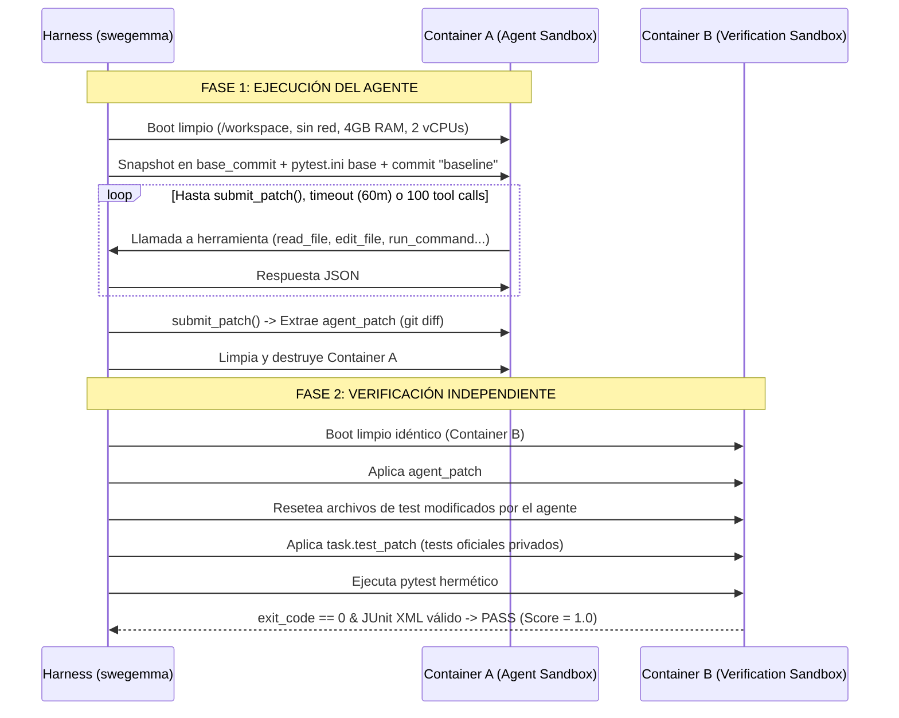

# Kaggle Gemma 4 Developer Agent · Especificaciones Técnicas Oficiales

Documento de referencia técnica verificado directamente contra el arnés oficial **`swegemma`** y sus bibliotecas compañeras (**`adk-submission`** y **`adk-eval-core`**), documentadas en `data/HARNESS_README.md` (49 356 bytes, descargado el 2026-10-02 vía Kaggle API para la competencia `gemma-4-developer-agent`, id 149921).

Todas las citas «`HARNESS § X.Y`» remiten a secciones específicas de ese documento.

---

## 1. Fechas y Metadatos Oficiales (Verificados vía API de Kaggle)

| Parámetro | Code Track (`gemma-4-developer-agent`) | Paper Track (`gemma-4-developer-agent-paper`) | Fuente |
|---|---|---|---|
| **Cierre de envíos** | **2026-12-02 23:59 UTC** | **2026-11-12 23:59 UTC** | Kaggle API (`competitions/list`) |
| **Límite de envíos** | **1 envío por día** | **5 envíos por día** (`maxDailySubmissions: 5`) | Kaggle API (`competitions/list`) |
| **Fusión de equipos** | 2026-11-25 23:59 UTC | **2026-11-12 23:59 UTC** (`mergerDeadline`) | Kaggle API (`competitions/list`) |
| **Bolsa de premios** | 65 000 USD | 35 000 USD | Kaggle API (`competitions/list`) |
| **Estado de inscripción** | Inscrito | **No inscrito** (`userHasEntered: false`) | Kaggle API (`competitions/list`) |
| **Reglas y Rúbrica** | Completamente documentadas en `HARNESS_README.md` | **No verificadas** (no presentes en la API ni en `data/`) | Verificación en sesión |

> [!WARNING]
> La rúbrica y criterios de evaluación del Paper Track **no figuran en la API de Kaggle ni en los archivos del dataset**. Cualquier mención previa a criterios del jurado (Novelty, Quality, Relevance, Verifiability, Clarity) carece de fuente documental en este repositorio y queda como **no verificada**. Además, la API indica que el usuario aún no ha ingresado al Paper Track (`userHasEntered: false`).

---

## 2. Entorno de Cómputo y Regla de Modelo Único (`HARNESS § 3`)

### 2.1 Hardware del Host de Evaluación (`HARNESS § 3.1`)
* **GPUs:** **4 × NVIDIA L4** (`24 GB GDDR6` cada una, total **96 GB VRAM**).
* **Motor de Inferencia:** `vLLM` local (`127.0.0.1:8000`), sirviendo vía endpoint OpenAI-compatible `/v1`.
* **Configuración del Servidor vLLM:**
  * `tensor_parallel_size = 4` (distribuye pesos y KV-cache entre las 4 GPUs L4).
  * `gpu_memory_utilization = 0.80` (~76.8 GB utilizables en total).
  * `max_model_len = 32768` (techo absoluto de tokens combinados: prompt + razonamiento + salida).
  * `enable_auto_tool_choice = True`, `tool_call_parser = "gemma4"`, `reasoning_parser = "gemma4"`.
  * `enable_lora = True`, `max_loras = 8`, `max_lora_rank = 128`.

### 2.2 Regla Estricta de Modelo Único (`HARNESS § 3.2`)
* **Modelo Obligatorio de Competencia:** **`gemma-4-31b-it-qat-w4a16-ct`** (cuantización INT4 W4A16, footprint en VRAM de ~16–18 GB).
* **Restricción:** El validador `validate_single_declared_model(agent_dir)` recorre todos los archivos YAML del submission. **Todos los agentes deben declarar exactamente este modelo base**.
* **Error fatal:** Declarar variantes de distinto tamaño (2B, 9B, 27B) o modelos múltiples lanza un `ParticipantVisibleError` y aborta la evaluación inmediatamente.
* **LoRA permitido (`HARNESS § 3.4`):** Se permite adjuntar hasta 8 adaptadores LoRA fine-tuneados en `adapters/<nombre>/adapter_model.safetensors` (peso total descomprimido `< 3 GiB`), y enrutar subagentes a diferentes adaptadores mediante la clave `adapter: <nombre>`.

---

## 3. Contrato de Submission (`HARNESS § 2`)

### 3.1 Modelo de Seguridad Declarativo (Sin Código Python de Agente) (`HARNESS § 2.1`)
* Los competidores **no envían puntos de entrada de código Python** (`agent.py`, `agent_loop.py` o scripts de ejecución de agente).
* La biblioteca **`adk-submission`** utiliza un compilador declarativo en YAML (`compile_submission`). Los agentes se instancian contra registros cerrados de herramientas, modelos y skills de Google ADK. El uso de `importlib` está deshabilitado.
* **Extensiones estrictamente permitidas:** `.yaml`, `.yml` (configuraciones), `.md`, `.txt` (prompts y `SKILL.md`), `.py` (scripts de skills de ADK únicamente), `.json` (`adapter_config.json`), `.safetensors` (`adapter_model.safetensors`). Cualquier archivo binario ejecutable o pickle (`.pt`, `.bin`) es rechazado.

### 3.2 Estructura del Directorio de Envío (`submission.zip`) (`HARNESS § 2.2`)
```text
submission/
├── agent.yaml              # REQUERIDO: Configuración raíz del agente (LlmAgent o Workflow)
├── eval_config.yaml        # Opcional: Sobrescritura de presupuestos por tarea
├── configs/                # Opcional: Parámetros de sampling (!include)
├── prompts/                # Opcional: Instrucciones de sistema en Markdown (!include)
│   └── system.md
├── sub_agents/             # Opcional: Subagentes o AgentTools en YAML
│   └── code_analyzer.yaml
├── adapters/               # Opcional: Adaptadores PEFT LoRA (.safetensors)
│   └── repair_lora/
│       ├── adapter_config.json
│       └── adapter_model.safetensors
└── skills/                 # Opcional: Directorios de Skills ADK
    └── common_fix/
        └── SKILL.md
```

### 3.3 Clases de Agente Soportadas (`HARNESS § 2.3`)
* **`LlmAgent` (por defecto):** Agente individual con `instruction`, `tools`, `skills`, `sub_agents` y `generate_content_config`.
* **`SequentialAgent`:** Ejecuta una lista de subagentes en orden lineal estricto.
* **`ParallelAgent`:** Ejecuta subagentes concurrentemente en ramas aisladas.
* **`LoopAgent`:** Ejecuta subagentes repetidamente hasta `max_iterations` (acotado a 1..500).

---

## 4. Ciclo de Vida de Evaluación y Aislamiento (`HARNESS § 4`)

Cada tarea del benchmark se evalúa mediante un ciclo hermético en **dos contenedores independientes**:



### 4.1 Características Críticas del Sandbox (`HARNESS § 4.1`)
1. **Red Deshabilitada:** `network_mode = "none"`. No hay acceso a internet ni a PyPI. Todas las dependencias ya están pre-instaladas en wheels cacheados.
2. **Límites de Recursos:** 4 GiB de RAM por contenedor (procesos que excedan esto mueren por `SIGKILL` 137) y 2 vCPUs.
3. **Aislamiento Hermético Entre Tareas:** Al terminar una tarea, `/workspace` se formatea por completo (`rm -rf`). **No existe persistencia en disco ni memoria de proceso entre tareas durante la evaluación.**

---

## 5. Herramientas Integradas del Arnés (`swegemma.tools`) (`HARNESS § 6`)

El arnés registra **9 herramientas oficiales** disponibles para los agentes:

### 5.1 Ejecución y Ciclo (`HARNESS § 6.1`)
1. **`run_command(command: str)`:** Ejecuta comandos bash en `/workspace`. Timeout de 300 s. Salida truncada a 5 000 caracteres. Consume presupuesto de tool calls.
2. **`submit_patch()`:** Captura el diff git de los cambios en `/workspace`, marca la tarea como lista y finaliza la sesión. **No consume presupuesto de tool calls.**
3. **`get_status()`:** Devuelve el tiempo restante, tool calls usados y tamaño del parche actual. **No consume presupuesto de tool calls.**

### 5.2 Manipulación de Archivos (`HARNESS § 6.2`)
4. **`read_file(filepath: str, start_line: int, end_line: int)`:** Lectura con paginación de líneas. Máximo 150 líneas y 10 000 caracteres por llamada.
5. **`edit_file(filepath: str, old_string: str, new_string: str, allow_multiple: bool)`:** Reemplazo atómico con motor de 3 niveles (`exact` $\to$ `flexible` con auto-indentación $\to$ `regex`).
6. **`write_file(filepath: str, content: str)`:** Crea o sobrescribe archivos creando directorios padre automáticamente.

### 5.3 Inteligencia de Código sobre Grafo AST (`HARNESS § 6.3`)
7. **`get_code_neighbors(node: str, edge_type: str, max_neighbors: int)`:** Consulta vecinos (llamadores, llamados, definiciones, imports) sobre el grafo AST NetworkX precomputado del repositorio.
8. **`search_similar_code(query: str, k: int)`:** Busca los top-$k$ nodos por similitud coseno sobre embeddings `.npz` precalculados de funciones y clases.
9. **`get_code_subgraph(nodes: list[str])`:** Extrae el subgrafo inducido para un conjunto de símbolos de código.

---

## 6. Presupuestos Operativos (`HARNESS § 7`)

Los presupuestos por defecto por tarea administrados por `swegemma` para la evaluación oficial son:
* **Tiempo de sesión:** **60.0 minutos**.
* **Llamadas a herramientas:** **100 llamadas** (en evaluación oficial).
* **Turnos de razonamiento:** **500 turnos**.
* **Timeout de comando individual:** **300 segundos**.

### Discrepancia Crítica del Starter Kit Oficial (`eval_config.yaml`)
El archivo `eval_config.yaml` provisto en el starter kit de Kaggle (`sample_submission/`) fija límites mínimos
de prueba rápida (`HARNESS § 7.1`): `max_time_minutes: 1`, `max_tool_calls: 10`, `max_turns: 50` y
`timeout_seconds: 60`. Bajo este presupuesto de juguete, el agente casi con certeza agotará su cuota antes de
diagnosticar y reparar los defectos. Para la línea base de #103 se debe definir si mantener estos límites de
ejemplo o adoptar los topes de evaluación oficial (ver `conditions/a_kit/NOTA.md`).


---

## 7. Métrica de Evaluación (`HARNESS § 8`)

* **Métrica Principal:** **Resolution Rate** (proporción de tareas con estado resuelto entre 0.0 y 1.0).
* **Condición de PASS:**
  1. El parche del agente (`agent_patch`) se aplica limpiamente sin errores de sintaxis.
  2. Los archivos de test modificados por el agente se revierten a `HEAD` (el agente no puede manipular los tests para ganar).
  3. Se aplica el parche secreto de evaluación (`task.test_patch`).
  4. La suite de pruebas de validación corre con `exit_code == 0` y genera un reporte JUnit XML válido sin fallos ni errores.

---

## 8. Implicaciones Cruciales para la Arquitectura de ALL

1. **El Aprendizaje de ALL es Fuera de Línea (Offline):** Debido a que cada contenedor de evaluación es efímero y air-gapped (`network_mode="none"`, `/workspace` reiniciado en cada tarea, sin persistencia en disco ni memoria entre contenedores según `HARNESS § 4.1`), cualquier memoria episódica o aprendizaje de ALL debe consolidarse fuera de línea sobre un split de tareas previo, antes del empaquetado (`submission.zip`).
2. **Promoción a Skills como Hipótesis de Transferencia:** La hipótesis central de ALL para este benchmark es que patrones validados pueden formularse como directrices operativas en `skills/*/SKILL.md`. Al inicio del estudio no existe ninguna skill consolidada en este directorio; cualquier skill previa que se pretenda usar debe provenir de un proceso medible y registrado, evitando escribir reglas a mano bajo el rótulo de «consolidadas».
3. **Exploración de Anclajes Estructurales con Herramientas Nativas:** El arnés ya provee `get_code_neighbors`, `search_similar_code` y `get_code_subgraph` (`HARNESS § 6.3`). Esto permite diseñar directrices o adaptadores que utilicen la topología del código en lugar de coincidencias puramente léxicas, abordando el riesgo de transferencia negativa documentado en H4 (donde la memoria léxica indujo a error ante señuelos).
