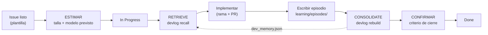

# learning/: la vida de Agents Learning Loops

El repositorio aprende de su propio desarrollo con el mismo bucle que implementa.
Cada issue trabajado es un **episodio**: una meta, los pasos que se dieron (con
sus fallos reales) y las lecciones. Antes de empezar el siguiente issue, la
memoria asociativa se consulta para recuperar qué funcionó y qué falló.



ESTIMAR y CONFIRMAR son pasos del orquestador sobre el issue y el Project #5; el episodio solo conserva
su rastro en los bloques opcionales `estimate` y `outcome`. El texto canónico del ciclo es el *Flujo por
issue* de [`CONTRIBUTING.md`](../CONTRIBUTING.md#flujo-por-issue-la-vida-del-proyecto).

## Archivos

| Ruta | Rol |
|---|---|
| `episodes/NNN-<id>.json` | **Fuente de verdad**: un episodio por issue/hito, revisable en el PR |
| `dev_memory.json` | Grafo **derivado**; se regenera con `rebuild` (no editar a mano) |

Los episodios son la **fuente de verdad**. [`skills/`](../skills/README.md) contiene skills de entorno
([glosario](../docs/entorno/glosario.md)): una **proyección legible** de procedimientos ya fijados en este
archivo y en `CONTRIBUTING.md`. No sustituyen a los episodios ni son nodos de ninguna memoria.

## Formato de un episodio

```json
{
  "seq": 3,
  "id": "issue-11",
  "goal": "Título o meta del issue",
  "ref": "#11",
  "steps": [
    {"action": "run_tests", "success": false, "error": "mensaje real del error"},
    {"action": "edit_module", "success": true, "note": "qué se corrigió"}
  ],
  "lessons": ["Lección redactada, accionable, en una frase"]
}
```

`seq` define el orden cronológico (y por tanto el reloj lógico de la memoria).
Registra los fallos **tal como ocurrieron**: son la señal de aprendizaje.

### Bloques opcionales: `estimate` y `outcome`

Conservan lo que se predijo y lo que pasó. Son opcionales (los episodios anteriores no los tienen) y
`rebuild` los ignora: la presencia de estos bloques no cambia `dev_memory.json`.

```json
"estimate": {"version": 1, "date": "2026-10-02", "size": "S", "points": 2, "uncertainty": 2, "risk": 1, "planned_model": "Sonnet 5.5", "planned_effort": "medium"},
"outcome": {"used_model": "Sonnet 5.5", "model_source": "self-reported", "escalated": false, "estimate_revisions": 0, "prs": 1}
```

- `estimate` copia la «Estimación v1» del issue: es el modelo **previsto** y no se sobrescribe al escalar.
  `points` es tamaño relativo, no horas ni tokens.
- `outcome.model_source` es `self-reported` (lo declara el agente que ejecutó) o `transcript` (se leyó de
  una transcripción). Sin transcripción, `used_model` es autoinformado y no se presenta como medido.
- `outcome.prs` cuenta los PR del issue; `estimate_revisions`, los comentarios «Estimación v2».
- **La verificación del cierre no va en el episodio.** El episodio se escribe antes del merge y esa
  verificación quedaría obsoleta; vive en el campo *Verificación* del Project #5 y en el issue
  ([`confirmar-cierre`](../skills/confirmar-cierre/SKILL.md)).

Reglas de registro:

1. **El fallo va en la acción que lo causó, no en la que lo detectó.** Si una
   autorrevisión encuentra un test defectuoso, falla `write_tests` y
   `review_code` es un éxito (es la acción que lo resolvió). De lo contrario, la
   memoria aprende a evitar las revisiones (#13).
2. **El primer éxito tras un fallo es su resolución.** La consolidación crea
   `error -RESOLVED_BY-> acción` y una lección *fallback* solo para ese paso;
   ordena los pasos para que eso sea cierto.

## Vocabulario de acciones

Mantenerlo pequeño y estable hace que la experiencia se acumule sobre los mismos nodos `Action`:

| Acción | Significado |
|---|---|
| `write_code` / `edit_module` | Código nuevo / modificación de un módulo existente |
| `write_tests` / `run_tests` | Escribir / ejecutar pruebas |
| `review_code` | Autorrevisión antes del PR (un fallo = defecto encontrado) |
| `run_demo` | Ejecutar el benchmark (`aal-benchmark`) |
| `add_dependency` | Cambios en `pyproject.toml` / entorno |
| `update_spec` / `update_docs` / `validate_schema` | Especificaciones, documentación, validación del JSON Schema |
| `rebuild_memory` / `recall_memory` | Operaciones de esta bitácora |
| `write_issue_bodies` / `gh_create_issues` / `gh_project_add` / `gh_link_subissues` | Gestión en GitHub |
| `estimate_issue` | ESTIMAR: «Estimación v1» en el issue y campos del tablero |
| `gh_project_update` | Cambiar campos o estado de una tarjeta del Project #5 |
| `confirm_closure` | CONFIRMAR: comprobar el criterio de cierre antes de *Done* |
| `git_push` / `open_pr` / `merge_pr` | Flujo git |

## Flujo por issue

```bash
# 0. ESTIMAR (orquestador): «Estimación v1» en el issue y campos del Project #5
# 1. In Progress, y después RETRIEVE:
python -m scripts.devlog recall "título del issue"   # (--embedder fastembed: búsqueda semántica)
# 2. implementar en la rama issue-<n>-...
# 3. escribir learning/episodes/NNN-issue-<n>.json (con estimate y outcome)
python -m scripts.devlog rebuild                     # 4. CONSOLIDATE
# 5. commit del episodio y dev_memory.json dentro del mismo PR
# 6. tras el merge verificado (mergedAt): CONFIRMAR (orquestador) y mover a Done
```

Los pasos, responsables y reglas del registro están en
[`CONTRIBUTING.md`](../CONTRIBUTING.md#flujo-por-issue-la-vida-del-proyecto); aquí no se repiten.

## Chequeo del tablero

`python -m scripts.devlog board` cruza issues, tarjetas del Project #5 y episodios, sin escribir nada:

```bash
python -m scripts.devlog board --since 76            # lee GitHub con gh (--since es obligatorio)
python -m scripts.devlog board --snapshot <dir>      # lee <dir>/items.json e issues.json
```

Con `gh` hace falta `GH_TOKEN` de la cuenta dueña del Project (`cherrera0001`): otra cuenta no ve el
Project y el comando lo dice. La instantánea es la salida de
`gh project item-list 5 --owner cherrera0001 --limit 300 --format json` (`items.json`) y de
`gh issue list --repo cherrera0001/Agents_Learning_Loops --state all --json number,state,stateReason,title,labels,closedAt`
(`issues.json`); `subissues.json` es opcional: `{"<épica>": [{"number": 1, "state": "OPEN"}]}`. Sin
`--since` (solo con instantánea) las reglas 2 a 4 no se evalúan, y sin `subissues.json` tampoco la 6; ambos
casos se avisan por stderr. Una línea por hallazgo: `R<regla> #<issue>: <mensaje>`.

| Regla | Hallazgo | Alcance |
|---|---|---|
| 1 | Issue cerrado con tarjeta fuera de *Done*, o tarjeta en *Done* con issue abierto | todos |
| 2 | Tarjeta en *In Progress* o *Done* sin *Talla*, *Puntos*, *Incertidumbre* o *Riesgo* | `>= --since`; sin épicas |
| 3 | Tarjeta en *Done* sin *Verificación* = Verificada, *Modelo usado* o *Escaló* | `>= --since`; épicas: solo *Verificación* |
| 4 | Issue cerrado como completado sin episodio cuyo `ref` cite `#n` exacto (ni `PR #n`, ni `otro/repo#n`) | `>= --since`; sin épicas |
| 5 | Episodio con `estimate.size` distinta de la *Talla* del tablero del issue que cita | todos |
| 6 | Épica cerrada con subissues abiertos | épicas |
| 7 | Episodio con `estimate.planned_model` distinto del campo *Modelo* de la tarjeta del issue principal | todos |
| 8 | Episodio con `outcome.used_model` o `outcome.escalated` distinto de *Modelo usado* o *Escaló* en la tarjeta del issue principal (una clave ausente en el episodio no se compara) | todos |
| 9 | Issue con número `>= --since` sin tarjeta en el tablero | `>= --since`; incluye épicas |
| 10 | Lectura truncada de subissues: épica con ≥ 50 subissues → código 2. Solo aplica a la lectura por `gh`, no a `--snapshot` | épicas |

Códigos de salida: `0` sin hallazgos, `1` con hallazgos, `2` si no se pudo leer la fuente (`gh` ausente,
cuenta que no ve el Project, lectura incompleta o instantánea incompleta, o subissues truncados en R10); un `2` nunca se informa como
«sin hallazgos». No corre en CI: el token de CI no ve Projects de usuario.
