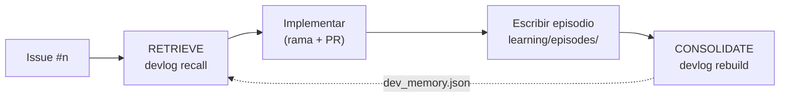

# learning/: la vida de Agents Learning Loops

El repositorio aprende de su propio desarrollo con el mismo bucle que implementa.
Cada issue trabajado es un **episodio**: una meta, los pasos que se dieron (con
sus fallos reales) y las lecciones. Antes de empezar el siguiente issue, la
memoria asociativa se consulta para recuperar qué funcionó y qué falló.



## Archivos

| Ruta | Rol |
|---|---|
| `episodes/NNN-<id>.json` | **Fuente de verdad**: un episodio por issue/hito, revisable en el PR |
| `dev_memory.json` | Grafo **derivado**; se regenera con `rebuild` (no editar a mano) |

## Formato de un episodio

```json
{
  "seq": 3,
  "id": "issue-11",
  "goal": "Título o meta del issue",
  "ref": "#11",
  "steps": [
    {"action": "run_tests", "success": false, "error": "mensaje real del error"},
    {"action": "edit_module", "success": true, "note": "qué se corrigió"}
  ],
  "lessons": ["Lección redactada, accionable, en una frase"]
}
```

`seq` define el orden cronológico (y por tanto el reloj lógico de la memoria).
Registra los fallos **tal como ocurrieron**: son la señal de aprendizaje.

## Vocabulario de acciones

Mantenerlo pequeño y estable hace que la experiencia se acumule sobre los mismos nodos `Action`:

| Acción | Significado |
|---|---|
| `write_code` / `edit_module` | Código nuevo / modificación de un módulo existente |
| `write_tests` / `run_tests` | Escribir / ejecutar pruebas |
| `review_code` | Autorrevisión antes del PR (un fallo = defecto encontrado) |
| `run_demo` | Ejecutar `python -m src.main` |
| `add_dependency` | Cambios en `pyproject.toml` / entorno |
| `update_spec` / `update_docs` / `validate_schema` | Especificaciones, documentación, validación del JSON Schema |
| `rebuild_memory` / `recall_memory` | Operaciones de esta bitácora |
| `write_issue_bodies` / `gh_create_issues` / `gh_project_add` / `gh_link_subissues` | Gestión en GitHub |
| `git_push` / `open_pr` / `merge_pr` | Flujo git |

## Flujo por issue

```bash
python -m scripts.devlog recall "título del issue"   # 1. RETRIEVE
# 2. implementar en la rama issue-<n>-...
# 3. escribir learning/episodes/NNN-issue-<n>.json
python -m scripts.devlog rebuild                     # 4. CONSOLIDATE
# 5. commit del episodio y dev_memory.json dentro del mismo PR
```
