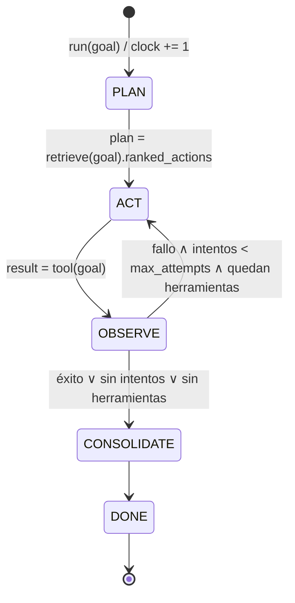

# Protocolo del bucle de aprendizaje

Especificación de los estados y transiciones del agente (`src/agent/core.py`).

## 1. Máquina de estados



| Estado | Entrada | Efecto sobre la memoria | Salida |
|---|---|---|---|
| **PLAN** | texto de la meta, herramientas disponibles | Lectura: siembra + activación propagada. Escritura: nodo `Goal` y aristas `ASSOCIATED_WITH` hacia `Concept(topic)` | `plan`: herramientas ordenadas por `score`; `lessons` recordadas |
| **ACT** | siguiente herramienta del plan | — | `ToolResult` crudo |
| **OBSERVE** | `ToolResult` | `Goal -LEADS_TO-> Action -LEADS_TO-> Outcome [-FAILED_DUE_TO-> Concept(error)]` | `ToolResult` evaluado (el evaluador puede degradar un éxito que no satisface la meta) |
| **CONSOLIDATE** | trayectoria del episodio | Refuerzo / penalización / lecciones; poda cada `prune_every` episodios | lista de lecciones |
| **DONE** | — | — | `Episode` |

## 2. Invariantes

1. **Tiempo lógico**: `clock` se incrementa exactamente una vez por episodio, al entrar en PLAN.
2. **Planificar antes de escribir**: la recuperación ocurre *antes* de insertar el `Goal` actual, para que la meta no se active a sí misma.
3. **Orden estable**: ante empate de `score`, se conserva el orden de registro de herramientas. Con memoria vacía el agente se comporta igual que el agente sin memoria.
4. **Pesos acotados**: `weight ∈ [0, 1]` siempre. Lo garantiza la regla EMA con objetivo en {0, 1} y, además, `Edge` (Pydantic, `validate_assignment`) rechaza cualquier asignación fuera de rango.
5. **Integridad referencial**: toda arista une dos nodos existentes; nodos y aristas se validan contra `src/memory/models.py` (ids `goal:|action:|outcome:|concept:`, `relation` del enum `Relation`).
6. **Contrato generado**: `specs/memory_schema.json` se genera desde los modelos (`python -m scripts.export_schema`); un test falla si no está sincronizado.

## 3. Recuperación (PLAN)

```
seeds(q)  = { g ↦ sim(q, g.label)  | g ∈ Goal, sim ≥ 0.2 }
          ∪ { topic(t) ↦ 1.0       | t ∈ tokens(q), topic(t) ∈ G }

A₀ = seeds
Aₖ₊₁(v) = Σ_{u→v} Aₖ(u) · δ · w̃(u,v)  +  Σ_{v→u} Aₖ(u) · δ · ρ(tipo) · w̃(v,u)
A(v)    = min(1, Σₖ Aₖ(v))                       k ≤ max_hops, Aₖ ≥ umbral

w̃(e)     = weight(e) · exp(-λₑ · (clock − last_updated(e)))      λₑ = decay_factor de la arista
valencia(a) = tanh( Σ w̃(· -RESOLVED_BY-> a)  −  Σ w̃(a -FAILED_DUE_TO-> ·) )
score(a)  = A(a) · valencia(a)
```

`δ = 0.7`, `max_hops = 3`, `ρ(ASSOCIATED_WITH) = 1.0`, `ρ(resto) = 0.5`.

## 4. Consolidación (CONSOLIDATE)

Regla: `w ← w + η · (objetivo − w)`, con `last_updated ← clock` y `count += 1`.

| Evento | Arista | Objetivo | η |
|---|---|---|---|
| Acción `a` resuelve la meta `g` | `g -RESOLVED_BY-> a` | 1 | 0.4 |
| Acción `a` tiene éxito | `a -FAILED_DUE_TO-> e` (todas) | 0 | 0.2 |
| `a` tiene éxito tras fallo con error `e` | `e -RESOLVED_BY-> a` | 1 | 0.4 |
| Acción `a` falla con error `e` | `a -FAILED_DUE_TO-> e` | 1 | 0.4 |
| Acción `a` falla | `g' -RESOLVED_BY-> a` (metas pasadas) | 0 | 0.2 |

Lecciones (`Concept kind=lesson`) generadas:

- `lesson:avoid:<tool>:<error>` — «'<tool>' falló con '<error>'», asociada a la acción, al error y a los *topics* de la meta.
- `lesson:fallback:<falló>:<resolvió>` — «Si '<falló>' falla con '<error>', usar '<resolvió>'».

## 5. Poda

Cada `prune_every` episodios: eliminar aristas con `w̃ < 0.02` y luego nodos de grado 0, **excepto** `Goal` (registro episódico).

## 6. Criterio de aceptación (benchmark)

- Sin memoria: el agente repite el fallo en cada episodio.
- Con memoria: el error inicial ocurre **una sola vez**; los episodios siguientes con metas semánticamente cercanas tienen éxito al primer intento (`tests/test_learning.py`).
- Con errores intermitentes: la memoria reduce el número total de llamadas frente al agente sin memoria.
