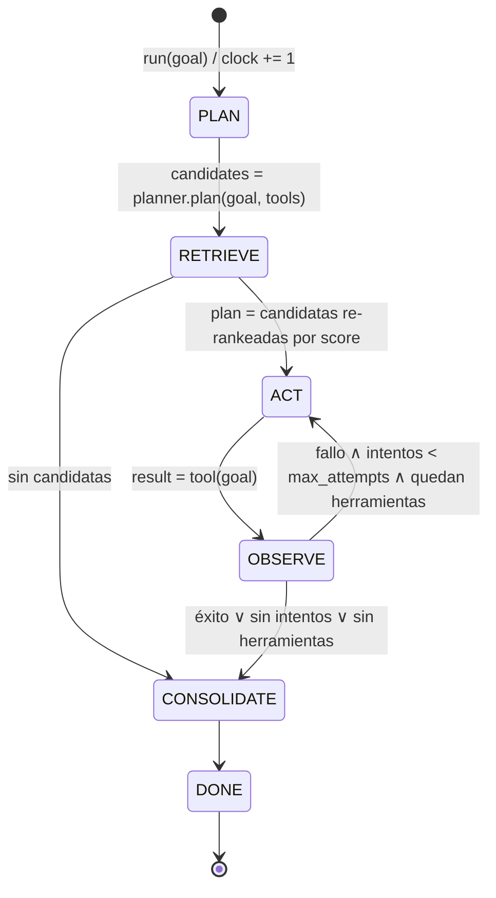

# Protocolo del bucle de aprendizaje

Esta especificación describe el **agente de biblioteca** ([glosario](../docs/entorno/glosario.md), término 1),
objeto de estudio del Experimento 0. No describe al solver acotado del Experimento 1 ni el trabajo de
quien edita el repositorio: el harness de entorno está en [`docs/entorno/harness.md`](../docs/entorno/harness.md).

Especificación de los estados y transiciones del agente (`src/agent/core.py`).

## 1. Máquina de estados



Las transiciones válidas están en `TRANSITIONS` (`src/agent/core.py`); cualquier otra lanza `IllegalTransition`.

| Estado | Entrada | Efecto sobre la memoria | Salida |
|---|---|---|---|
| **PLAN** | texto de la meta, herramientas disponibles | — (no consulta la memoria) | `candidates`: herramientas candidatas según el `Planner` (por defecto `RuleBasedPlanner`: todas, en orden de registro; punto de extensión para un planner LLM) |
| **RETRIEVE** | meta y candidatas | Lectura: siembra híbrida + activación propagada; escribe `activation_level`/`last_accessed_at`. Luego escribe el nodo `Goal` y sus `ASSOCIATED_WITH` hacia `Concept(topic)` | `plan`: candidatas ordenadas por `score`; `lessons` y caminos explicativos |
| **ACT** | siguiente herramienta del plan | — | `ToolResult` crudo |
| **OBSERVE** | `ToolResult` | `Goal -LEADS_TO-> Action -LEADS_TO-> Outcome [-FAILED_DUE_TO-> Concept(error)]` | `ToolResult` evaluado (el evaluador puede degradar un éxito que no satisface la meta) |
| **CONSOLIDATE** | trayectoria del episodio | Refuerzo / penalización / lecciones; poda cada `prune_every` episodios | lista de lecciones |
| **DONE** | — | — | `Episode` |

## 2. Invariantes

1. **Tiempo lógico**: `clock` se incrementa exactamente una vez por episodio, al entrar en PLAN.
2. **Transiciones verificadas**: el episodio solo avanza por `TRANSITIONS`; RETRIEVE siempre precede a ACT.
3. **Recuperar antes de escribir**: la recuperación ocurre *antes* de insertar el `Goal` actual, para que la meta no se active a sí misma.
4. **Orden estable**: ante empate de `score`, se conserva el orden de las candidatas del PLAN. Con memoria vacía el agente se comporta igual que el agente sin memoria.
5. **Pesos acotados**: `weight ∈ [0, 1]` siempre. Lo garantizan las reglas EMA y hebbiana y, además, `Edge` (Pydantic, `validate_assignment`) rechaza cualquier asignación fuera de rango.
6. **Integridad referencial**: toda arista une dos nodos existentes; nodos y aristas se validan contra `src/memory/models.py` (ids `goal:|action:|outcome:|concept:`, `relation` del enum `Relation`).
7. **Contrato generado**: `specs/memory_schema.json` se genera desde los modelos (`python -m scripts.export_schema`); un test falla si no está sincronizado.

## 3. Recuperación (RETRIEVE)

```
sim(q, n) = α · max(0, cos(emb(q), emb(n))) + (1 − α) · léxica(q, n.label)
seeds(q)  = top_k { n ↦ sim(q, n) | n ∈ Goal ∪ Action ∪ Concept, sim ≥ τ_seed }
          ∪ { topic(t) ↦ 1.0       | t ∈ tokens(q), topic(t) ∈ G }

emb: LexicalEmbedder (hashing) por defecto | FastEmbedEmbedder (extra [embeddings]).
Los vectores se cachean en Node.embedding; si cambia el modelo, se invalidan.

A ← seeds;  F ← ∅ (disparados);  frontera₀ = { u | A(u) ≥ θ }

por cada salto k < max_hops:
    F ← F ∪ fronteraₖ                                   (refracción: cada nodo dispara una vez)
    para u ∈ fronteraₖ, para cada vecino v ∉ F:
        Δ(v) += A(u) · δ · τ(u,v) / norm(grado(u))
    A(v) ← min(1, A(v) + Δ(v))                          (un nodo en F ya no acumula)
    fronteraₖ₊₁ = { v | Δ(v) > 0, A(v) ≥ θ }            (umbral sobre la activación ACUMULADA)

resultado = { v | A(v) ≥ θ }

τ(u,v)  = w̃(u→v)                    si la arista va hacia adelante
        = ρ(relación) · w̃(v→u)      si se recorre hacia atrás
norm(d) = 1 | √d | d                según fan_out = none | sqrt | linear

w̃(e)     = weight(e) · exp(-λₑ · (clock − last_updated(e)))      λₑ = decay_factor de la arista
v_global(a) = tanh( Σ w̃(· -RESOLVED_BY-> a)  −  Σ w̃(a -FAILED_DUE_TO-> ·) )

# Valencia contextual (#8): evidencia episódica ponderada por la activación de su meta
para cada Outcome o de a (a -LEADS_TO-> o), con meta g = goal:{o.episode} y s = ±1 (éxito/fallo):
    k(g) = A(g) · exp(−(A_max − A(g)) / T)          A_max = máx. activación entre Goals
ctx(a)  = Σ k·s·w̃(a→o) / Σ k·w̃(a→o)              ∈ [−1, 1]
conf(a) = masa / (masa + κ),  masa = Σ k·w̃(a→o)
valencia(a) = conf · ctx(a) + (1 − conf) · v_global(a)      (= v_global si no hay evidencia)
score(a)  = A(a) · valencia(a)
```

Parámetros (`RetrievalConfig`): `α = 0.7`, `τ_seed = 0.25`, `top_k = 20`, `δ = 0.7`, `θ = 0.01`, `max_hops = 3`, `fan_out = sqrt`, `T = 0.1`, `κ = 0.2`, `contextual_valence = True`;
`ρ(ASSOCIATED_WITH) = 1.0`, `ρ(resto) = 0.5`.

- **Refracción**: un nodo que ya disparó no vuelve a disparar ni acumula, así que los ciclos A→B→A no inflan la activación.
- **Fan-out**: los hubs (p. ej. `Concept(topic)` frecuentes) reparten su activación entre sus vecinos en lugar de saturar a todos. Sin esta normalización, la memoria de desarrollo asignaba relevancia 1.0 a todas las acciones (#4).
- **Efecto en memoria**: `retrieve` fija `Node.activation_level` (0 para los no activados) y `last_accessed_at = clock` en los activados; es la entrada de la consolidación hebbiana (#5).
- **Explicabilidad**: cada `ActionScore.path` es el camino de mayor aporte desde una semilla hasta la acción.

## 4. Consolidación (CONSOLIDATE)

Toda actualización fija `last_updated ← clock` y `count += 1`.

### 4.1 Regla hebbiana (rutas entre nodos co-activados)

```
r = +1 (éxito):  Δw = η_h · a_i · a_j · (1 − w)      potenciación, satura en 1
r = −1 (fallo):  Δw = −η_h · a_i · a_j · w           depresión, satura en 0
```

`η_h = 0.3`. Para cada paso con acción `a` (`a_j = 1`):

| Arista | `a_i` |
|---|---|
| `g -LEADS_TO-> a` (meta actual) | 1 |
| `u -LEADS_TO/RESOLVED_BY-> a` (contexto: metas pasadas, errores resueltos) | `A(u)` del RETRIEVE previo (0 si no se recuperó: sin cambio) |

`ASSOCIATED_WITH` y `FAILED_DUE_TO` **no** son hebbianas: que una acción falle no debe debilitar la lección que advertía ese fallo.

### 4.2 Refuerzo dirigido (EMA) de relaciones agregadas

Regla: `w ← w + η · (objetivo − w)`.

| Evento | Arista | Objetivo | η |
|---|---|---|---|
| Acción `a` resuelve la meta `g` | `g -RESOLVED_BY-> a` | 1 | 0.4 |
| Acción `a` tiene éxito | `a -FAILED_DUE_TO-> e` (todas) | 0 | 0.2 |
| `a` es el primer éxito tras fallo con error `e` | `e -RESOLVED_BY-> a` | 1 | 0.4 |
| Acción `a` falla con error `e` | `a -FAILED_DUE_TO-> e` | 1 | 0.4 |

La penalización de metas pasadas `g' -RESOLVED_BY-> a` ante un fallo ya no es uniforme: la aplica la regla hebbiana en proporción a `A(g')`, así que solo se debilitan las experiencias que efectivamente se recordaron en este contexto.

### 4.3 Decaimiento

- **Perezoso**: `w̃ = w · exp(−λₑ · Δt)` al leer (lo usa la recuperación).
- **Explícito**: `Consolidator.decay()` materializa `w ← w̃` y `last_updated ← clock`; es equivalente (test de equivalencia) e idempotente en el mismo tick.

Lecciones (`Concept kind=lesson`) generadas:

- `lesson:avoid:<tool>:<error>` — «'<tool>' falló con '<error>'», asociada a la acción, al error y a los *topics* de la meta.
- `lesson:fallback:<falló>:<resolvió>` — «Si '<falló>' falla con '<error>', usar '<resolvió>'».

## 5. Poda

Cada `prune_every` episodios:

1. eliminar aristas con `w̃ < prune_threshold` (0.02);
2. si `max_edges` está definido, eliminar las más débiles (por `w̃`) hasta respetarlo;
3. eliminar nodos de grado 0, **excepto** `Goal` (registro episódico).

## 6. Criterio de aceptación (benchmark)

- Sin memoria: el agente repite el fallo en cada episodio.
- Con memoria: el error inicial ocurre **una sola vez**; los episodios siguientes con metas semánticamente cercanas tienen éxito al primer intento (`tests/test_learning.py`).
- Con errores intermitentes: la memoria reduce el número total de llamadas frente al agente sin memoria.
